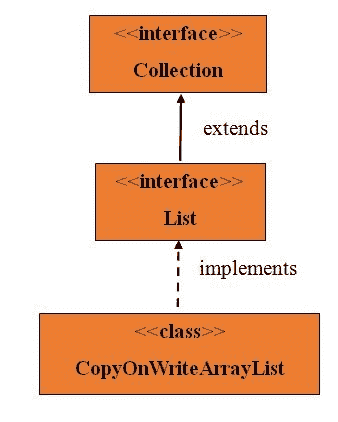
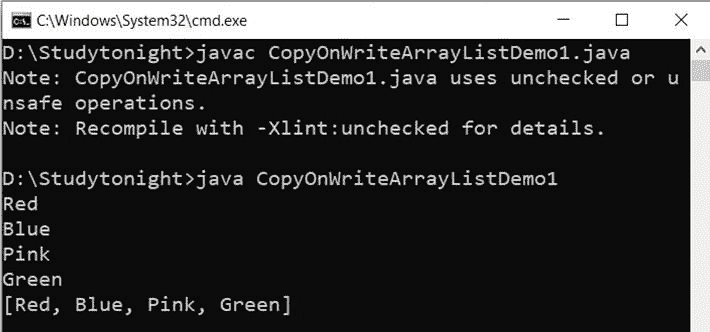

# Java `CopyOnWriteArrayList`

> 原文：<https://www.studytonight.com/java/copy-on-write-array-list.php>

* * *

在 Java 中，JDK 1.5 引入了 CopyOnWriteArrayList 类。这个类实现了列表接口。这是`ArrayList`的修改版本。这非常昂贵，因为每次执行更新时都会创建一个克隆拷贝。它是螺纹安全的。在此类中，无法执行删除操作，如果执行，将出现不支持操作异常错误。



* * *

#### **下面是 CopyOnWriteArrayListClass 的方法**

* * *

| 没有。 | 方法 | 描述 |
| one | 添加(英、法) | 它用于将元素添加到列表的末尾。 |
| Two | 加法(整数索引，E 元素) | 它用于在列表的指定位置添加元素。 |
| three | 加法(整数索引，集合 c) | 它用于在列表的指定位置的指定集合中添加元素。 |
| four | 清除() | 它用于从列表中移除所有元素。 |
| five | 等于(对象 0) | 它用于比较列表中另一个元素的元素。 |
| six | get(int 索引) | 它用于从列表中的指定位置获取元素。 |
| seven | hashCode() | 它用于从列表中获取哈希代码。 |
| eight | 索引（对象 o） | 它用于从列表中获取第一个元素。如果列表为空，则返回-1。 |
| nine | 迭代器() | 它返回列表中的所有元素。使用迭代器。 |
| Ten | lastIndexOf（Object o） | 它用于从列表中获取最后一个元素。如果列表为空，则返回-1。 |
| Eleven | 列表迭代器() | 它用于以适当的顺序获取迭代列表。 |
| Twelve | 移除(整数索引) | 它用于从列表中移除指定的元素。 |
| Thirteen | removeRange(intfromIndex，inttoIndex) | 它用于从指定范围中移除元素。 |
| Fourteen | 集合(整数索引，E 元素) | 它用于替换指定元素中的元素。 |
| Fifteen | subList（intfromIndex， inttoIndex） | 它用于获取指定范围内的元素。 |
| Sixteen | toaarray(t[]a) | 它用于以适当的顺序获取列表中的所有元素。 |
| Seventeen | toString() | 它用于获取列表的字符串表示形式 |

* * *

**示例:**

```java
	 import java.util.concurrent.CopyOnWriteArrayList; 
import java.util.*; 

class CopyOnWriteArrayListDemo1 extends Thread { 

    static CopyOnWriteArrayListobj = new CopyOnWriteArrayList(); 
    public void run() 
    { 
obj.add("Green"); 
    } 
    public static void main(String[] args) throws InterruptedException
    { 
obj.add("Red"); 
obj.add("Blue"); 
obj.add("Pink"); 

        CopyOnWriteArrayListDemo1 obj1 = new CopyOnWriteArrayListDemo1 (); 
obj1.run(); 
Thread.sleep(1000); 
        Iterator a = obj.iterator(); 
        while (a.hasNext()) 
	{ 
            String s = (String)a.next(); 
System.out.println(s); 
Thread.sleep(1000); 
        } 
System.out.println(obj); 
    } 
} 

```



* * *

* * *