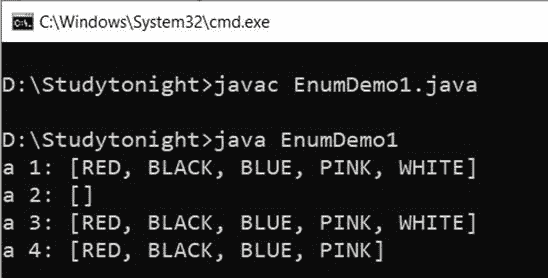

# `EnumSet`

> 原文：<https://www.studytonight.com/java/enum-set.php>

* * *

在 Java 中，EnumSet 扩展了抽象集，并在 Set 接口中实现。这个类是 Java 集合框架的成员，也不能同步。EnumDet 比 HashSet 快。

**语法:**

```java
	 public abstract class EnumSet<E extends Enum<E>> 

```

* * *

#### **下面是枚举类**的方法

* * *

| 没有。 | 方法 | 描述 |
| one | (e1)的枚举 | 它用于使用指定的元素创建`EnumSet`。 |
| Two | enumset complete of(enumset s) | 它用于使用唯一的指定元素创建`EnumSet`。 |
| three | enumsetallof(类元素类型) | 它用于使用类的所有元素创建`EnumSet`。 |
| four | 枚举范围(从，到) | 它用于获取给定范围的枚举元素。 |
| five | EnumSetcopyof() | 它用于将集合中的元素复制到新的`EnumSet`中。 |

* * *

**示例:**

```java
	 import java.util.EnumSet; 

enum Demo1
{ 
    RED, BLACK, BLUE, PINK, WHITE
}; 
public class EnumDemo1
{ 
    public static void main(String[] args)  
    { 
        EnumSet1<Demo1> a1, a2, a3, a4; 
        a1 = EnumSet1.of(Demo1.RED, Demo1.BLACK, Demo1.BLUE, Demo1.PINK, Demo1.WHITE); 
        a2 = EnumSet1.complementOf(a1); 
        a3 = EnumSet1.allOf(Demo1.class); 
        a4 = EnumSet1.range(Demo1.RED, Demo1.PINK); 
		System.out.println("a 1: " + a1); 
		System.out.println("a 2: " + a2); 
		System.out.println("a 3: " + a3); 
		System.out.println("a 4: " + a4); 
    } 
} 

```



* * *

* * *