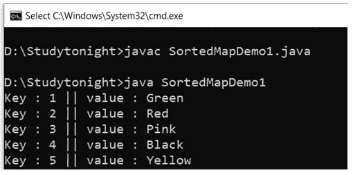

# Java `SortedMap`接口

> 原文：<https://www.studytonight.com/java/sorted-map-interface.php>

* * *

在 Java 中，SortedMap 是 Collection 框架的一个接口。SortedMap 扩展了 Map 接口，还提供了元素的排序。遍历排序后的元素变得更加容易。

* * *

#### **以下是 SortedMap 接口的方法。**

* * *

| 没有。 | 方法 | 描述 |
| one | 子密钥 | 它用于查看给定范围内的元素 |
| Two | 校长 | 它用于获取小于 toKey 的密钥。 |
| three | 大小映射(K fromKey) | 它用于获取大于或等于 fromKey 的密钥。 |
| four | firstKey() | 它用于获取最低键。 |
| five | lastKey() | 它用于获取最高密钥。 |
| six | 比较器() | 它用于获取映射中使用的比较器。 |
| seven | 值() | 它用于获取映射的值 |
| eight | 密钥集() | 它用于从映射中获取集合视图。 |
| nine | entrySet() | 它用于获取映射中包含的映射的集合视图。 |

* * *

**示例:**

```java
	 import java.util.Iterator; 
import java.util.Map; 
import java.util.Set; 
import java.util.SortedMap; 
import java.util.TreeMap; 

public class SortedMapDemo1
{ 
    public static void main(String[] args) 
    { 
SortedMap<Integer, String> a = new TreeMap<Integer, String>(); 
a.put(new Integer(2), "Red"); 
a.put(new Integer(3), "Pink"); 
a.put(new Integer(5), "Yellow"); 
a.put(new Integer(4), "Black"); 
a.put(new Integer(1), "Green"); 
        Set b = a.entrySet(); 
        Iterator i = b.iterator(); 
        while (i.hasNext()) 
        { 
Map.Entry c = (Map.Entry)i.next(); 
int key1 = (Integer)c.getKey(); 
            String value1 = (String)c.getValue(); 
System.out.println("Key : " + key1 + " || value : " + value1); 
        } 
    } 
} 

```



* * *

* * *