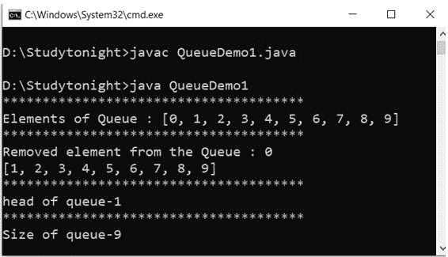

# `Queue`接口

> 原文：<https://www.studytonight.com/java/queue-interface.php>

* * *

在 Java 中，Queue 接口在 java.util 包下。队列扩展了集合接口。它用于保存集合中要处理的元素，还可以执行插入、删除等操作。在这个界面中，元素被插入到列表的末尾，并从列表的开头删除。它遵循**先进先出**的概念，即**先进先出**。要声明队列，需要一个具体的类，通常使用优先级队列和链接列表类。

* * *

#### **下面是 Queue 接口的方法。**

* * *

| 没有。 | 方法 | 描述 |
| one | 添加() | 它用于在队列中添加元素。 |
| Two | peek() | 它用来查看队列的头.. |
| three | 元素() | 用于检查队列是否为空。如果为空，它将抛出 NoSuchElementFound。 |
| four | 移除() | 它用于从队列头移除元素。 |
| five | 民意测验() | 它用于移除元素并返回队列头。 |
| six | 大小() | 它用于获取元素的大小。 |

* * *

**示例:**

```java
	 import java.util.LinkedList; 
import java.util.Queue; 

public class QueueDemo1 
{ 
  public static void main(String[] args) 
  { 
    Queue<Integer> a = new LinkedList<>(); 
    for (int i=0; i<10; i++) 
a.add(i); 
System.out.println("**************************************");
System.out.println("Elements of Queue : "+a); 
System.out.println("**************************************");
int b= a.remove(); 
System.out.println("Removed element from the Queue : " + b); 
System.out.println(a); 
System.out.println("**************************************");
int c = a.peek(); 
System.out.println("head of queue-" + c); 
System.out.println("**************************************");
int d= a.size(); 
System.out.println("Size of queue-" + d); 
  } 
} 

```



* * *

* * *