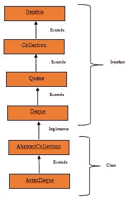
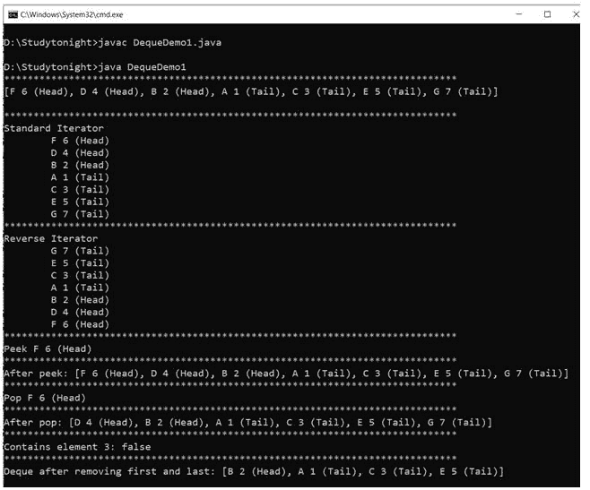

# `Deque`接口

> 原文：<https://www.studytonight.com/java/deque-interface.php>

* * *

在 Java 中，Deque 接口在 Java . util . Dequee 下，是 java.util.Queue 接口的一个子类型。Deque 是一个双端队列，这意味着可以从两端添加和删除元素。德格可以用作队列或堆栈，即**先进先出**或**后进先出。**

#### **下图是德客界面**的层次结构



#### **以下是德客界面**的方法

| 没有。 | 方法 | 描述 |
| one | 添加(元素) | 它用于在德格的尾部添加元素。 |
| Two | 添加第一个(元素) | 它用于在德格的头部添加元素。 |
| three | addLast（item） | 它用于在德格的尾部添加元素。 |
| four | 报价(要素) | 它用于在尾部添加一个元素，如果添加成功，将返回一个布尔值。 |
| five | offerFirst(元素) | 它用于在头部添加元素，如果添加成功，则返回布尔值。 |
| six | offerLast(元素) | 它用于在尾部添加一个元素，如果添加成功，将返回一个布尔值。 |
| seven | 迭代器() | 它是用来迭代的。 |
| eight | 下降畸胎() | 它用于在 deque 中以相反的顺序进行迭代。 |
| nine | 推动(元件) | 它用于在文件头添加元素。 |
| Ten | 流行元素 | 它是用来去除头部的元素。 |
| Eleven | removeFirst() | 它是用来去除头部的元素。 |
| Twelve | removeLast() | 它用于从 deque 的尾部移除元素 |
| Thirteen | 民意测验() | 它用于获取和移除 deque 中的第一个元素。如果 deque 为空，则返回 null。 |
| Fourteen | pollFirst() | 它用于获取和移除 deque 中的第一个元素。如果 deque 为空，则返回 null。 |
| Fifteen | pollLast() | 它用于获取和移除 deque 中的最后一个元素。如果 deque 为空，则返回 null。 |
| Sixteen | peek() | 它是用来去除鱼头的。 |
| Seventeen | peekFirst() | 它是用来去除鱼头的。 |
| Eighteen | 扫视最后（） | 它是用来去除尾巴的。 |

**示例:**

```java
	 import java.util.*; 

public class DequeDemo1 
{ 
    public static void main(String[] args) 
    { 
Deque<string>obj = new LinkedList<string>(); 

obj.add("A 1 (Tail)");
obj.addFirst("B 2 (Head)"); 
obj.addLast("C 3 (Tail)"); 
obj.push("D 4 (Head)"); 
obj.offer("E 5 (Tail)"); 
obj.offerFirst("F 6 (Head)"); 
obj.offerLast("G 7 (Tail)"); 
	System.out.println("*****************************************************************************");
System.out.println(obj + "\n");

	System.out.println("*****************************************************************************"); 
System.out.println("Standard Iterator"); 
        Iterator iterator = obj.iterator(); 
        while (iterator.hasNext()) 
System.out.println("\t" + iterator.next()); 

        Iterator reverse = obj.descendingIterator();

	System.out.println("*****************************************************************************"); 
System.out.println("Reverse Iterator"); 
        while (reverse.hasNext()) 
System.out.println("\t" + reverse.next()); 

	System.out.println("*****************************************************************************");
System.out.println("Peek " + obj.peek()); 

	System.out.println("*****************************************************************************");
System.out.println("After peek: " + obj); 

	System.out.println("*****************************************************************************");
System.out.println("Pop " + obj.pop()); 

	System.out.println("*****************************************************************************");
System.out.println("After pop: " + obj); 

	System.out.println("*****************************************************************************");
System.out.println("Contains element 3: " + obj.contains("Element 3 (Tail)")); 

obj.removeFirst(); 
obj.removeLast(); 

	System.out.println("*****************************************************************************");
System.out.println("Deque after removing " + "first and last: " + obj); 
    } 
}</string></string> 

```



* * *

* * *