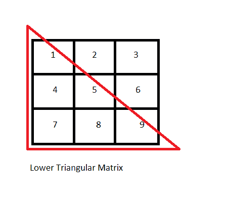

# Java 程序：显示下三角矩阵

> 原文：<https://www.studytonight.com/java-programs/java-program-to-display-lower-triangular-matrix>

在本教程中，我们将学习如何显示下三角矩阵。但是在继续之前，如果您不熟悉数组的概念，那么请务必查看 Java 中的文章[数组](https://www.studytonight.com/java/array.php)。

下面是同样的图示。



**输入:**输入矩阵元素:

1 2 3

4 5 6

7 8 9

**输出:**下三角矩阵为:

1 0 0

4 5 0

7 8 9

上述情况有两种情况:

情况 1:当值由用户定义时

情况 2:当值被预定义时

让我们分别看一下这些案例。

## 程序 1:显示下三角矩阵

在下面的程序中，我们将看到当值由用户定义时，如何显示下三角矩阵。

### 算法:

1.  开始
2.  声明变量来存储行数和列数。
3.  要求用户初始化行和列。
4.  检查行数和列数是否相等。
5.  如果不相等，则显示一条消息，说明行数和列数应该相等。
6.  如果相等，则声明一个矩阵。
7.  要求用户初始化矩阵元素。
8.  打印原始矩阵。
9.  调用一个方法来显示下三角矩阵。
10.  使用循环迭代元素。
11.  将 0 分配给行数小于列数的元素。
12.  打印结果矩阵。
13.  停下来。

下面是相同的代码。

```java
// Java Program to print the lower triangular matrix 
import java.util.*; 

public class Main 
{ 
    // Print the matrix 
    public static void printMatrix(int[][] arr) 
    { 
        int m = arr.length;   //For Rows
        int n = arr[0].length; //For columns
        for (int i = 0; i < m; i++) 
        { 
            for (int j = 0; j < n; j++) 
            {
                System.out.print(arr[i][j] + " "); 
            }    
            System.out.println(); 
        } 
    } 

    //Display the lower triangular matrix
    public static void lowerTriangularMatrix(int arr[][]) 
    { 
        int m = arr.length; 
        int n = arr[0].length; 

        if (m != n) 
        { 
            System.out.println("Matrix entered should be a Square Matrix");
            System.out.println("Try Again..");
            return; 
        } 
        else 
        { 
            // looping over the whole matrix 
            for (int i = 0; i < m; i++) 
            { 
                for (int j = 0; j < n; j++) 
                { 
                    if (i < j) 
                    { 
                        arr[i][j] = 0; 
                    } 
                } 
            } 

            System.out.println( "Lower Triangular Matrix is : "); 

            // printing the lower triangular matrix 
            printMatrix(arr); 
        } 
    } 
    public static void main(String[] args) 
    { 
        //Take input from the user
        Scanner sc=new Scanner(System.in);

        int m,n;     //Declare variables for rows and columns
        System.out.println("Enter the number of rows: ");
        m=sc.nextInt();

        System.out.println("Enter the number of columns: ");
        n=sc.nextInt();

        System.out.println("Enter the Matrix Elements: ");
        int arr[][] = new int[m][n];   //Declare the matrix
        for(int i=0;i<m;i++)
        {
            for(int j=0;j<n;j++)
            {
                arr[i][j]=sc.nextInt();   //Initialize the matrix
            }
        }
        //Print Original Matrix
        System.out.println( "Original Matrix is : "); 
        printMatrix(arr); 

        // calling to display the lower triangular matrix
        lowerTriangularMatrix(arr); 
    } 
}
```

输入行数:3
输入列数:3
输入矩阵元素:1 2 8 7 5 4 3 9
原始矩阵为:
1 2 8
7 6 5
4 3 9
下三角矩阵为:
1 0 0
7 6 0
4 3 9

## 程序 2:显示下三角矩阵

在下面的程序中，我们将看到如何显示预定义值时的下三角矩阵。

### 算法:

1.  开始
2.  声明变量来存储行数和列数。
3.  初始化行和列。
4.  检查行数和列数是否相等。
5.  如果不相等，则显示一条消息，说明行数和列数应该相等。
6.  如果相等，则声明一个矩阵。
7.  初始化矩阵元素。
8.  打印原始矩阵。
9.  调用一个方法来显示下三角矩阵。
10.  使用循环迭代元素。
11.  将 0 分配给行数小于列数的元素。
12.  打印结果矩阵。
13.  停下来。

下面是相同的代码。

```java
// Java Program to print the lower triangular matrix 
import java.io.*; 

public class Main 
{ 
    // Print the matrix 
    public static void printMatrix(int[][] arr) 
    { 
        int m = arr.length;   //For Rows
        int n = arr[0].length; //For columns
        for (int i = 0; i < m; i++) 
        { 
            for (int j = 0; j < n; j++) 
            {
                System.out.print(arr[i][j] + " "); 
            }    
            System.out.println(); 
        } 
    } 

    //Display the lower triangular matrix
    public static void lowerTriangularMatrix(int arr[][]) 
    { 
        int m = arr.length; 
        int n = arr[0].length; 

        if (m != n) 
        { 
            System.out.println("Matrix entered should be a Square Matrix");
            System.out.println("Try Again..");
            return; 
        } 
        else 
        { 
            // looping over the whole matrix 
            for (int i = 0; i < m; i++) 
            { 
                for (int j = 0; j < n; j++) 
                { 
                    if (i < j) 
                    { 
                        arr[i][j] = 0; 
                    } 
                } 
            } 

            System.out.println( "Lower Triangular Matrix is : "); 

            // printing the lower triangular matrix 
            printMatrix(arr); 
        } 
    } 
    public static void main(String[] args) 
    { 
        int arr[][] = { { 8, 7, 6 }, { 4, 2, 5 }, { 7, 9, 8 } }; 
        //Print Original Matrix
        System.out.println( "Original Matrix is : "); 
        printMatrix(arr); 

        // calling to display the lower triangular matrix
        lowerTriangularMatrix(arr); 
    } 
}
```

原始矩阵为:
8 7 6
4 2 5
7 9 8
下三角矩阵为:
8 0 0
4 2 0
7 9 8

* * *

* * *