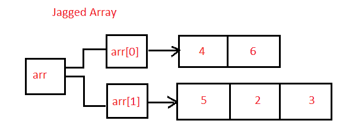

# 创建包含两个数组的交错数组的 Java 程序

> 原文：<https://www.studytonight.com/java-programs/java-program-to-create-a-jagged-array-that-contains-two-arrays>

在本教程中，我们将学习如何创建包含两个数组的交错数组。交错数组被定义为一个数组，其中该数组的每个元素本身就是一个数组。但是在继续之前，如果您不熟悉数组的概念，那么请务必查看 Java 中的文章[数组](https://www.studytonight.com/java/array.php)。



**输入:**

输入交错数组的行数:2

输入每行的列数:3 4

输入元素:1 2 3 4 5 6 7

**输出:**

数组的元素:

1 2 3

4 5 6 7

## 程序 1:创建交错数组

在这个方法中，我们将看到如何创建一个交错数组，该数组包含两个带有预定义输入的 1D 数组。

### 算法:

1.  开始
2.  声明数组的大小。
3.  初始化交错数组的行数。
4.  现在，初始化交错数组的数组。
5.  首先，声明第一行的列数。
6.  现在，声明第二行的列数。
7.  为要打印的元素声明一个变量，并将其初始化为零。
8.  开始初始化数组元素。
9.  对同一个循环使用两个。
10.  使用第一个 for 循环遍历行。
11.  使用第二个 for 循环遍历列。
12.  现在，通过增加 count 元素来初始化元素。
13.  现在，使用两个 for 循环显示 2D 交错数组的值。
14.  停止

下面是相同的代码。

下面的程序演示了如何创建包含两个预定义输入数组的交错数组

```java
/*Java Program to to create a jagged array which contains two 1D array*/

public class Main 
{
    public static void main(String[] args)
    {
        // Declaring 2-D array with 2 rows
        int arr[][] = new int[2][];

        // Initializing the arrays of jagged arrays

        // First row has 4 columns
        arr[0] = new int[4];

        // Second row has 5 columns
        arr[1] = new int[5];

        // Initializing array
        int count = 0;
        for (int i = 0; i < arr.length; i++)   //For Rows
        {
            for (int j = 0; j < arr[i].length; j++)   //For Columns
            {
                arr[i][j] = count++;
            }
        }

        // Displaying the values of 2D Jagged array
        System.out.println("Elements of 2D Jagged Array");
        for (int i = 0; i < arr.length; i++) 
        {
            for (int j = 0; j < arr[i].length; j++) 
            {
                System.out.print(arr[i][j] + " ");
            }
            System.out.println();
        }
    }
}
```

2D 锯齿状阵列的元素
0 1 2 3
4 5 6 7 8

## 程序 2:创建交错数组

在这个方法中，我们将看到如何创建一个交错数组，该数组包含两个带有用户定义输入的 1D 数组。

### 算法

1.  开始
2.  声明数组的大小。
3.  要求用户初始化交错数组的行数。
4.  要求用户为交错数组初始化每行的列数。
5.  对相同的使用 for 循环。
6.  开始初始化数组元素。
7.  对同一个循环使用两个。
8.  使用第一个 for 循环遍历行。
9.  使用第二个 for 循环遍历列。
10.  现在，通过增加 count 元素来初始化元素。
11.  现在，使用两个 for 循环显示 2D 交错数组的值。
12.  停止

下面是相同的代码。

下面的程序演示了如何创建包含两个用户定义输入的 1D 数组的交错数组。

```java
/*Java Program to to create a jagged array which contains two 1D array*/
import java.util.*;

public class Main 
{
    public static void main(String[] args)
    {
        //Taking Input from the user
        Scanner sc=new Scanner(System.in);

        //Declare number of rows for jagged array
        int m;
        System.out.println("Enter the number of rows for jagged arrays");
        m=sc.nextInt();     //Initialize the number of rows for jagged array

        // Declaring 2-D array with m rows
        int arr[][] = new int[m][];

        //Initializing the columns for each rows of jagged array
        System.out.println("Enter the number of columns for each rows of jagged arrays");
        for(int i=0;i<m;i++)
        {
            arr[i]=new int[sc.nextInt()];
        }

        // Initializing array
        System.out.println("Enter the elements");
        for (int i = 0; i < arr.length; i++)   //For Rows
        {
            for (int j = 0; j < arr[i].length; j++)   //For Columns
            {
                arr[i][j] = sc.nextInt();
            }
        }

        // Displaying the values of 2D Jagged array
        System.out.println("Elements of 2D Jagged Array");
        for (int i = 0; i < arr.length; i++)     //For Rows
        {
            for (int j = 0; j < arr[i].length; j++)    //For Columns
            {
                System.out.print(arr[i][j] + " ");
            }
            System.out.println();
        }
    }
}
```

输入交错数组的行数 2
输入交错数组每一行的列数 3 4
输入元素 1 2 3 4 5 6 7
2D 交错数组的元素
1 2 3
4 5 6 7

* * *

* * *