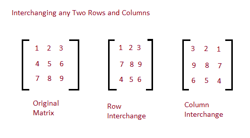

# Java 程序：交换给定矩阵中任意两行和列

> 原文：<https://www.studytonight.com/java-programs/java-program-to-interchange-any-two-rows-and-columns-in-the-given-matrix>

在本教程中，我们将学习如何交换给定矩阵中的任意两行和列。但是在继续之前，如果您不熟悉数组的概念，那么请务必查看 Java 中的文章[数组](https://www.studytonight.com/java/array.php)。

下面是给定矩阵中任意两行和列互换的图示。



**输入:**进入矩阵:

1 2 3

4 5 6

7 8 9

**输出:**交换行后:2 和 3

1 2 3

7 8 9

4 5 6

交换柱后:1 和 3

3 2 1

9 8 7

6 5 4

## 程序 1:交换任意两行和列

在这个程序中，我们将看到当值是用户定义的时，如何交换给定矩阵中的任意两行和列。

### 算法

1.  开始
2.  为行和列的大小声明变量。
3.  要求用户初始化行数和列数。
4.  声明一个具有该大小的矩阵。
5.  请用户初始化矩阵。
6.  打印原始矩阵。
7.  使用 while 循环检查用户是否希望交换行或列，或者不交换。
8.  使用循环分别交换行和列。
9.  询问用户他/她想要交换哪两行或哪列。
10.  基于此交换行或列元素。
11.  显示结果。
12.  停止

下面是相同的代码。

```java
/*Java Program to interchange any two rows and columns in the given matrix*/
import java.util.Scanner;
public class Main 
{
    public static void main(String[] args) 
    {
        int m,n;   //Declare the variables for rows and columns

        //Take input from the user
        Scanner sc = new Scanner(System.in);

        System.out.print("Enter number of rows in matrix:");
        m = sc.nextInt();  //Initialize the number of rows

        System.out.print("Enter number of columns in matrix:");
        n = sc.nextInt();  //Initialize the number of columns

        int arr[][] = new int[m][n];  //Declare a Matrix
        System.out.println("Enter all the elements of matrix:");
        for (int i = 0; i < m; i++) 
        {
            for (int j = 0; j < n; j++) 
            {
                arr[i][j] = sc.nextInt();
            }
        }

       //Print the original matrix
        System.out.println("The Original Matrix:");
        for (int i = 0; i < m; i++) 
        {
            for (int j = 0; j < n; j++) 
            {
                System.out.print(arr[i][j] + " ");
            }
            System.out.println("");
        }

        //Check whether user want to interchange rows or columns
        while (true) 
        {
            System.out.println("Enter 1 to interchange rows");
            System.out.println("Enter 2 to interchange columns");
            System.out.println("Enter 3 to Exit");
            int n1=sc.nextInt();
            switch (n1) 
            {
                case 1:
                //Enter the rows whose datas you want to interchange 
                System.out.println("Enter the row numbers:");
                int x = sc.nextInt();   
                int y = sc.nextInt();
                int temp=0;
                for(int i = 0; i < m; i++)
                {
                    temp = arr[(x-1)][i];
                    arr[x-1][i] = arr[y-1][i];
                    arr[y-1][i] = temp;
                }
                //Print the matrix after interchanging elements
                System.out.println("Matrix after interchanging rows:"+x +" and "+y);
                for (int i = 0; i < m; i++) 
                {
                    for (int j = 0; j < n; j++) 
                    {
                        System.out.print(arr[i][j] + " ");
                    }
                System.out.println("");
                }
                break;
                case 2:
                //Enter the columns whose datas you want to interchange 
                System.out.println("Enter the column numbers:");
                int p = sc.nextInt();
                int q = sc.nextInt();
                int temp1=0;
                for(int i = 0; i < p; i++)
                {
                    temp1 = arr[i][(p-1)];
                    arr[i][p-1] = arr[i][(q-1)];
                    arr[i][q-1] = temp1;
                }
                //Print the matrix after interchanging elements
                System.out.println("Matrix after interchanging columns:"+p +" and "+q);
                for (int i = 0; i < m; i++) 
                {
                    for (int j = 0; j < n; j++) 
                    {
                        System.out.print(arr[i][j] + " ");
                    }
                System.out.println("");
                }
                break;
          	case 3:
                //Exit from the program
                System.exit(0);
            }
        }
    }
}
```

输入矩阵行数:3
输入矩数组数:3
输入矩阵所有元素:1 2 3 4 5 6 7 8 9
原矩阵:
1 2 3
4 5 6
7 8 9
输入 1 互换行
输入 2 互换列
输入 3 退出
1
互换行后输入行号:3 2
矩阵:3 和 2
1 2 3
7 8 9
4 5 6
输入 1 互换行
输入 2 互换列
输入 3 退出
2
互换列后输入列号:1 3
矩阵:1 和 3
3 2 1
7 8 9
4 5 6
输入 1 互换行
输入 2 互换列
输入 3 退出
3

## 程序 2:交换任意两行和列

在这个程序中，我们将看到当值被预定义时，如何交换给定矩阵中的任意两行和列。

### 算法

1.  开始
2.  声明并初始化矩阵。
3.  打印原始矩阵。
4.  输入要互换的列。
5.  调用方法来交换列。
6.  交换数字以交换列。
7.  交换列后打印矩阵。
8.  现在，调用一个方法来交换行。
9.  交换数字以交换行。
10.  交换行后打印矩阵。
11.  停下来。

下面是相同的代码。

```java
/*Java Program to interchange any two rows and columns*/
import java.io.*; 

public class Main 
{
    //To Print the arr
    public static void printMatrix(int[][] arr) 
    { 
        for (int i = 0; i < arr.length; i++) { 
            for (int j = 0; j < arr[0].length; j++) 
                System.out.print(arr[i][j] + " "); 
            System.out.println(); 
        } 
    } 

    //To Interchange Columns  
    public static void interchangeColumns(int[][] arr, 
                                             int K, int L) 
    { 
        for (int i = 0; i < arr.length; i++) { 

            // Swap two numbers 
            int temp = arr[i][K - 1]; 
            arr[i][K - 1] = arr[i][L - 1]; 
            arr[i][L - 1] = temp; 
        } 
        System.out.println("After Interchanging Column "+ K + " and "+ L+ " :");
        // Print arr 
        printMatrix(arr); 
    } 

    //To Interchange Rows  
    public static void interchangeRows(int[][] arr, int x, int y) 
    { 
        for (int i = 0; i < arr[0].length; i++) { 

            // Swap two numbers 
            int temp = arr[x - 1][i]; 
            arr[x - 1][i] = arr[y - 1][i]; 
            arr[y - 1][i] = temp; 
        } 
        System.out.println("After Interchanging Row "+ x + " and "+ y + " :");
        // Print arr 
        printMatrix(arr); 
    } 

    // Driver code 
    public static void main(String args[]) throws IOException 
    { 
        int arr[][] 
            = { { 2, 9, 8 }, { 7, 6, 4 }, { 3, 9, 2 } };  //Matrix Declaration and Initialization

        //Print Original arr    
        System.out.println("Original arr: ");
        printMatrix(arr); 

        // calling to exchange Columns
        int K = 1, L = 2; 
        interchangeColumns(arr, K, L); 

        // calling to exchange Rows
         int K1 = 1, L1 = 2; 
        interchangeRows(arr, K1, L1); 

    } 
} 
```

第 1 列和第 2 列互换后
9 2 8
6 7 4
7 6 4
3 9 2
第 1 列和第 2 列互换后:
9 2 8
6 7 4
9 3 2
第 1 排和第 2 排互换后:
6 7 4
9 2 8
9 3 2

* * *

* * *