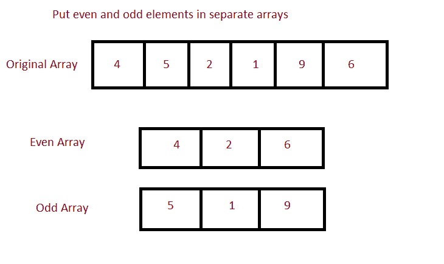

# Java 程序：将一个数组的偶数和奇数元素放入两个独立的数组中

> 原文：<https://www.studytonight.com/java-programs/java-program-to-put-even-and-odd-elements-of-an-array-in-two-separate-arrays>

在本教程中，我们将学习如何将偶数和奇数元素放在两个独立的数组中。最简单的方法是首先通过分别计算数组中偶数和奇数项的数量来检查两个数组的索引，然后将这些元素粘贴到新形成的数组中。但是在继续之前，如果您不熟悉数组的概念，那么请务必查看 Java 中的文章[数组](https://www.studytonight.com/java/array.php)。



**输入:**输入数组元素:7 6 9 2 4 1 3 6 9 8

**输出:**

偶数数组:6 2 4 6 8

奇数数组:7 9 1 3 9

## 程序 1:把偶数和奇数柠檬放在两个独立的数组中

在这种方法中，我们将直接将数组的偶数和奇数元素放在主方法本身的两个独立数组中。

### 算法

1.开始

2.声明一个数组。

3.初始化数组。

4.声明两个变量来存储偶数组和奇数组的大小，并将其初始化为零。

5.计算偶数和奇数元素的总数，并将其分配给数组大小。

6.声明两个新数组来存储偶数和奇数元素。

7.使用 for 循环迭代所有元素

8.如果元素是偶数，则将其存储在第一个数组中，如果元素是奇数，则将其存储在第二个数组中。

9.显示两个数组。

10.停下来。

下面是相同的代码。

## 程序 2:将偶数和奇数元素放入两个独立数组的示例

下面的程序演示了如何将偶数和奇数元素直接放在两个独立的数组中。首先，声明一个数组，然后初始化。然后计算偶数和奇数元素的数量。声明两个具有这些大小的新数组，并将偶数和奇数元素复制到这些数组中。最后，打印这两个独立的数组。

```java
/*Java Program to put the even and odd elements in two separate array*/
import java.util.Scanner;

public class findElement
{
     public static void main(String []args)
     {
         Scanner sc=new Scanner(System.in);
         int n;     //Declare array size
         System.out.println("Enter the size of the array");
         n=sc.nextInt();   //Initialize array size

         int arr[]=new int[n];   //Declare array 
        System.out.println("Enter the array");  
        for(int i=0;i<n;i++)     //Initialize array
        {
            arr[i]=sc.nextInt();
        }

        int m=0,n1=0;    //Declare the size of the array for even and odd elements
        for(int i=0;i<n;i++)   
        {
            if(arr[i]%2==0)
             m++;    //Increment even array size
             else 
             n1++;   //Increment odd array size
        }
        int even[]=new int[m];    //Declare an even array
        int odd[]=new int[n1];   //Declare an odd array

        int k=0,t=0;
        for(int i=0;i<n;i++)
        {
            if(arr[i]%2==0)
            {
              even[k]=arr[i];   //Initialize elements of even array
              k++;
            }
            else
            {
                odd[t]=arr[i];  //Initialize elements of odd array
                t++;
            }
        }

        System.out.println("The array with even elements...");
        for(int i=0;i<m;i++)
        {
            System.out.print(even[i]+" ");   //Print Even Array
        }
        System.out.println("");
        System.out.println("The array with odd elements...");
        for(int i=0;i<n1;i++)
        {
            System.out.print(odd[i]+" ");    //Print Odd Array
        }

    }
}
```

输入数组 10 的大小
输入数组 87 6 7 5 4 3 4 32 12 1
偶数元素的数组...
6 4 32 12
奇数元素的数组...
87 7 5 3 1

## 程序 2:把偶数和奇数柠檬放在两个独立的数组中

在这种方法中，我们将使用一种方法将数组的偶数和奇数元素放在两个独立的数组中，并使用另一种方法打印这些元素。

### 算法

1.  开始
2.  声明一个数组。
3.  初始化数组。
4.  调用一个方法，将数组的偶数和奇数元素放在两个独立的数组中。
5.  在其中声明两个变量来存储偶数和奇数数组的大小，并将它们初始化为零。
6.  计算偶数和奇数元素的总数，并将其分配给数组大小。
7.  声明两个新数组来存储偶数和奇数元素。
8.  使用 for 循环迭代所有元素
9.  如果元素是偶数，则将其存储在第一个数组中，如果元素是奇数，则将其存储在第二个数组中。
10.  调用另一个方法来打印这两个数组。
11.  停止

下面是相同的代码。

下面的程序演示了如何使用不同的方法将偶数和奇数元素放在两个独立的数组中。首先，声明一个数组，然后初始化。然后调用一个方法，计算偶数和奇数元素的数量。声明两个具有这些大小的新数组，并将偶数和奇数元素复制到这些数组中。然后调用另一个方法来打印这些数组。

```java
/*Java Program to put the even and odd elements in two separate arrays*/

import java.util.Scanner;

public class findElement
{
    //Method to print the even and odd array
    static void printArray(int even[], int m, int odd[],int n1)
    {
        System.out.println("The array with even elements...");
        for(int i=0;i<m;i++)
        {
            System.out.print(even[i]+" ");   //Print Even Array
        }
        System.out.println("");
        System.out.println("The array with odd elements...");
        for(int i=0;i<n1;i++)
        {
            System.out.print(odd[i]+" ");    //Print Odd Array
        }

    }

    //Method to put even and odd elements in different arrays
    static void separate(int arr[],int n)    
    {
         int m=0,n1=0;    //Declare the size of the array for even and odd elements
         for(int i=0;i<n;i++)   
         {
            if(arr[i]%2==0)
             m++;    //Increment even array size
             else 
             n1++;   //Increment odd array size
         }
        int even[]=new int[m];    //Declare an even array
        int odd[]=new int[n1];   //Declare an odd array

        int k=0,t=0;
        for(int i=0;i<n;i++)
        {
            if(arr[i]%2==0)
            {
              even[k]=arr[i];   //Initialize elements of even array
              k++;
            }
            else
            {
                odd[t]=arr[i];  //Initialize elements of odd array
                t++;
            }
        }
        printArray(even,m,odd,n1);
    }

     //Driver Method
     public static void main(String []args)
     {
         Scanner sc=new Scanner(System.in);
         int n;     //Declare array size
         System.out.println("Enter the size of the array");
         n=sc.nextInt();   //Initialize array size

         int arr[]=new int[n];   //Declare array 
        System.out.println("Enter the array");  
        for(int i=0;i<n;i++)     //Initialize array
        {
            arr[i]=sc.nextInt();
        }

        separate(arr,n);

    }
}
```

输入数组的大小 10
输入数组 78 65 43 45 3 21 78 88 24 12
偶数元素的数组...
78 78 88 24 12
奇元阵...
65 43 45 3 21

* * *

* * *