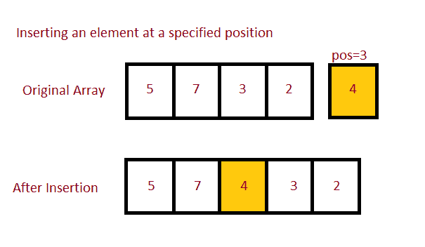

# Java 程序：在数组的指定位置插入一个元素

> 原文：<https://www.studytonight.com/java-programs/java-program-to-insert-an-element-at-specified-position-in-an-array>

在本教程中，我们将学习如何将元素添加到数组中的给定位置。最简单的方法是移动元素，然后在特定位置插入元素。但是在继续之前，如果您不熟悉数组的概念，那么请务必查看 Java 中的文章[数组](https://www.studytonight.com/java/array.php)。



**输入:**

原始数组:5 7 2 3 1 5 6 8

要素:55

职位:2

**产量:**5 7 55 2 3 5 6 8

## 程序 1:在数组的给定位置添加一个元素

在这种方法中，我们将使用循环在特定位置插入元素。

### 算法

1.  开始
2.  声明数组
3.  初始化数组。
4.  声明要插入的元素和插入位置。
5.  声明一个大小为+1 的新数组。
6.  使用 for 循环遍历每个元素。
7.  首先将所有元素插入到该位置。
8.  然后，在特定位置插入元素。
9.  插入其余的元素。
10.  返回新数组。
11.  打印更新后的数组。
12.  停下来。

下面是相同的代码。

下面的程序演示了如何使用循环在数组的特定位置添加元素。

```java
/*Java Program to add an element in an Array at a specific position*/

import java.util.Arrays; 
import java.util.Scanner;

public class Main
{
    //Method to add an element in the given specific position
    public static int[] addElement(int n, int arr[], int ele, int pos) 
    { 
        int i; 

        // create a new array of size n+1 
        int newarr[] = new int[n + 1]; 

        // insert the elements from the old array into the new array 

        for (i = 0; i < n + 1; i++) 
        { 
            if (i < pos - 1) 
                newarr[i] = arr[i];  // insert all elements till position 
            else if (i == pos - 1) 
                newarr[i] = ele;        // then insert element at specific position 
            else
                newarr[i] = arr[i - 1]; // then insert rest of the elements
        } 
        return newarr; 
    } 

    //Driver Method
    public static void main(String[] args)
    {
        Scanner sc=new Scanner(System.in);

        int n;    //Array Size Declaration
        System.out.println("Enter the number of elements :");
        n=sc.nextInt();    //Array Size Initialization

        int arr[]=new int[n];    //Array Declaration
        System.out.println("Enter the elements of the array :");
        for(int i=0;i<n;i++)     //Array Initialization
        {
            arr[i]=sc.nextInt();
        }
        System.out.println("Enter the elements you want to insert :");
        int ele = sc.nextInt(); 

        // Position to insert 
        System.out.println("Enter the position where you want to insert :");
        int pos = sc.nextInt(); 

        arr = addElement(n, arr, ele, pos); 

        // print the updated array 
        System.out.println("\nArray with " + ele  + " inserted at position " + pos + ":\n" + Arrays.toString(arr)); 

    }
} 
```

输入元素个数:10
输入数组元素:8 7 6 9 5 3 4 1 2 9
输入要插入的元素:22
输入要插入的位置:2

在位置 2 插入 22 的数组:
【8，22，7，6，9，5，3，4，1，2，9】

## 程序 2:在数组的给定位置添加一个元素

在这种方法中，我们将数组转换为`ArrayList`，以便在特定位置插入元素。

### 算法

1.  开始
2.  声明数组
3.  初始化数组。
4.  声明要插入的元素和插入位置。
5.  声明将插入元素的单独方法。
6.  将数组转换为`ArrayList`。
7.  在该位置添加元素。
8.  将列表转换回数组。
9.  现在，打印原始数组。
10.  显示更新的数组。
11.  停下来。

下面是相同的代码。

下面的程序演示了如何使用`ArrayList`在数组的特定位置添加元素。

```java
/*Java Program to add an element in an Array at a specific position*/

import java.util.ArrayList; 
import java.util.Arrays; 
import java.util.List;
import java.util.Scanner;
import java.util.Collections;

public class Main
{
    //Method to add an element in the given specific position
    private static void addElement(Integer[] arr, int element, int position) 
    { 
        // Coverting array to ArrayList 
        List<Integer> list = new ArrayList<>(Arrays.asList(arr)); 

        // Adding the element at position 
        list.add(position - 1, element); 

        // Converting the list back to array 
        arr = list.toArray(arr); 

        // Printing the original array 
        System.out.println("Initial Array:\n" + Arrays.toString(arr)); 

        // Printing the updated array 
        System.out.println("\nArray with " + element + " inserted at position "+ position + ":\n" + Arrays.toString(arr)); 
    } 

    //Driver Method
    public static void main(String[] args)
    {
        Scanner sc=new Scanner(System.in);

        int n;    //Array Size Declaration
        System.out.println("Enter the number of elements :");
        n=sc.nextInt();    //Array Size Initialization

        Integer arr[]=new Integer[n];    //Array Declaration
        System.out.println("Enter the elements of the array :");
        for(int i=0;i<n;i++)     //Array Initialization
        {
            arr[i]=sc.nextInt();
        }
        System.out.println("Enter the elements you want to insert :");
        int ele = sc.nextInt(); 

        // Position to insert 
        System.out.println("Enter the position where you want to insert :");
        int pos = sc.nextInt(); 

        // Calling the function to insert 
        addElement(arr, ele, pos); 

    }
} 
```

输入元素个数:
10
输入数组元素:
4 5 3 6 8 9 1 2 7 6
输入要插入的元素:
21
输入要插入的位置:
2
初始数组:
【4，5，3，6，8，9，1，2，7，6】

在位置 2 插入 21 的数组:
【4，21

* * *

* * *