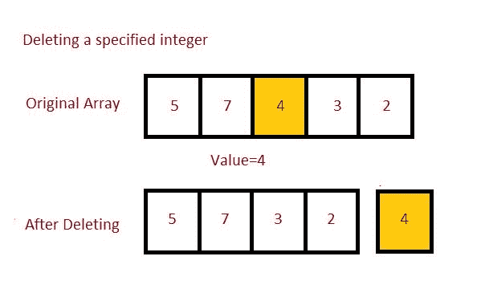

# Java 程序：从数组中删除指定整数

> 原文：<https://www.studytonight.com/java-programs/java-programt-to-delete-the-specified-integer-from-an-array>

在本教程中，我们将学习如何从数组中删除特定元素。移除数组中元素的最简单方法是将元素从我们要移除元素的位置向左移动一个索引。但是在继续之前，如果您不熟悉数组的概念，那么请务必查看 Java 中的文章[数组](https://www.studytonight.com/java/array.php)。



**输入:** 5 9 8 3 2 6 7

**输出:**待删除元素:8

数组:5 9 3 2 6 7

## 程序 1:如何从数组中删除特定元素

在这种方法中，我们将遍历所有元素，并将元素向左移动 1 个索引，只要找到要删除的元素。

### 算法

1.  开始
2.  声明数组
3.  初始化数组。
4.  声明要删除的元素。
5.  使用 for 循环迭代数组的所有元素。
6.  如果找到该元素，则开始将该索引后的元素向左移动一个元素。
7.  现在，打印更新后的数组。
8.  停止

下面是相同的代码。

下面的程序演示了如何通过遍历所有元素从数组中删除特定元素。

```java
/*Java Program to delete an element from an Array*/
import java.util.Arrays;
import java.util.Scanner;

public class Main
{
    public static void main(String[] args)
    {
        Scanner sc=new Scanner(System.in);
        int n;    //Array Size Declaration
        System.out.println("Enter the number of elements :");
        n=sc.nextInt();    //Array Size Initialization

        Integer arr[]=new Integer[n];    //Array Declaration
        System.out.println("Enter the elements of the array :");
        for(int i=0;i<n;i++)     //Array Initialization
        {
            arr[i]=sc.nextInt();
        }
        System.out.println("Enter the element you want to remove ");
        int elem = sc.nextInt();

    for(int i = 0; i < arr.length; i++)
    {
      if(arr[i] == elem)   //If element found
      {
        // shifting elements
        for(int j = i; j < arr.length - 1; j++)
        {
            arr[j] = arr[j+1];
        }
        break;
      }
    }

       System.out.println("Elements after deletion " );
       for(int i = 0; i < arr.length-1; i++)
       {
             System.out.print(arr[i]+ " ");
       }  
    }
} 
```

输入元素个数:10
输入数组元素:
1 2 3 4 5 6 7 8 9 10
输入要删除的元素
5
删除后的元素
1 2 3 4 6 7 8 9 10

## 程序 2:如何从数组中删除特定元素

在这种方法中，我们将使用集合 API 从数组中移除元素。首先，我们将一个数组转换成一个`ArrayList`，然后删除特定的元素。移除元素后，我们将把`ArrayList`转换回数组。

### 算法

1.  开始
2.  声明数组
3.  初始化数组。
4.  声明要删除的元素。
5.  使用 for 循环迭代数组的所有元素。
6.  如果找到该元素，则调用一个单独的方法来删除该元素。
7.  将数组转换为`ArrayList`。
8.  现在，移除元素。
9.  将其转换回数组。
10.  现在，打印更新后的数组。
11.  停下来。

下面是相同的代码。

下面的程序演示了如何使用 Java 语言提供的集合 API 从数组中删除特定的元素。

```java
/*Java Program to delete an element in an Array*/
import java.util.ArrayList;
import java.util.Arrays;
import java.util.List;
import java.util.Scanner;

public class RemoveElement 
{
  public static void main(String[] args) 
  {
    Scanner in = new Scanner(System.in);

          int n;                               // Array Size Declaration
         System.out.println("Enter the number of elements :");
          n=in.nextInt();                // Array Size Initialization

        Integer arr[]=new Integer[n];    // Array Declaration
        System.out.println("Enter the elements of the array :");
        for(int i=0;i<n;i++)                   // Array Initialization
        {
            arr[i]=in.nextInt();
        }

    System.out.print("Enter Element to be deleted : ");
    int elem = in.nextInt();          //Initializing Element

    System.out.println("Original Array " + Arrays.toString(arr));        
    for(int i = 0; i < arr.length; i++)
    {
      if(arr[i] == elem)
      {
               arr = removeElementUsingCollection(arr, i);
               break;
      }
    }
    System.out.println("Array after removal of Element -- " );
    for(int i = 0; i < arr.length; i++)
    {
           System.out.print(" " + arr[i]);
    }

  }  

    static Integer[] removeElementUsingCollection( Integer[] arr, int index )
    {
      List<Integer> tempList = new ArrayList<Integer>(Arrays.asList(arr));
      tempList.remove(index);
      return tempList.toArray(new Integer[0]);
    }
} 
```

输入元素个数:10
输入数组元素:
1 2 3 4 5 6 7 8 9 10
输入要删除的元素:8
原数组
【1，2，3，4，5，6，7，8，9，10】
删除元素后的数组-
1 2 3 5 6 7 9 10

* * *

* * *