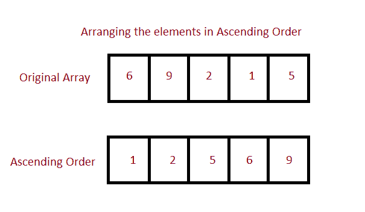

# 按升序排列数组的 Java 程序

> 原文：<https://www.studytonight.com/java-programs/java-program-to-sort-an-array-in-ascending-order>

在本教程中，我们将学习如何按升序对数组元素进行排序。排序是指按字母顺序或数字顺序排列数据。但是在继续之前，如果您不熟悉数组的概念，那么请务必查看 Java 中的文章[数组](https://www.studytonight.com/java/array.php)。



**输入:**输入数组元素:5 4 6 7 8 2 3 1 9

**输出:**按升序排列的数组:1 2 3 4 5 6 7 8 9

方法 1:使用循环

方法 2:使用数组。排序()

让我们分别看看这些方法。

## 程序 1:按升序排列数组的元素

在这种方法中，我们将看到如何使用循环以升序对数组进行排序。我们可以使用手动排序对数组进行排序，就像使用 for 循环一样。我们可以做的是使用两个 for 循环，一个从开始遍历数组，另一个 for 循环在外部遍历下一个元素。在正文中，我们可以比较相邻的元素，如果它们没有按顺序排列，就可以交换。我们也可以使用一个临时变量来交换元素。

### 算法

1.  开始
2.  声明数组
3.  要求用户初始化数组
4.  声明一个临时变量来存储交换时的元素。
5.  对同一个循环使用两个。
6.  使用第一个 for 循环来保存元素并遍历所有元素。
7.  使用第二个 for 循环与其余元素进行比较。
8.  通过比较和交换对元素进行排序。
9.  显示更新的数组。
10.  停止

下面是相同的代码。

下面的程序演示了如何使用循环对数组进行升序排序。

```java
/*Java Program to Sort an Array in Ascending Order*/
import java.util.Arrays;
import java.util.Scanner;
import java.util.Collections;

public class Main
{
    public static void main(String[] args)
    {
        Scanner sc=new Scanner(System.in);
        int n;    //Array Size Declaration
        System.out.println("Enter the number of elements :");
        n=sc.nextInt();    //Array Size Initialization

        Integer arr[]=new Integer[n];    //Array Declaration
        System.out.println("Enter the elements of the array :");
        for(int i=0;i<n;i++)     //Array Initialization
        {
            arr[i]=sc.nextInt();
        }

        int temp = 0;    //Temporary variable to store the element

         for (int i = 0; i < arr.length; i++)   //Holds each Array element
         {     
            for (int j = i+1; j < arr.length; j++)    //compares with remaining Array elements
            {     
               if(arr[i] > arr[j]) //Compare and swap
               {    
                   temp = arr[i];    
                   arr[i] = arr[j];    
                   arr[j] = temp;    
               }     
            }     
        }    

        System.out.println();    

        //Displaying elements of array after sorting    
        System.out.println("Elements of array sorted in ascending order: ");    
        for (int i = 0; i < arr.length; i++) 
        {     
            System.out.print(arr[i] + " ");    
        }    
    }
} 
```

输入元素个数:10
输入数组元素:
6 7 8 4 3 5 1 8 9 7
数组元素按升序排序:
1 3 4 5 6 7 8 8 9

## 程序 2:按升序排列数组的元素

在这种方法中，我们将看到如何使用 Arrays.sort()以升序对数组进行排序。“java.util”包的 Arrays 类提供了排序方法，该方法以数组作为参数，并对数组进行排序。这是一种直接排序方法，只需调用一次方法，就可以按升序对数组进行排序。

### 算法:

1.  开始
2.  声明数组
3.  要求用户初始化数组
4.  使用 Arrays.sort()以升序对元素进行排序。
5.  打印更新后的数组。
6.  停止

下面是相同的代码。

下面的程序演示了如何使用 Arrays.sort()按升序对数组进行排序。

```java
/*Java Program to Sort an Array in Ascending Order*/

import java.util.Arrays;
import java.util.Scanner;

public class AscendingOrder
{
    public static void main(String[] args)
    {
        Scanner sc=new Scanner(System.in);
        int n;    //Array Size Declaration
        System.out.println("Enter the number of elements :");
        n=sc.nextInt();    //Array Size Initialization

        int arr[]=new int[n];    //Array Declaration
        System.out.println("Enter the elements of the array :");
        for(int i=0;i<n;i++)     //Array Initialization
        {
            arr[i]=sc.nextInt();
        }

        Arrays.sort(arr);    //Sorts the Array in Ascending Order

        System.out.printf("Sorted arr[] : %s",
                          Arrays.toString(arr));   //Prints the sorted Array
    }
} 
```

输入元素个数:10
输入数组元素:1 4 2 5 6 8 2 3 9 8
排序 arr[] : [1，2，2，3，4，5，6，8，8，9]

* * *

* * *