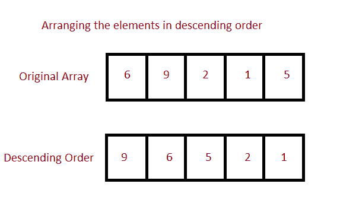

# Java 程序：按降序排列数组

> 原文：<https://www.studytonight.com/java-programs/java-program-to-sort-an-array-in-descending-order>

在本教程中，我们将学习如何按降序对数组元素进行排序。排序是指按字母顺序或数字顺序排列数据。但是在继续之前，如果您不熟悉数组的概念，那么请务必查看 Java 中的文章[数组](https://www.studytonight.com/java/array.php)。



**输入:** 5 4 6 7 8 2 3 1 9

**输出:**9 8 7 6 5 3 2 1

## 程序 1:按降序排列数组的元素

在这种方法中，我们将看到如何使用循环按降序对数组进行排序。我们可以使用手动排序对数组进行排序，就像使用 for 循环一样。我们可以做的是使用两个 for 循环，一个从开始遍历数组，另一个 for 循环在外部遍历下一个元素。在正文中，我们可以比较相邻的元素，如果它们没有按顺序排列，就可以交换。我们也可以使用一个临时变量来交换元素。

### 算法

1.  开始
2.  声明数组
3.  初始化数组
4.  声明一个临时变量来存储交换时的元素。
5.  对同一个循环使用两个。
6.  使用第一个 for 循环来保存元素并遍历所有元素。
7.  使用第二个 for 循环与其余元素进行比较。
8.  通过比较和交换对元素进行排序。
9.  显示更新的数组。
10.  停止

下面是相同的代码。

下面的程序演示了如何使用循环对数组进行降序排序。

```java
/*Java Program to Sort an Array in Descending Order*/
import java.util.Scanner;

public class Main
{
    public static void main(String[] args)
    {
        Scanner sc=new Scanner(System.in);
        int n;    //Array Size Declaration
        System.out.println("Enter the number of elements :");
        n=sc.nextInt();    //Array Size Initialization

        Integer arr[]=new Integer[n];    //Array Declaration
        System.out.println("Enter the elements of the array :");
        for(int i=0;i<n;i++)     //Array Initialization
        {
            arr[i]=sc.nextInt();
        }

        int temp = 0;    //Temporary variable to store the element

         for (int i = 0; i < arr.length; i++)   //Holds each Array element
         {     
            for (int j = i+1; j < arr.length; j++)    //compares with remaining Array elements
            {     
               if(arr[i] < arr[j]) //Compare and swap
               {    
                   temp = arr[i];    
                   arr[i] = arr[j];    
                   arr[j] = temp;    
               }     
            }     
        }    

        System.out.println();    

        //Displaying elements of array after sorting    
        System.out.println("Elements of array sorted in descending order: ");    
        for (int i = 0; i < arr.length; i++) 
        {     
            System.out.print(arr[i] + " ");    
        }    
    }
} 
```

输入元素个数:10
输入数组元素:6 7 4 51 2 3 9 77 8 4

数组元素按降序排序:
77 51 9 8 7 6 4 3 2

## 程序 2:按降序排列数组的元素

在这种方法中，我们将看到如何使用 Arrays.sort()和 Collections.reverseOrder()按降序对数组进行排序。“java.util”包的 Arrays 类提供了排序方法，该方法以数组作为参数，并对数组进行排序。这是一种直接排序方法，只需调用一次方法，就可以按升序对数组进行排序。然后，当使用 Collections.reverseOrder()时，它会反转数组的顺序，现在得到的数组是降序的。

### 算法

1.  开始
2.  声明数组
3.  初始化数组
4.  使用`Arrays.sort()`对元素进行升序排序。
5.  然后，使用 Collections.reverseOrder()反转顺序。
6.  更新后的数组将按降序排列。
7.  打印更新后的数组。
8.  停止

下面是相同的代码。

这里需要注意的一点是 Collections.reverseOrder()不适用于基元类型。因此，我们将定义一个整数数组。

下面的程序演示了如何使用`Arrays.sort()`和`Collections.reverseOrder()`对数组进行降序排序

```java
/*Java Program to Sort an Array in Descending Order*/

import java.util.Arrays; 
import java.util.Collections; 
import java.util.Scanner;

public class Main 
{ 
    public static void main(String[] args) 
    { 
        //Collections.reverseOrder do not work for primitive Types 
        //define an array with Integer
         Scanner sc=new Scanner(System.in);
         System.out.println("Enter the number of elements ");
         Integer n=sc.nextInt();
         System.out.println("Enter the array elements ");
         Integer[] arr=new Integer[n];
         for(int i=0;i<n;i++)
         {
             arr[i]=sc.nextInt();
         }

        //print original array
        System.out.printf("Original Array: %s", 
                 Arrays.toString(arr)); 

        // Sorts the array in descending order 
        Arrays.sort(arr, Collections.reverseOrder()); 

        //print sorted array  
        System.out.printf("\n\nSorted Array: %s", 
               Arrays.toString(arr)); 
    } 
} 
```

输入元素个数 10
输入数组元素 6 7 4 51 2 3 9 77 8 4
原始数组:[6，7，4，51，2，3，9，77，8，4]

排序数组:[77，51，9，8，7，6，4，4，3，2]

* * *

* * *