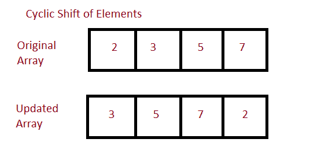

# Java 程序：循环置换数组元素

> 原文：<https://www.studytonight.com/java-programs/java-program-to-cyclically-permute-the-elements-of-an-array>

在本教程中，我们将学习如何循环置换数组的元素，也就是说，将每个数组元素向左移动一个索引。第一个值将进入最后一个索引。但是在继续之前，如果您不熟悉数组的概念，那么请务必查看 Java 中的文章[数组](https://www.studytonight.com/java/array.php)。



**输入:** 2 4 1 5 6 7

**输出:** 4 1 5 6 7 2

## 程序 1:循环置换数组的元素

在这种方法中，我们通过将元素移动一个位置来循环置换数组的元素。

### 算法

1.  开始
2.  声明一个数组。
3.  初始化数组
4.  声明一个变量，该变量将在循环前的第一个索引处存储元素。
5.  使用 for 循环迭代数组的每个元素。
6.  现在，将每个元素向左移动。
7.  现在，修改后的数组中的最后一个元素将是起始元素。
8.  停止

下面的程序演示了如何通过遍历和移位元素来循环置换数组的元素。在 for 循环之前声明一个变量来存储数组的第一个元素。使用 for 循环将其余元素向左移动一个位置。最后，将存储的值赋给数组的最后一个元素。显示结果。

```java
/*Java program to cyclically permute the elements of an array*/
import java.util.Arrays;  
import java.util.Scanner;
import java.util.*;  

public class Main  
{  
   public static void main(String args[])   
   {  
      Scanner sc=new Scanner(System.in);

      int n;    //Declare array size
      System.out.println("Enter the number of elements ");
      n=sc.nextInt();     //Initialize array size

      int arr[]=new int[n];   //Declare array
      System.out.println("Enter the elements of the array ");
      for(int i=0; i<n ;i++)     //Initialize array
      {
          arr[i]=sc.nextInt();
      }
      System.out.println("Initial Array "+Arrays.toString(arr));
      int x = arr[0]; // store a[0] 
        int i; 
        for (i = 0; i < arr.length - 1; i++) { 

            // for other element shift left 
            arr[i] = arr[i + 1]; 
        } 
        // for the last element in the modified array 
        // it will be starting element 
        arr[i] = x; 

      System.out.println("Updated Array" +Arrays.toString(arr));  //Display the array
   }  
} 
```

输入元素数量:
5
输入数组元素
6 7 8 2 3 4
初始数组【6 7 8 2 3 4】
更新数组【7 8 2 3 4 6】

## 程序 2:循环置换数组的元素

在这种方法中，我们通过交换元素来循环置换数组的元素。

### 算法

1.  开始
2.  声明一个数组。
3.  初始化数组
4.  声明另一个变量来存储数组的第一个元素。
5.  使用 for 循环来交换数组的每个元素。
6.  在每次迭代中，用第一个元素交换每个元素。
7.  在每次迭代中继续交换元素，直到循环结束。
8.  显示更新的数组。
9.  停下来。

下面是相同的代码。

下面的程序演示了如何通过交换元素来循环置换数组的元素。首先，声明并初始化一个数组。声明另一个变量来存储数组的第一个元素。使用 for 循环遍历数组的每个元素。然后，用数组的第一个元素交换每个元素。在每次迭代中，只有两个元素被交换。继续这个过程，直到循环结束，得到最终结果。

```java
/*Java program to cyclically permute the elements of an array*/
import java.util.Arrays;  
import java.util.Scanner;
import java.util.*;  

public class Main  
{  
   public static void main(String args[])   
   {  
      Scanner sc=new Scanner(System.in);

      int n;    //Declare array size
      System.out.println("Enter the number of elements ");
      n=sc.nextInt();     //Initialize array size

      int arr[]=new int[n];   //Declare array
      System.out.println("Enter the elements of the array ");
      for(int i=0; i<n ;i++)     //Initialize array
      {
          arr[i]=sc.nextInt();
      }
      //Display the original array
      System.out.println("Initial Array "+Arrays.toString(arr));

        int first = arr[0];  //Initialize the first element of the array to a variable
        int start = 0; 

        // swaping each element with the first element 
        for (int i = 1; i < arr.length; i++) { 
            arr[start++] = arr[i]; 
            arr[i] = first; 
        } 

       //Display the updated array
      System.out.println("Updated Array" +Arrays.toString(arr));    

   }  
} 
```

输入元素数量:
5
输入数组元素
1 4 3 6 8 2 6 7 9
初始数组[ 1 4 3 6 8 2 6 7 9 ]
更新数组[4 3 6 8 2 7 9 1]

* * *

* * *