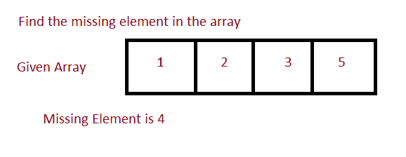

# Java 程序：识别给定数组中缺失数字

> 原文：<https://www.studytonight.com/java-programs/java-program-to-identify-the-missing-number-in-a-given-array>

在本教程中，我们将学习如何识别数组中缺失的元素。这意味着我们必须找到 n-1 个整数列表中缺少的一个元素，其中整数在 1 到 n 的范围内，并且列表中没有重复。但是在继续之前，如果您不熟悉数组的概念，那么请务必查看 Java 中的文章[数组](https://www.studytonight.com/java/array.php)。



**输入:** 1 2 4 5 6

**输出**:缺失元素为 3。

## 程序 1:使用总和技术查找缺失元素

在这个程序中，我们将看到如何使用总和技术来识别数组中缺失的元素。这种方法背后的逻辑是，首先我们通过使用公式 sum=(n+1)*(n+2)/2 找到数组中所有元素的总和。这里，我们使用公式 sum=(n+1)*(n+2)/2，而不是 sum=(n)*(n+1)/2，因为这里的元素总数是 n，但是由于缺少一个元素，所以总数加起来是 n+1。

### 算法

1.  开始
2.  声明数组大小。
3.  要求用户初始化数组大小。
4.  声明数组。
5.  要求用户初始化数组元素。
6.  使用公式 sumtotal= n*(n+1)/2 计算前 n 个自然数的总和
7.  声明一个变量和来存储数组元素的和。
8.  使用 for 循环遍历数组的每个元素。
9.  从计算的总和中扣除每个元素。
10.  总和中剩余的元素将是缺少的元素。
11.  打印总和。
12.  停下来。

下面的程序演示了如何使用总和技术识别数组中缺少的元素。

```java
/*Java Program to find the missing element*/
import java.util.*;  
import java.util.Arrays; 

//Driver Code
public class Main  
{  
   public static void main(String args[])   
   {  
       Scanner sc=new Scanner(System.in);

      int n;    //Declare array size
      System.out.println("Enter the total number of elements ");
      n=sc.nextInt();     //Initialize array size

      int arr[]=new int[n];   //Declare array
      System.out.println("Enter the elements of the array ");
      for(int i=0; i<n ;i++)     //Initialize array
      {
          arr[i]=sc.nextInt();
      }

      int sum=(n+1)*(n+2)/2;   //Calculate the expected sum of all the elements from 1 to n
      for(int i=0;i<n;i++)
      {
          sum=sum-arr[i]; //Subtract each element from the sum
      }
      System.out.println("Missing Element is "+sum);  //Print the missing element
   }
} 
```

输入元素总数 4
输入数组的元素 1 2 4 5
缺少的元素是 3

## 程序 2:使用异或技术找到丢失的元素

在这个程序中，我们将看到如何使用异或技术识别数组中丢失的元素。

### 算法

1.  开始
2.  声明数组大小。
3.  要求用户初始化数组大小。
4.  声明数组。
5.  要求用户初始化数组元素。
6.  声明两个变量。将第一个变量初始化为数组的第一个元素，将第二个变量初始化为 1。
7.  使用 for 循环迭代所有元素。
8.  求每个元素与第一个变量的异或。
9.  使用另一个 for 循环遍历所有元素。
10.  求每个元素与第二个变量的异或。
11.  通过对上述结果变量进行异或运算，找到缺失的元素。
12.  打印缺失的元素。
13.  停下来。

下面的程序演示了如何使用异或技术识别数组中丢失的元素。

```java
/*Java Program to find the missing element*/
import java.util.*;  
import java.util.Arrays; 

//Driver Code
public class Main  
{  
   public static void main(String args[])   
   {  
       Scanner sc=new Scanner(System.in);

      int n;    //Declare array size
      System.out.println("Enter the total number of elements ");
      n=sc.nextInt();     //Initialize array size

      int arr[]=new int[n];   //Declare array
      System.out.println("Enter the elements of the array ");
      for(int i=0; i<n ;i++)     //Initialize array
      {
          arr[i]=sc.nextInt();
      }

        int x1 = arr[0];
        int x2 = 1;

        /* For xor of all the elements in array */
        for (int i = 1; i < n; i++)
            x1 = x1 ^ arr[i];

        /* For xor of all the elements  from 1 to n+1 */
        for (int i = 2; i <= n + 1; i++) 
        {
            x2 = x2 ^ i;
        }
        int melement=x1 ^ x2;
        System.out.println("Missing Element is "+melement);  //Print the missing element
   }
} 
```

输入元素总数 7
输入数组的元素 1 2 3 4 5 7 8
缺少的元素是 6

* * *

* * *