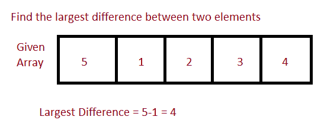

# 找到两个元素，使它们之间的差异最大

> 原文：<https://www.studytonight.com/java-programs/java-program-to-find-two-elements-such-that-difference-between-them-is-the-largest>

在本教程中，我们将学习如何在数组中找到 2 个元素，使它们之间的差异最大。但是在继续之前，如果您不熟悉数组的概念，那么请务必查看 Java 中的文章[数组](https://www.studytonight.com/java/array.php)。



**输入:** 7 8 5 4 3 2 1

**输出:**最大差值为 8-1 = 7

## 计划 1:找出最大的差异

在这个方法中，我们将看到如何通过比较和检查每对元素的差异来找到数组中的 2 个元素，以便它们之间的差异最大。

### 算法

1.  开始
2.  声明数组大小。
3.  要求用户初始化数组大小。
4.  声明数组。
5.  要求用户初始化数组元素。
6.  对同一个循环使用两个。
7.  使用第一个 for 循环来保存元素。
8.  使用第二个 for 循环来计算拾取的元素与数组中所有其他元素之间的差异。
9.  同时将差值与计算出的最大差值进行比较。
10.  检查任意两个元素之间的所有可能差异。
11.  打印差异最大的元素。
12.  停下来。

下面的程序演示了如何找到数组中的 2 个元素，使它们之间的差异最大。

```java
/*Java Program to find 2 Elements in the Array such that Difference Between them is Largest*/
import java.util.*;  
import java.util.Arrays; 

//Driver Code
public class Main  
{  
   public static void main(String args[])   
   {  
      Scanner sc=new Scanner(System.in);

      int n;    //Declare array size
      System.out.println("Enter the total number of elements ");
      n=sc.nextInt();     //Initialize array size

      int arr[]=new int[n];   //Declare array
      System.out.println("Enter the elements of the array ");
      for(int i=0; i<n ;i++)     //Initialize array
      {
          arr[i]=sc.nextInt();
      }

        int difference, largestDifference = arr[1] - arr[0]; 
        int element1 = arr[1], element2 = arr[0];  // two elements ele1 and ele2 .

        int res[] = new int[3]; // Array to store the difference

        /* Check for all possible difference between any 2 elements in the array and finally select the elements whose difference is the largest */

        for (int i = 0; i < n; i++) 
        { 
            for (int j = i + 1; j < n; j++) 
            { 
                difference = Math.abs(arr[i] - arr[j]); 
                if (difference > largestDifference) 
                { 
                    largestDifference = difference; 
                    element1 = arr[i]; 
                    element2 = arr[j]; 
                } 
            } 
        } 
        res[0] = largestDifference; 
        res[1] = element1; 
        res[2] = element2; 

        System.out.println( "Two elements with largest difference are "
            + res[1] + " and " + res[2]); 
        System.out.println("The Greatest Difference is "
                           + res[0]); 
   }
} 
```

输入元素总数 10
输入数组的元素 7 3 5 1 3 6 8 9 5 4
两个元素相差最大的是 1 和 9
相差最大的是 8

## 程序 2:找到最大的差异

在这个方法中，我们将看到如何通过比较和检查每对元素的差异来找到数组中的 2 个元素，以便它们之间的差异最大。

### 算法

1.  开始
2.  声明数组大小。
3.  要求用户初始化数组大小。
4.  声明数组。
5.  要求用户初始化数组元素。
6.  使用 Array.sort()对数组进行排序。
7.  第一个和最后一个元素将是数组中的最小和最大元素。
8.  这两个元素之间的差异将给出最大的元素。
9.  打印差异最大的元素。
10.  停止

说明:下面的程序演示了如何找到数组中的 2 个元素，使它们之间的差异最大。

```java
/*Java Program to find 2 Elements in the Array such that Difference Between them is Largest*/
import java.util.*;  
import java.util.Arrays; 

//Driver Code
public class Main  
{  
   public static void main(String args[])   
   {  
       Scanner sc=new Scanner(System.in);

      int n;    //Declare array size
      System.out.println("Enter the total number of elements ");
      n=sc.nextInt();     //Initialize array size

      int arr[]=new int[n];   //Declare array
      System.out.println("Enter the elements of the array ");
      for(int i=0; i<n ;i++)     //Initialize array
      {
          arr[i]=sc.nextInt();
      }

        Arrays.sort(arr);  //Sort the array
        System.out.println("Two elements with the largest difference are "+arr[n-1]+" and "+arr[0]);
        int difference=arr[n-1]-arr[0];
        System.out.println("The largest difference is "+difference);

   }
} 
```

输入元素总数 10
输入数组的元素 8 7 6 59 7 6 42 5 7 9
两个元素相差最大的是 59 和 5
相差最大的是 54

* * *

* * *