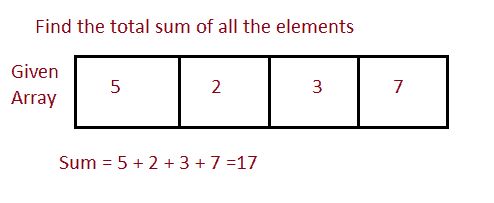

# 接受数组元素并计算总和的 Java 程序

> 原文：<https://www.studytonight.com/java-programs/java-program-to-accept-array-elements-and-calculate-the-sum>

在本教程中，我们将学习如何接受数组元素并计算总和。但是在继续之前，如果您不熟悉数组的概念，那么请务必查看 Java 中的文章[数组](https://www.studytonight.com/java/array.php)。



**输入:** 91 72 63 54 91 21 43 45 64 40

**输出:**数组中所有元素之和为 584

## 程序 1:计算数组元素的总和

在这个方法中，我们将看到如何接受数组的元素，并使用 for-each 循环计算数组中所有元素的总和。

### 算法

1.  开始
2.  声明数组大小。
3.  要求用户初始化数组大小。
4.  声明数组。
5.  要求用户初始化数组元素。
6.  声明一个变量和来存储数组中所有元素的和。
7.  将变量初始化为 0。
8.  使用 for-each 循环计算数组中所有元素的总和。
9.  显示总和。
10.  停下来。

下面的程序演示了如何接受数组的元素，并使用每个循环计算数组中所有元素的总和。

```java
/*Java Program to find the sum of all the elements in the array using */
import java.util.*;  
import java.util.Arrays; 

//Driver Code
public class Main  
{  
   public static void main(String args[])   
   {  
       Scanner sc=new Scanner(System.in);

      int n;    //Declare array size
      System.out.println("Enter the total number of elements ");
      n=sc.nextInt();     //Initialize array size

      int arr[]=new int[n];   //Declare the array
      System.out.println("Enter the elements of the array ");
      for(int i=0; i<n ;i++)     //Initialize the array
      {
          arr[i]=sc.nextInt();
      }
      int sum = 0;       //Variable to calculate the total sum
      //Using For each loop
      for( int num : arr) 
      {
          sum = sum+num;     //Increment the value of sum in each iteration
      }

       //Print the total sum
        System.out.println("The sum of all the elements in the array is "+sum);

   }
} 
```

输入元素总数 10
输入数组的元素 98 71 62 55 34 21 90 73 21 32
数组中所有元素的总和为 557

## 程序 2:计算数组元素的和

在这个方法中，我们将看到如何接受数组的元素，并使用 while 循环计算数组中所有元素的总和。

### 算法

1.  开始
2.  声明数组大小。
3.  要求用户初始化数组大小。
4.  声明数组。
5.  要求用户初始化数组元素。
6.  声明一个变量和来存储数组中所有元素的和。
7.  将变量初始化为 0。
8.  声明另一个变量来遍历数组的所有元素。
9.  将其初始化为 0。
10.  使用 while 循环计算数组中所有元素的总和。
11.  在每次迭代中增加总和的值。
12.  在每次迭代中增加另一个变量的值，遍历所有元素。
13.  显示总和。
14.  停下来。

下面的程序演示了如何接受数组的元素，并使用 while 循环计算数组中所有元素的总和。

```java
/*Java Program to find the sum of all the elements in the array*/
import java.util.*;  
import java.util.Arrays; 

//Driver Code
public class Main  
{  
   public static void main(String args[])   
   {  
       Scanner sc=new Scanner(System.in);

      int n;    //Declare array size
      System.out.println("Enter the total number of elements ");
      n=sc.nextInt();     //Initialize array size

      int arr[]=new int[n];   //Declare array
      System.out.println("Enter the elements of the array ");
      for(int i=0; i<n ;i++)     //Initialize array
      {
          arr[i]=sc.nextInt();
      }
      int sum = 0;    //Variable to store the sum
      //Using while loop calculate the sum
      int i=0;        //Variable to iterate through all the elements
      while(i!=n)
      {
          sum=sum+arr[i];   //Increment the value of sum in each iteration
          I++;    //Increment to iterate to the next element
      }

       //Print the sum
        System.out.println("The sum of all the elements in the array is "+sum);

   }
} 
```

输入元素总数 10
输入数组的元素 9 7 6 5 91 21 43 45 64 40
数组中所有元素的总和为 331

* * *

* * *