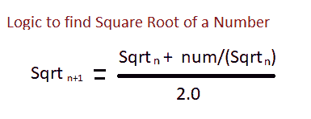

# 寻找数字平方根的 Java 程序

> 原文：<https://www.studytonight.com/java-programs/java-program-to-find-square-root-of-a-number>

在本教程中，我们将学习如何在 java 中找到一个数的平方根。一个数的平方根被定义为在乘法时给出原始数的值。但是在继续之前，如果你不熟悉 java 中循环的概念，那么一定要查看关于 Java 中[循环](https://www.studytonight.com/java/loops-in-java.php)的文章。

**输入:**输入数字:49

**输出:**数字的平方根是 7.0

上述问题可以通过以下方式解决:

方法 1:使用用户定义的方法

方法 2:使用预定义的方法

让我们分别看看这些方法。

## 程序 1:寻找一个数的平方根的 Java 程序

在这个程序中，我们将学习如何在 java 中找到一个数字的平方根，而不使用预定义的方法。在这里，我们将使用下面的逻辑来寻找一个数的平方根。



### 算法:

1.  开始
2.  创建 Scanner 类的实例。
3.  声明一个变量。
4.  要求用户初始化变量。
5.  调用用户定义的方法来查找数字的平方根。
6.  声明一个临时变量。
7.  声明另一个变量来存储数字/2 值。
8.  使用边做边循环计算平方根。
9.  计算数字的平方根并返回值。
10.  现在，打印数字的平方根。
11.  停止

下面是相同的代码。

```java
//Java Program to Calculate the square root of a number
import java.util.Scanner;  
public class Main   
{  
    public static void main(String[] args)    
    {
        //Take input from the user
        //Create an instance of the Scanner class
        Scanner sc = new Scanner(System.in); 
        System.out.println("Enter a number: ");  
        int n = sc.nextInt();  
        System.out.println("The square root of "+ n+ " is: "+squareRoot(n));  
    }  
    //user-defined method to find the square root  
    public static double squareRoot(int num)   
    {  
        //temporary variable  
        double temp;  
        double sqrtroot=num/2;  
        do   
        {  
            temp=sqrtroot;  
            sqrtroot=(temp+(num/temp))/2;  
        }   
        while((temp-sqrtroot)!= 0);  
        return sqrtroot;  
   }  
} 
```

Ca
输入一个数字:45
45 的平方根是:6.73939939999

## 程序 2:寻找一个数的平方根的 Java 程序

在这个程序中，我们将学习如何使用一个预定义的方法在 java 中找到一个数的平方根。

### 算法:

1.  开始
2.  创建 Scanner 类的实例。
3.  声明一个变量。
4.  要求用户初始化变量。
5.  使用预定义的方法来寻找数字的平方根。
6.  使用 Math.pow()计算数字的平方根。
7.  打印数字的平方根值。
8.  停止

下面是相同的代码。

```java
//Java Program to Calculate the square root of a number
import java.util.Scanner;  
public class Main   
{  
    public static void main(String[] args)    
    {
        //Take input from the user
        //Create an instance of the Scanner class
        Scanner sc = new Scanner(System.in); 
        System.out.println("Enter a number: ");  
        int num = sc.nextInt();  
        Double squareroot = Math.pow(num, 0.5);
        System.out.println("The Square Root of the Given Number  " + num + "  =  " + squareroot);

   }  
} 
```

输入一个数字:36
给定数字 36 的平方根= 6.0

* * *

* * *