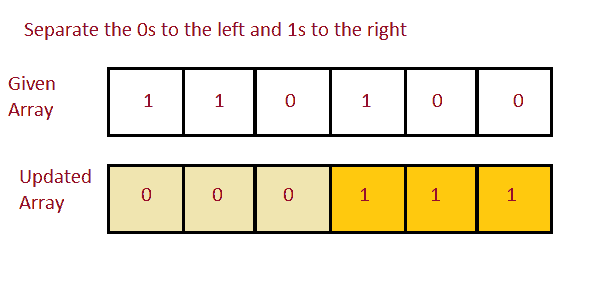

# 编程分离左侧的 0 和右侧的 1

> 原文：<https://www.studytonight.com/java-programs/program-to-separate-0s-on-the-left-side-and-1s-on-the-right-side>

在本教程中，我们将学习如何将数组左侧的 0 和右侧的 1 分开。但是在继续之前，如果您不熟悉数组的概念，那么请务必查看 Java 中的文章[数组](https://www.studytonight.com/java/array.php)。



**输入:**0 0 1 0 1 0 1 1 0 1 1 1

**输出:**0 0 0 1 1 1 1 1 1 1

## 程序 1:左边分开 0，右边分开 1

在这个方法中，我们将看到如何使用排序技术将数组左侧的 0 和右侧的 1 分开。

### 算法

1.  开始
2.  声明数组大小。
3.  要求用户初始化数组大小。
4.  声明数组。
5.  要求用户初始化数组元素。
6.  检查输入的元素是否为 0 和 1。
7.  如果输入的元素不是 0 和 1，请用户再次输入。
8.  如果输入的元素是 0 和 1，则使用 arrays.sort()对数组进行排序
9.  这种排序将保持 0 在左侧，1 在右侧。
10.  打印排序后的数组。
11.  停下来。

下面的程序演示了如何使用排序技术将数组左侧的 0 和右侧的 1 分开。

```java
import java.util.*;  
import java.util.Arrays; 
//Driver Code
public class Main  
{  
    static void printElements(int arr[],int n)
    {
        System.out.println("Resultant Array is ");
        for(int i=0;i<n;i++)
        {
            System.out.print(arr[i]+" ");
        }
        System.out.println(" ");
    }
   public static void main(String args[])   
   {  
       Scanner sc=new Scanner(System.in);
      int n;    //Declare array size
      System.out.println("Enter the total number of elements ");
      n=sc.nextInt();     //Initialize array size
      int arr[]=new int[n];   //Declare array
      System.out.println("Enter the elements of the array ");
      for(int i=0; i<n ;i++)     //Initialize array
      {
          arr[i]=sc.nextInt();
      }      
      int flag=1;      
        for(int t=0;t<n;t++)
        {
            if(arr[t]==0 || arr[t]==1)
            {
               Arrays.sort(arr);     //Sort the array
               flag++;
           }
          else
          {
                 flag=0;
          }
      }      
      if(flag==0)
      {
          System.out.println("Elements other than 0 and 1 are entered");
          System.out.println("Please Enter Valid Inputs ");
      }
      else{
          printElements(arr,n);
      }                 
   }
}
```

输入元素总数 10
输入数组的元素 0 0 1 1 1 0 0 0
结果数组是
0 0 0 1 1 1 1

## 程序 2:左边分开 0，右边分开 1

在这个方法中，我们将看到如何使用分离技术来分离数组左侧的 0 和右侧的 1。

### 算法

1.  开始
2.  声明数组大小。
3.  要求用户初始化数组大小。
4.  声明数组。
5.  要求用户初始化数组元素。
6.  首先检查输入的元素是否为 0 和 1。
7.  如果输入的元素不是 0 和 1，请用户再次输入。
8.  如果输入的元素是 0 和 1，则声明一个变量来计算零的总数。
9.  使用 for 循环迭代数组的每个元素。
10.  在发现 0 的地方增加计数。
11.  现在，用 0 填充循环直到计数。
12.  用 1 填充数组的剩余元素。
13.  停止

下面的程序演示了如何使用分离技术分离数组左侧的 0 和右侧的 1。

```java
import java.util.*;  
import java.util.Arrays; 

//Driver Code
public class Main  
{  
    static void printElements(int arr[],int n)
    {
        System.out.println("Resultant Array is ");
        for(int i=0;i<n;i++)
        {
            System.out.print(arr[i]+" ");
        }
        System.out.println(" ");
    }
   public static void main(String args[])   
   {  
       Scanner sc=new Scanner(System.in);

      int n;    //Declare array size
      System.out.println("Enter the total number of elements ");
      n=sc.nextInt();     //Initialize array size

      int arr[]=new int[n];   //Declare array
      System.out.println("Enter the elements of the array ");
      for(int i=0; i<n ;i++)     //Initialize array
      {
          arr[i]=sc.nextInt();
      }

      int flag=1;

        for(int t=0;t<n;t++)
        {
            if(arr[t]==0 || arr[t]==1)
            {
               // Counts the no of zeros in array 
               int count = 0; 

               // Iteration over each element of the array 
               for (int i = 0; i < n; i++) 
               { 
                    if (arr[i] == 0) 
                    count++;       // Incrementing the count 
               } 

             // Loop to fill the array with 0 until count 
             for (int i = 0; i < count; i++) 
             arr[i] = 0; 

             // Loop to fill the remaining array space with 1 
             for (int i = count; i < n; i++) 
                arr[i] = 1; 

           flag++;
          }
          else
          {
                 flag=0;
          }
      }

      if(flag==0)
      {
          System.out.println("Elements other than 0 and 1 are entered");
          System.out.println("Please Enter Valid Inputs ");
      }
      else
      {
          printElements(arr,n);
      }

   }
}
```

输入元素总数 10
输入数组的元素 0 0 1 1 0 1 1 0 0
结果数组是
0 0 0 1 1 1 1

* * *

* * *