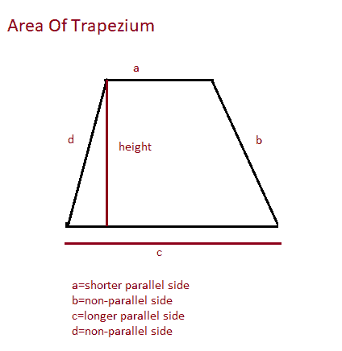

# 寻找梯形区域的 Java 程序

> 原文：<https://www.studytonight.com/java-programs/java-program-to-find-the-area-of-a-trapezium>

在本教程中，我们将学习如何在 java 中计算**梯形**的面积。梯形是 2D 形状，属于有一对平行边的四边形的范畴。梯形区域是二维平面中由梯形覆盖的区域。但是在继续之前，如果你不熟悉数据类型的概念，那么一定要查看关于 Java 中[数据类型的文章](https://www.studytonight.com/java/datatypes-and-identifier.php)。

**输入:**输入梯形平行边的长度:5

输入梯形平行边的长度:3

输入梯形的高度:4

**输出:**梯形的面积:16

下面是同样的图示。



上述问题出现了两种情况:

情况 1:当给定平行边和高度时

案例二:当所有的边都给了。

让我们分别看看这些案例。

## 程序 1:寻找梯形区域的 Java 程序

在这个程序中，我们将学习如何使用底部和高度公式来寻找梯形的面积。

### 算法:

1.  开始
2.  创建 Scanner 类的实例。
3.  声明变量来存储梯形边的值。
4.  要求用户初始化变量。
5.  声明另一个变量来存储梯形的高度。
6.  使用底部和高度公式计算面积。
7.  显示结果。
8.  停下来。

下面的程序演示了如何找到梯形的面积。

```java
//Java Program to Calculate the Area of a Trapezium
import java.util.Scanner;
public class Main
{
     public static void main(String []args)
     {
        //Take input from the user 
        //Create an instance of the Scanner Class
        Scanner sc=new Scanner(System.in);
        System.out.println("Enter the length of the parallel sides of the trapezium: ");
        double side1=sc.nextDouble();
        System.out.println("Enter the length of the parallel sides of the trapezium: ");
        double side2=sc.nextDouble();
        System.out.println("Enter the height of the trapezium: ");
        double height = sc.nextDouble();
        //Calculate the area
        double area=((side1+side2)*height)/2;
       if (side1 <= 0 || side2<=0)
            System.out.println("Length should be positve");
        else
            System.out.println("Area of trapezium = "+ area);
     }
}
```

输入斜方肌平行边长度:6
输入斜方肌平行边长度:8
输入斜方肌高度:6
斜方肌面积= 42.0

## 程序 2:寻找梯形区域的 Java 程序

在这个程序中，我们将学习当给定梯形的所有边时，如何找到梯形的面积。

### 算法:

1.  开始
2.  创建 Scanner 类的实例。
3.  声明变量来存储梯形边的值。
4.  要求用户初始化变量。
5.  声明另一个变量来存储梯形的半周长。
6.  从梯形的半周长减去边。
7.  计算上述结果的平方根。
8.  现在，用公式计算梯形的面积。
9.  显示结果。
10.  停下来。

下面的程序演示了如何找到梯形的面积。

```java
//Java Program to Calculate the Area of a Trapezium
import java.util.Scanner;
public class Main
{
     public static void main(String []args)
     {
        //Take input from the user 
        //Create an instance of the Scanner Class
        Scanner sc=new Scanner(System.in);
        System.out.println("Enter the length of the longer side of the trapezium: ");
        double a=sc.nextDouble();
        System.out.println("Enter the length of the shorter side of the trapezium: ");
        double b=sc.nextDouble();
        System.out.println("Enter the length of the non-parallel side of the trapezium: ");
        double c = sc.nextDouble();
         System.out.println("Enter the length of the non-parallel side of the trapezium: ");
        double d = sc.nextDouble();
        double s =(a+b+c+d)/2;
        double num=(s-a)*(s-b)*(s-b-c)*(s-b-d);
        double res=Math.sqrt(num);
        //Calculate the area
        double Area =(a+b)/(a-b)*res;
       if (a <= 0 || b<=0 || c<=0 || d<=0)
            System.out.println("Length should be positve");
        else
            System.out.println("Area of trapezium = "+ Area);
     }
}
```

输入斜方肌长边长度:14
输入斜方肌短边长度:6
输入斜方肌非平行边长度:5
输入斜方肌非平行边长度:5
斜方肌面积= 30.0

* * *

* * *