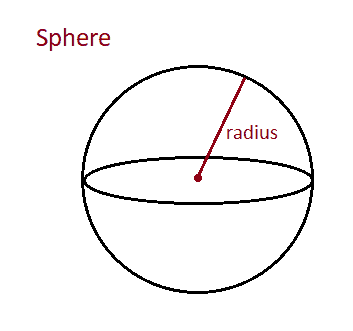

# Java 程序：计算球体表面积和体积

> 原文：<https://www.studytonight.com/java-programs/java-program-to-calculate-the-surface-area-and-volume-of-sphere>

在本教程中，我们将学习如何在 java 中找到球体的表面积和体积。完美对称的三维圆形物体是球体。从中心到边界的连线叫做球的半径。球体的表面积被定义为其外表面在三维空间中所覆盖的区域。球体的体积被定义为它的容量。但是在继续之前，如果你不熟悉 java 中数据类型的概念，那么一定要查看主题为[Java 中数据类型](https://www.studytonight.com/java/datatypes-and-identifier.php)的文章。

下图是球体的图示。



**输入:**输入球体半径:5

**输出:**球体表面积:314

球体的体积是 523.33

让我们看看例子，知道如何找到球体的表面积和体积。

## 程序 1:求球体的表面积和体积

在这个例子中，我们将学习如何用 java 计算球体的表面积和体积。

### 算法:

1.  开始
2.  创建扫描仪类的实例
3.  声明一个变量来存储球体的半径。
4.  要求用户初始化变量。
5.  声明变量来存储球体的表面积和体积。
6.  使用公式计算值。
7.  显示计算出的球体表面积和体积
8.  停下来。

下面的例子演示了如何找到一个球体的表面积和体积。

```java
//Java Program to Find the Surface Area and Volume of Sphere
import java.util.*;

public class Main 
{
    // Driver Code
    public static void main (String[] args)
    {
       Scanner sc=new Scanner(System.in);
       System.out.println("Enter the radius of the sphere: ");
       double radius=sc.nextDouble();
       double surface_area = 4 * 3.14 * (radius * radius);
       double volume = ((double)4 / 3) * 3.14 * (radius * radius * radius);   
        System.out.println("The surface area of the sphere = "+surface_area);   
        System.out.println("The volume of sphere = "+volume);  
    }
}
```

输入球体的半径:10
球体的表面积= 1256.0
球体的体积= 4186。56860 . 66666666666

## 程序 2:求球体的表面积和体积

在这个例子中，我们将学习如何用 java 计算球体的表面积和体积。

## 算法:

1.  开始
2.  创建扫描仪类的实例
3.  声明变量来存储球体的半径。
4.  要求用户初始化这些变量。
5.  调用两个用户定义的方法来计算球体的表面积和体积。
6.  将输入的值作为参数传递。
7.  声明变量来存储球体的表面积和体积。
8.  使用公式计算值。
9.  返回计算值。
10.  显示计算出的球体表面积和体积。
11.  停下来。

下面的例子演示了如何找到球体的表面积和体积

```java
//Java Program to Find the Surface Area and Volume of Sphere
import java.util.*;

public class Main 
{
    //Calculate the Volume of Sphere
	public static double VolumeOfSphere (double radius) 
	{
		double Volume = (4.0 / 3) * Math.PI * radius * radius * radius;
		return Volume;
	}
	//Calculate the Surface Area of Sphere
	public static double SurfaceAreaOfSphere (double radius) 
	{
		double surfacearea =  4 * Math.PI * radius * radius;
		return surfacearea;
	}
	// Driver Code
    public static void main (String[] args)
    {
       Scanner sc=new Scanner(System.in);
       System.out.println("Enter the radius of the sphere: ");
       double radius=sc.nextDouble();
       double surface_area = SurfaceAreaOfSphere(radius);
       double volume = VolumeOfSphere(radius);
       System.out.println("The surface area of the sphere = "+surface_area); 
       System.out.println("The volume of sphere = "+volume);

    }
}
```

输入球体的半径:4
球体的表面积= 201.06192982974676
球体的体积= 268 . 58688 . 58686868666

* * *

* * *