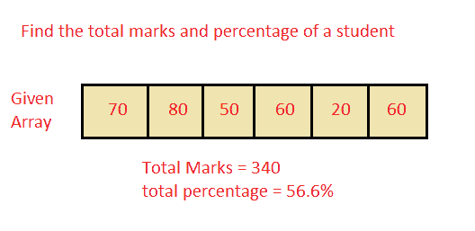

# Java 程序：接受学生分数并计算总分数和百分比

> 原文：<https://www.studytonight.com/java-programs/java-program-to-accept-the-marks-of-a-student-and-find-the-total-marks-and-percentage>

在本教程中，我们将学习如何将学生的分数接受到一维数组中，并找到总分数和百分比。但是在继续之前，如果您不熟悉数组的概念，那么请务必查看 Java 中的文章[数组](https://www.studytonight.com/java/array.php)。



**输入:**

马克= 40 50 80 90 60 70

**输出:**

总分= 390

总百分比= 65%

## 程序 1:找出学生的总分数和百分比

在这种方法中，我们将使用迭代方法来计算学生获得的总分数和百分比。

### 算法

1.  开始
2.  声明一个数组。
3.  要求用户初始化数组。
4.  调用一个方法来计算数组中所有元素(标记)的总和和百分比。
5.  在那里声明一个 sum 变量，并将其初始化为 0。
6.  在每次迭代中更新总和。
7.  打印总和。
8.  计算百分比。
9.  打印安全百分比。
10.  停下来。

下面是相同的代码。

下面的程序演示了如何接受一个学生的分数到一个数组中，并使用迭代法找到总分数和百分比。

```java
/* Java Program to accept the marks of a student into a 1-D array and find the total marks and percentage. */
import java.util.*;   
public class Main 
{ 
    // Main driver method 
    public static void main(String args[]) 
    {   
        // Taking input from user 
        Scanner sc = new Scanner(System.in); 
        int n;     //Declaring Variables

        //Ask the user to enter the Array Size
        System.out.println("Enter the total subjects ");
        n=sc.nextInt();

        //Declare the array
        int arr[] = new int[n]; 
        System.out.println("Enter the marks secured in each subject ");
        for(int i=0;i<n;i++)   //Initialize the array
        {
            arr[i]=sc.nextInt();
        }

        int total=0;
        //Calculate the total marks
        for(int i=0;i<n;i++)
        {
            total=total+arr[i];
        }
        //Display the total marks
        System.out.println("The total marks obtained is "+total);

        //Calculate the percentage
        float percentage; 
        percentage = (total / (float)n); 

        //Display the total percentage
        System.out.println( "Total Percentage : " + percentage + "%");                         
    }   
}
```

输入总科目 6
输入每个科目的安全分数 78 98 67 90 34 23
获得的总分数为 390
总百分比:65.0%

## 程序 2:找出学生的总分数和百分比

在这种方法中，我们将使用递归方法来计算学生获得的总分数和总百分比。

### 算法

1.  开始
2.  声明一个数组。
3.  要求用户初始化数组。
4.  调用一种方法来计算学生获得的总分数和总百分比。
5.  使用递归函数计算数组中所有元素的总和和百分比。
6.  返回数组中所有元素的百分比和总和。
7.  打印数组中所有元素的百分比和总和。
8.  停止

下面的程序演示了如何接受一个学生的分数到一个数组中，并使用递归方法找到总分数和百分比。

```java
/* Java Program to accept the marks of a student into a 1-D array and find the total marks and percentage. */
import java.util.*; 
public class Main 
{ 
    // Recursively computes average of a[]
    static double findTotal(int a[], int i, int n)
    {
        // Last element
        if (i == n-1)
            return a[i];    
        // When index is 0, divide sum computed so
        // far by n.
        if (i == 0)
            return ((a[i] + findTotal(a, i+1, n))/n);    
        // Compute sum
        return (a[i] + findTotal(a, i+1, n));
    }    
    // Function that returns the average of an array.
    static double findPercentage(int a[], int n)
    {
         return findTotal(a, 0, n);
    }    
    // Main driver method 
    public static void main(String args[]) 
    {   
        // Taking input from user 
        Scanner sc = new Scanner(System.in); 
        int n;     //Declaring Variables

        //Ask the user to enter the Array Size
        System.out.println("Enter the total subjects ");
        n=sc.nextInt();

        //Declare the array
        int arr[] = new int[n]; 
        System.out.println("Enter the marks secured in each subject ");
        for(int i=0;i<n;i++)   //Initialize the array
        {
            arr[i]=sc.nextInt();
        }        
        //Print the sum and percentage
         double avg=findPercentage(arr, n);  
         double sum=avg*n;
        System.out.println("The total marks is "+sum);
        System.out.println("The total percentage is "+avg+" % ");     
    }   
}
```

输入总科目 6
输入每个科目的安全分数 87 56 34 24 45 99
总分数为 345.0
总百分比为 57.5 %

* * *

* * *