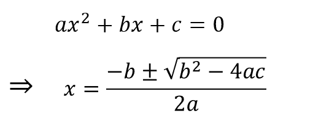

# 寻找二次方程所有根的 java 程序

> 原文：<https://www.studytonight.com/java-programs/java-programs-to-find-all-roots-of-a-quadritic-equation>

如果一个方程的形式是 **ax2+bx+c=0** ，其中 a、b、c 是实数，a 不等于 0，那么这个方程被称为**二次方程**。方程的标准形式和计算公式如下:



一个二次方程有两个根，这两个根取决于判别式。在上式中，sqrt((b*b)-(4*a*c))被称为判别式。

*   如果判别式是正的，那么根是实的，不相等的。
*   如果判别式为 0，那么根是实的且相等的。
*   如果判别式是负的，那么根是不相等的，是虚的。

在这里，我们得到一个二次方程，我们的任务是找到这个方程的根。例如，

**输入:** 1 -2 1

**输出:** 1 1

## 程序 1:求二次方程

在这个程序中，二次方程的根是在主方法本身中找到的。

### 算法:

1.  开始
2.  声明变量 a，b，c。
3.  初始化变量 a，b，c。
4.  用主方法本身计算二次方程的根。
5.  使用条件 a==0 检查根是否可能。
6.  计算判别式为判别式= sqrt((b*b)-(4*a*c))。
7.  如果判别式。> 0，那么根是真实的，不相等的。
8.  求根为(-b+判别式)/(2 *a)和(-b -判别式)/(2 *a)。
9.  如果判别式=0，那么根是实的和相等的。
10.  求根为(-b +判别式)/( 2*a)。
11.  如果判别式> 0，那么根是复杂且不同的。
12.  将根计算为(-b/(2*a)) + iD 和(-b/(2*a)) - iD。
13.  显示根。
14.  停止

下面是相同的代码。

在这个例子中，我们将直接找到二次方程的根。首先，二次方程的系数被声明和初始化。然后我们直接在主方法本身找到二次方程的根。

```java
//Java Program to find the roots of the quadratic equation
import java.util.Scanner;
public class QuadraticEquation
{

     public static void main(String []args)
     {
        Scanner sc=new Scanner(System.in);
        double a,b,c;      //Quadratic Variables declaration
        System.out.println("Enter the value of a..");
        a=sc.nextDouble();   //Quadratic Variables Initialization
        System.out.println("Enter the value of b..");
        b=sc.nextDouble();    //Quadratic Variables Initialization
        System.out.println("Enter the value of c..");
        c=sc.nextDouble();   //Quadratic Variables Initialization

        double d=(b*b)-(4*a*c);    //Find the determinant
        double D= Math.sqrt(d);
        double r=2*a;

        //Check for Roots
        if(D>0)
        {
            System.out.println("Roots are real and unequal");
            double root1=(D-b)/r;
            double root2=(-D-b)/r;
            System.out.println("Roots are..");
            System.out.println(root1);
            System.out.println(root2);
        }
        else if(D==0)
        {
            System.out.println("The roots of the quadratic equation are real and equal.");
            double root=(-b)/r;
            System.out.println("Root is "+root);
        }
        else
        {
            System.out.println("The roots of the quadratic equation are complex and different");
            System.out.println("Roots are ");
            System.out.println((-b/r)+" +i" + D);
            System.out.println((-b/r)+" -i" + D);
        }
     }
}
```

输入的值..15
输入 b 的值..68
输入 c 的值..3
根真实不平等
根真实不平等..
-0.044555558333472335
-4。58865 . 88888888666

## 程序 2:求二次方程

在这种方法中，用函数求出二次方程的根。

### 算法

1.  开始
2.  声明变量 a，b，c。
3.  初始化变量 a，b，c。
4.  调用一个函数来计算二次方程的根。
5.  使用条件 a==0 检查根是否可能。
6.  计算判别式为判别式= sqrt((b*b)-(4*a*c))
7.  如果判别式。> 0，那么根是真实的，不相等的。
8.  求根为(-b+判别式)/(2 *a)和(-b -判别式)/(2 *a)。
9.  如果判别式=0，那么根是实的和相等的。
10.  求根为(-b +判别式)/( 2*a)
11.  如果判别式> 0，那么根是复杂且不同的。
12.  将根计算为(-b/(2*a)) + iD 和(-b/(2*a)) - iD
13.  显示根。
14.  停止

下面是相同的代码。

在这个例子中，我们将使用方法来寻找二次方程的根。首先，二次方程的系数被声明和初始化。然后调用一个函数来求二次方程的根。

```java
//Java Program to find the roots of quadratic equation using Functions
import java.util.Scanner;
import static java.lang.Math.*;

public class QuadraticEquation
{
     public static void main(String []args)
     {
        Scanner sc=new Scanner(System.in);
        int a,b,c;    //Quadratic Variables Declaration
        System.out.println("Enter the value of a..");
        a=sc.nextInt();   //Quadratic Variables Initialization
        System.out.println("Enter the value of b..");
        b=sc.nextInt();    //Quadratic Variables Initialization
        System.out.println("Enter the value of c..");
        c=sc.nextInt();;   //Quadratic Variables Initialization
         quadraticRoots(a,b,c);   //Function Call

     }

     static void quadraticRoots(int a,int b,int c)
     {
        //Check whether roots are possible or not
        if (a == 0)   
        {  
           System.out.println("The value of a cannot be 0.");  
           return;  
        }  
       //calculating discriminant (d)  
       int d = b * b - 4 * a * c;  
       double D = sqrt(abs(d));  
       if (d > 0)   
       {  
          System.out.println("The roots of the equation are real and different. \n");  
          System.out.println((double)(-b + D) / (2 * a) + "\n"+ (double)(-b - D) / (2 * a));  
       }  
       else if (d == 0)   
       {  
          System.out.println("The roots of the equation are real and same. \n");  
          System.out.println(-(double)b / (2 * a) + "\n"+ -(double)b / (2 * a));  
       }  
       // executes if d < 0  
       else   
       {  
          System.out.println("The roots of the equation are complex and different. \n");  
          System.out.println(-(double)b / (2 * a) + " + i"+ D + "\n"+ -(double)b / (2 * a)+ " - i" + D);  
        }   
     }
}
```

输入的值..7
输入 b 的值..7
输入 c 的值..7
方程的根复杂且不同。

-0.5+i12.12435565298214
-0.5-i12 . 53961 . 53963943106

* * *

* * *