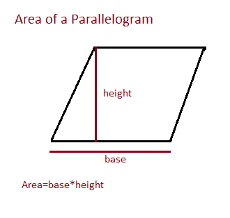

# Java 程序：计算平行四边形面积

> 原文：<https://www.studytonight.com/java-programs/java-program-to-find-the-area-of-a-parallelogram>

在本教程中，我们将学习如何用 java 计算平行四边形的面积。平行四边形是有两对平行边的简单四边形。平行四边形的相对边或相对边长度相等，平行四边形的相对角大小相等。平行四边形的面积是二维平面中被平行四边形覆盖的区域。

让我们看看下面的例子。

**输入:**输入基数:7

输入高度:8

**输出:**平行四边形的面积:56

下面是同样的图示。



上述问题可以通过以下方式解决:

## 程序 1:求平行四边形的面积

在这个程序中，我们将学习如何使用底部和高度公式来寻找平行四边形的面积。

### 算法

1.  开始
2.  创建 Scanner 类的实例。
3.  声明变量来存储平行四边形的底和高的值。
4.  要求用户初始化变量。
5.  声明另一个变量来存储平行四边形的面积。
6.  使用底部和高度公式计算面积。
7.  显示结果。
8.  停下来。

下面是 Java 语言的代码示例。

```java
//Java Program to Calculate the Area of a Parallelogram
import java.util.Scanner;
public class Main
{
     public static void main(String []args)
     {
        //Take input from the user 
        //Create an instance of the Scanner Class
        Scanner sc=new Scanner(System.in);
        System.out.println("Enter the base of the parallelogram: ");
        int base=sc.nextInt();
        System.out.println("Enter the height of the parallelogram: ");
        int height=sc.nextInt();
        int area=base*height;

        // display the area of a parallelogram
        System.out.println("Area of the parallelogram = " + area);
     }
}
```

输入平行四边形的底边:10
输入平行四边形的高度:20
平行四边形的面积= 200

## 程序 2:在 Java 中找到平行四边形的面积

在这个节目中，我们将学习如何使用三角学来寻找平行四边形的面积。

### 算法

1.  开始
2.  创建 Scanner 类的实例。
3.  声明变量来存储平行四边形边的值。
4.  要求用户初始化变量。
5.  声明另一个变量来存储平行四边形边之间的角度。
6.  将其转换为弧度。
7.  计算角度的正弦值。
8.  用三角公式计算平行四边形的面积，
9.  打印平行四边形的面积值。
10.  停下来。

下面是 Java 语言的代码示例。

```java
//Java Program to Calculate the Area of a Parallelogram
import java.util.Scanner;
public class Main
{
     public static void main(String []args)
     {
        //Take input from the user 
        //Create an instance of the Scanner Class
        Scanner sc=new Scanner(System.in);
        System.out.println("Enter the sides of the parallelogram: ");
        double a1=sc.nextDouble();
        System.out.println("Enter the sides of the parallelogram: ");
        double b1=sc.nextDouble();
        System.out.println("Enter the angle between the sides of the parallelogram: ");
        double a = sc.nextDouble();
        // converting values to radians
        double b = Math.toRadians(a);
        double area=a1*b1*(Math.sin(b));
        // display the area of parallelogram
        System.out.println("Area of the parallelogram = " + area);
     }
}
?
```

输入平行四边形的边:3
输入平行四边形的边:4
输入平行四边形的边之间的角度:90
平行四边形的面积= 12.0

## Java 程序：程序 3: Java 中求平行四边形面积

在这个程序中，我们将学习如何使用对角线来寻找平行四边形的面积。

### 算法

1.  开始
2.  创建 Scanner 类的实例。
3.  声明变量来存储平行四边形对角线的值。
4.  要求用户初始化这些变量。
5.  声明另一个变量来存储平行四边形任意两条对角线之间的角度。
6.  要求用户初始化变量。
7.  将其转换为弧度。
8.  计算角度的正弦值。
9.  用对角线公式计算平行四边形的面积，
10.  打印平行四边形的面积值。
11.  停下来。

下面是 Java 语言的代码示例。

```java
//Java Program to Calculate the Area of a Parallelogram
import java.util.Scanner;
public class Main
{
     public static void main(String []args)
     {
        //Take input from the user 
        //Create an instance of the Scanner Class
        Scanner sc=new Scanner(System.in);
        System.out.println("Enter the first diagonal of the parallelogram: ");
        double d1=sc.nextDouble();
        System.out.println("Enter the second diagonal of the parallelogram: ");
        double d2=sc.nextDouble();
        System.out.println("Enter the angle between the diagonals of the parallelogram: ");
        double a = sc.nextDouble();
        // converting values to radians
        double b = Math.toRadians(a);
        double area=(d1*d2*(Math.sin(b)))/2;
        // display the area of parallelogram
        System.out.println("Area of the parallelogram = " + area);
     }
}
```

输入平行四边形的第一条对角线:30
输入平行四边形的第二条对角线:40
输入平行四边形对角线之间的角度:30
平行四边形的面积= 299 . 999999999994

* * *

* * *