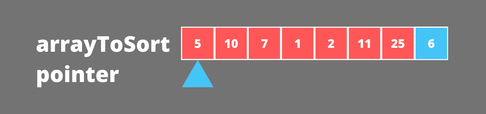
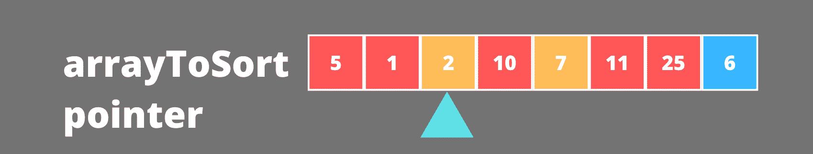

# Java 中的快速排序

> 原文：<https://www.studytonight.com/java-examples/quicksort-in-java>

快速排序是一种流行的排序算法，使用**分治**范式对数组进行排序。快速排序和合并排序一样，平均时间复杂度为 **O(N log N)** ，但在最坏的情况下，其性能可能会恶化。

在本教程中，我们将学习快速排序算法，并在 Java 中实现它。

## 快速排序算法

*   如上所述，快速排序算法使用**分治**方法对数组进行排序。
*   快速排序算法从选择一个**枢轴元素**开始。我们需要把这个枢轴放在正确的位置。
*   但并没有就此结束。我们还需要**把所有小于枢轴的元素放在枢轴元素**的左边，**所有大于枢轴的元素都要放在它的右边**。
*   我们的问题现在被分成两个更小的子问题，我们也有一个数组元素在它的正确位置。现在，我们只需要在枢轴左边的元素和数组右边的元素上递归地重复这个过程。

让我们借助一个例子来理解上面的方法。假设我们必须对以下数组进行排序- [5，10，7，1，2，11，25，6]，元素六被选为轴心。我们将使用最初设置为-1 的指针。

这个指针左边的所有数组元素(包括指针上的元素)都应该小于我们的轴。

我们将遍历整个数组，每当我们遇到比轴小的元素时，我们将增加我们的指针，并将这个较小的元素放在那个位置。以下步骤解释了分区过程。

迭代从数组的第一个元素开始，即 5。这小于透视，因此我们将更新指针值，并将此元素放在索引处。



*   下一个元素是 10，它不小于 6，所以我们将简单地移动到下一个元素。
*   7 也大于 6，所以我们继续。
*   下一个元素是 1，小于 6。我们将增加我们的指针，并用元素 1 交换那个位置的元素。


*   下一个元素是 2，它再次小于 6，所以我们将增加指针，并交换值。



*   接下来的元素是 11 和 25，它们都大于 6，所以我们不会改变任何东西。
*   循环结束，我们将再次增加指针，并将枢轴放在这个位置。


### 枢轴元素的重要性

*   枢轴元素在决定快速排序算法的效率方面起着至关重要的作用。**为了获得最佳效率，枢轴元件应将阵列分成相等的两半**。但是在数组中寻找这样的元素会增加时间复杂度。
*   **最坏的情况是枢轴总是被选为数组中最小或最大的元素**。在这些情况下，数组根本不会被划分，因为所有剩余的元素要么大于透视，要么小于透视。
*   快速排序的大多数实现要么选择第一个元素，要么选择最后一个元素作为轴心。这种方法的一个主要缺点是，如果数组已经排序，那么我们总是选择数组中最小或最大的元素。
*   解决这个问题常用的方法是**随机选择一个支点**。这将大大减少在每次迭代中获得最小或最大元素的机会。

## Java 中的快速排序实现

我们将使用两种方法来实现快速排序。一种方法是选择一个枢轴，并将其放置在正确的位置，它还会将数组拆分为两个更小和更大的元素。我们将此称为**分区()**方法。

```java
public static int partition(int[] arrToSort, int leftIdx, int rightIdx)
{
	int i = leftIdx - 1;
	int pivot = arrToSort[rightIdx];//the rightmost element is chosen as the pivot

	for(int j = leftIdx; j < rightIdx; j++)
	{
		//if current element is smaller than pivot then add it to the left half
		if(arrToSort[j] < pivot)
		{
			i += 1;
			int temp = arrToSort[j];
			arrToSort[j] = arrToSort[i];
			arrToSort[i] = temp;
		}
	}

	//add pivot element at its correct position
	int temp = arrToSort[i + 1];
	arrToSort[i + 1] = pivot;
	arrToSort[rightIdx] = temp;

	//return the sorted position of the pivot element
	return i + 1;
}
```

另一个方法将被称为 **quicksort()** ，它将负责递归调用。

```java
public static void quickSort(int[] arrToSort, int leftIdx, int rightIdx)
{
	if(leftIdx >= rightIdx)//array contains less than 2 elements
		return;

	int partitionIdx = partition(arrToSort, leftIdx, rightIdx);//getting the index of the pivot

	quickSort(arrToSort, leftIdx, partitionIdx - 1);//sorting the array to the left of pivot
	quickSort(arrToSort, partitionIdx + 1, rightIdx);//sorting the array to the right of pivot
}
```

让我们检查我们的代码是否正确工作，并给出所需的输出。

```java
import java.util.Arrays;
public class QuickSortDemo
{
    public static void main(String[] args)
	{
		int[] arr1 = {7, 9, 1, 2, 10, 15, 6};
		int[] arr2 = {1, 2, 3, 4, 5, 6, 7, 8};
		int[] arr3 = {1};
		int[] arr4 = {-5, 2,-1, 0, 11, 20, -20};

		quickSort(arr1, 0, arr1.length - 1);
		quickSort(arr2, 0, arr2.length - 1);
		quickSort(arr3, 0, arr3.length - 1);
		quickSort(arr4, 0, arr4.length - 1);

		System.out.println(Arrays.toString(arr1));
		System.out.println(Arrays.toString(arr2));
		System.out.println(Arrays.toString(arr3));
		System.out.println(Arrays.toString(arr4));
	}
}
```

【1、2、6、7、9、10、15】
【1、2、3、4、5、6、7、8】
【1】
【-20、-5、-1、0、2、11、20】

## 时间和空间复杂性

正如前面几节所讨论的，快速排序的效率取决于枢轴元素的选择。**最佳情况和平均情况的时间复杂度为 O(NLogN)** ，其中 N 是输入数组的长度。然而，**在最坏的情况下，时间复杂度可以上升到 O(N^2)** 。

QuickSort 是一个**原地**算法，也就是说它使用的是常数空间。所以**空间复杂度的快速排序是 O(1)** 。

## 摘要

快速排序是一种高效的排序算法，对于排序大量数据非常有用。快速排序算法的工作原理是选择一个枢轴元素并将其放置在正确的位置。它还将所有较小的元素放在枢轴的左侧，所有较大的元素放在其右侧。枢轴的选择会影响该算法的整体复杂度，但是随机选择枢轴将最大程度地给出最优复杂度。

* * *

* * *