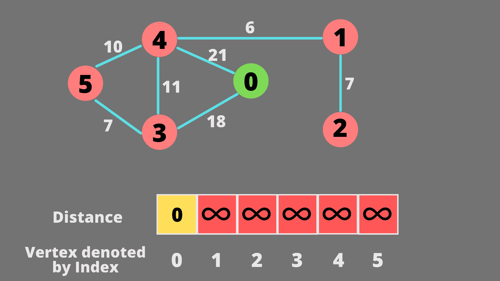
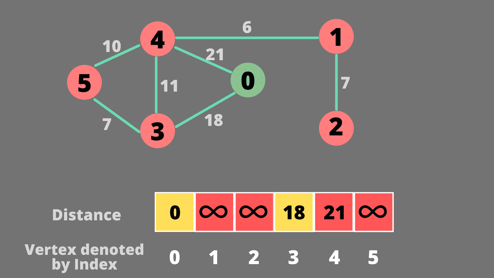
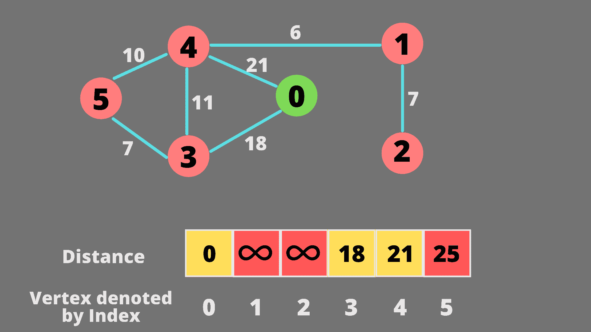
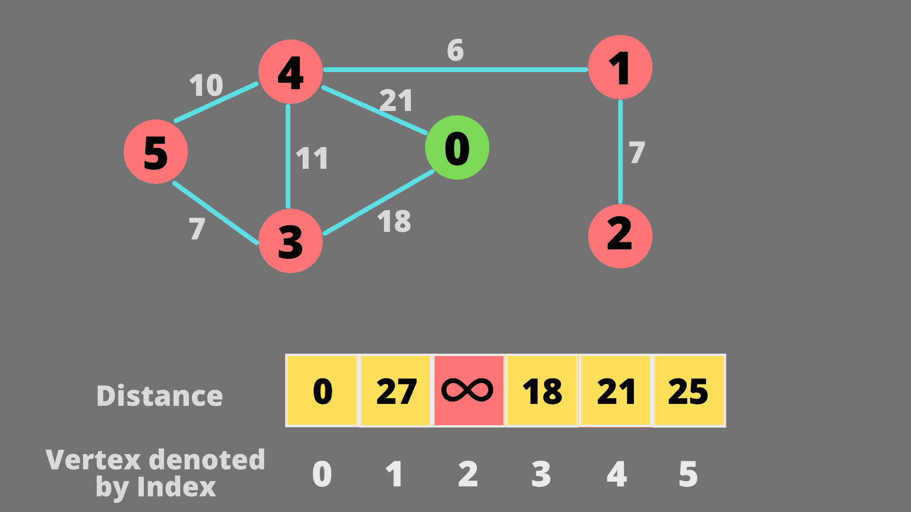
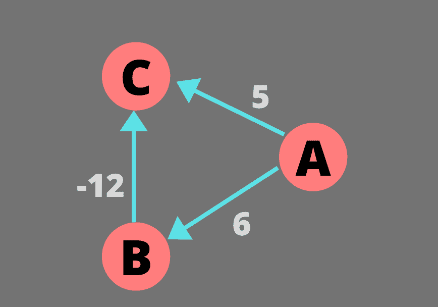

# Java 中的迪克斯特拉算法

> 原文：<https://www.studytonight.com/java-examples/dijkstras-algorithm-in-java>

迪克斯特拉算法是一种流行的算法，用于处理图形。该算法寻找从源顶点到加权图的所有其他顶点的最短距离。

在本教程中，我们将学习该算法的工作原理，并在 Java 中实现它。

## 迪克斯特拉算法

如上所述，迪克斯特拉算法用于解决加权图的**最短路径问题**。在每次迭代中，算法都会找到最接近当前节点的节点。然后，它探索这个最近的节点，并重复上述步骤。我们需要维护到每个节点的距离列表。这将有助于我们确定下一个要探索的节点。

该算法在每次迭代中选择最优路径，而不用担心后面会发生什么，因此被归类为**贪婪算法**。以下步骤解释了算法的工作原理。

*   我们首先创建一个距离数组来存储从源到顶点的距离。我们还创建了一个访问过的数组来指示我们是否已经确定了一个节点的最短距离。
*   接下来，我们将创建一个循环，只要我们没有找到每个节点的最短距离，这个循环就会运行。
*   在循环中，我们将找到最近的节点，其最短距离尚未计算。该节点不应出现在受访阵列中。
*   接下来，我们将探索该节点的所有相邻邻居。如果我们可以通过最近的节点到达一个节点，并且移动的距离更少，那么我们将更新该节点的最短距离。基本上，我们将更新节点 X 的最短距离，如果:

```java
(current shortest distance from source to the current closest node) + (distance from the current closest node to node X) < (current shortest distance from source to node X)
```

让我们借助一个例子来试着理解这个算法。我们将处理下图。我们将创建一个距离数组，并将每个元素(除了源)初始化为无穷大。顶点的命名从 0 到 5。使用索引更新距离数组会更容易。



我们将当前节点的每个邻居的距离(此步骤中为 0)添加到数组中。现在我们从距离数组中选择最近的未访问节点。所以选择节点 3。节点 3 的最短距离已经确定。



接下来，我们将为节点 3 的所有邻居更新距离数组。我们只会更新距离，如果我们可以通过更少的距离到达一个节点。现在距离最后确定的最近节点是节点 4。节点 4 的最短距离已经确定。



现在，从节点 4，我们可以通过更短的距离到达节点 1。因此，我们将更新节点 1 的距离数组值。下一个最近的未处理节点是节点 5。

从节点 5 开始，我们无法通过更短的距离到达任何节点。所以这一步不会更新距离值。节点 1 被选为下一个最接近的节点。



从节点 1 开始，唯一可以更新距离的节点是节点 2。下一个最近的节点也将是节点 2。现在，已经访问了所有节点，并且为所有节点确定了最短距离。循环将终止。

最后的最短距离数组是[0，27，34，18，21，25]。

### 迪克斯特拉算法的缺点

Dijkstra 算法的一个主要缺点是它**不能处理负边缘权重**。发生这种情况是因为 Dijkstra 的算法使用了贪婪的方法。无论何时从距离数组中选择最近的节点，我们都会将该节点的距离标记为最终确定。我们永远不会更新那个节点的距离。这对于正权重非常有效，但是对于负边缘权重可能给出不一致的解决方案。

例如，考虑以下具有负边权重的有向加权图。



让我们考虑顶点 A 作为源。在第一次迭代中，更新了 B 和 C 的距离。由于 C 是最近的节点，我们将该节点的最短最终距离标记为 5。从 C 开始，我们无法到达任何其他节点。下一个节点 B 将被选为最近的，并且该节点的距离也被标记为最终距离。所有节点都已被访问，最短距离已确定，因此算法结束。但是我们可以通过更短的距离(-6)经由节点 B 到达节点 C。但是 Dijkstra 的算法说从 A 到 C 的最短距离是 5。

## 迪克斯特拉算法的实现

让我们先来看看我们的 Graph 类。它有一个**二维邻接矩阵**，和一个用于存储顶点数量的整数变量。它还有一个 **addEdge()** 方法。我们使用有向图来实现，因此当添加边时，邻接矩阵的两个单元将被更新。

```java
class Graph
{
	int[][] adjMatrix;
	int numOfvertices;

	Graph(int[][] mat, int v)
	{
		this.adjMatrix = mat;
		this.numOfvertices = v;
	}

	void addEdge(int src, int dest, int edgeWeight)
	{
		adjMatrix[src][dest] = edgeWeight;
		adjMatrix[dest][src] = edgeWeight;
	}
}
```

让我们用 Java 实现 Dijkstra 的算法。我们将使用名为 **getClosestVertex()** 的辅助方法来查找最近的未访问节点。该方法的代码如下所示。

```java
public static int getClosestVertex(int[] distance, boolean[] visited)
{
	int min = Integer.MAX_VALUE;
	int minIdx = -1;
	for(int i=0; i<distance.length; i++)
	{
		if(distance[i] < min)
			if(visited[i] == false)
			{
				min = distance[i];
				minIdx = i;
			}
	}
	return minIdx;
}
```

接下来，我们将在一个**dijkstrashortestpath()**方法中实现主算法。该方法将采用一个图形和一个源顶点作为参数。它将返回一个最短距离数组。

```java
public static int[] dijkstrasShortestPath(Graph g, int src)
{
	//final shortest distance array
	int[] distance = new int[g.numOfvertices];
	//array to tell whether shortest distance of vertex has been found
	boolean[] visited = new boolean[g.numOfvertices];

	//initializing the arrays
	for(int i=0; i<g.numOfvertices; i++)
	{
		distance[i] = Integer.MAX_VALUE;//initial distance is infinite
		visited[i] = false;//shortest distance for any node has not been found yet
	}
	distance[src] = 0;

	for(int i=0; i<g.numOfvertices; i++)
	{
		int closestVertex = getClosestVertex(distance, visited);//get the closest node
		//if closest node is infinite distance away, it means that no other node can be reached. So 
        return
		if(closestVertex == Integer.MAX_VALUE)
			return distance;

		visited[closestVertex] = true;
		for(int j=0; j<g.numOfvertices; j++)
		{
			if(visited[j] == false)//shortest distance of the node j should not have been finalized
			{
				if(g.adjMatrix[closestVertex][j] != 0)
				{
					int d = distance[closestVertex] + g.adjMatrix[closestVertex][j];
					if(d < distance[j])//distance via closestVertex is less than the initial distance
						distance[j] = d;
				}
			}		
		}
	}
	return distance;
}
```

让我们检查一下我们的代码是否给出了预期的结果。

```java
import java.util.Arrays;

public static void main(String[] args)
{
	int numOfVertices = 6;
	int[][] adjMat = new int[6][6];
	Graph graph = new Graph(adjMat, numOfVertices);
	graph.addEdge(0, 4, 21);
    graph.addEdge(0, 3, 18);
    graph.addEdge(2, 1, 7);
    graph.addEdge(1, 4, 6);
    graph.addEdge(4, 5, 10);
    graph.addEdge(4, 3, 11);
    graph.addEdge(5, 3, 7);
    int[] dist = dijkstrasShortestPath(graph, 0);
	System.out.print(Arrays.toString(dist));
}
```

【0、27、34、18、21、25】

## 空间和时间复杂性

对于每次迭代，我们都在计算从最近的节点到所有剩余节点的距离。这导致了 **O(V^2)** 的时间复杂性，其中 v 是顶点的数量。

我们还维护了两个数组(距离和访问)，因此需要一个与顶点数量相等的额外空间。上述实现的空间复杂度为 **O(V)** 。

## 摘要

Dijkstra 算法用于寻找图的节点之间的最短距离。我们可以将该算法用于有向图和无向图，但它不适用于负边权重。我们可以通过使用最小堆或优先级队列来找到最近的节点，从而进一步优化我们的实现。

* * *

* * *