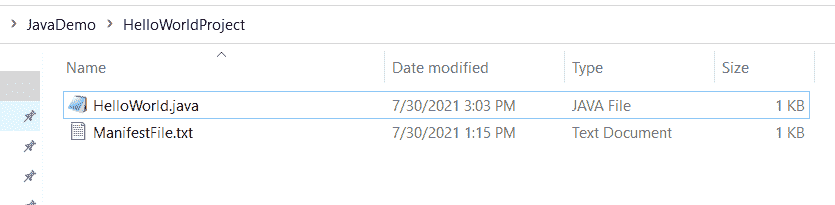
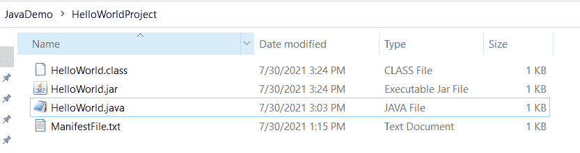
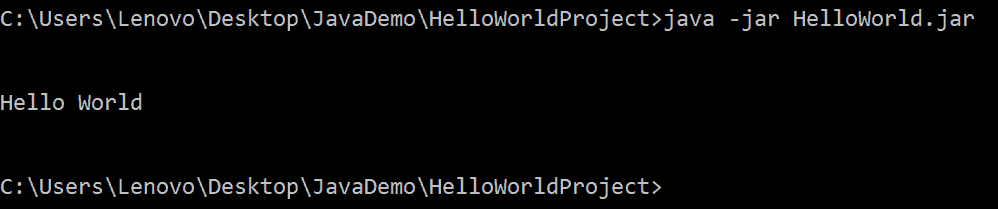
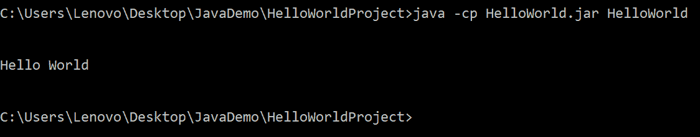
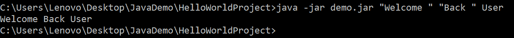
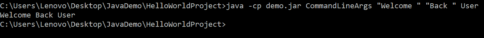

# 从命令行运行 JAR 文件

> 原文：<https://www.studytonight.com/java-examples/run-jar-file-from-command-line>

JAR 是 Java Archive 的缩写。JAR 文件包含压缩的 Java 项目文件。它包括。项目所需的类文件和其他元数据和资源。

JAR 文件是与他人共享和分发我们的 Java 代码的好方法。

在这个简短的教程中，我们将学习如何用 Java 创建和运行一个 JAR 文件。

## 创建 JAR 文件

一个 JAR 文件由编译后的 Java 组成。类文件和其他资源。我们可以创建一个可执行的或者不可执行的 JAR。

两者的区别在于，可执行的 JAR 文件包含清单文件，而不可执行的 JAR 文件不包含这一点。这个清单文件包含运行 JAR 时应该执行的类的名称。

在本教程中，我们将只使用一个类，它的主要方法是打印 Hello World。

```java
public class HelloWorld
{
	public static void main(String args[])
	{
		System.out.print("\n\nHello World\n\n");
	}
}
```

我们的目录有两个文件，**。java** 文件和可执行 JAR 所需的清单文件。



我们需要编译后的**。类**文件创建一个 JAR 文件。我们首先需要运行 javac 命令来创建。类文件。java 文件。

```java
javac HelloWorld.java
```

### 创建可执行的 JAR 文件

为了创建一个可执行的 JAR 文件，我们还需要一个清单文件。清单文件的内容如下所示。

```java
Main-Class: HelloWorld 
```

接下来，我们可以通过运行下面的 jar 命令来创建一个 JAR 文件。

```java
jar -cfm HelloWorld.jar ManifestFile.txt HelloWorld.class
```

**-c 标志**用于创建归档文件。 **-f 标志**用于指定文件名。并且 **-m 标志**将包括清单文件的内容。

执行上述命令后，在我们当前的目录中创建了一个名为 HelloWorld.jar 的新 JAR 文件。请注意。下图中显示的类文件是在运行 javac 命令后创建的。



### 创建不可执行的 JAR 文件

为了创建一个不可执行的 JAR 文件，我们将排除 **-m 标志**。我们不需要将清单文件的名称传递给我们的命令。

```java
jar -cf HelloWorld.jar HelloWorld.class
```

## 运行 JAR 文件

### 运行可执行的 JAR 文件

我们可以使用以下带有 **-jar** 选项的 java 命令来运行可执行的 jar 文件。

```java
java -jar HelloWorld.jar
```

该命令的输出如下所示。



### 运行不可执行的 JAR 文件

我们将使用 **-cp 选项**来运行一个**不可执行的 JAR** 文件，而不是使用 **-jar 选项**。我们需要在命令中指定 JAR 文件名和主类名。

```java
java -cp HelloWorld.jar HelloWorld
```

该命令的输出如下所示。



## 用命令行参数运行 JAR 文件

任何 Java 应用都可以有任意数量的命令行参数。这些参数通过字符串数组传递给类的 main()方法。JAR 文件也包含类，我们可以在运行 JAR 文件时传递命令行参数。

参数应该用空格分隔。如果任何参数包含空格，那么我们必须用引号将该参数括起来。

让我们用一个主方法创建一个新类。`main()`方法应该打印传递给它的命令行参数。

```java
public class CommandLineArgs
{
	public static void main(String args[])
	{
		for(String s : args)
			System.out.print(s);
	}
}
```

我们将编译**。java** 文件并创建可执行和不可执行的 jar 文件，如前面几节所示。

为了运行可执行的 JAR，我们将使用 java **-jar** 命令并传递参数。

在下面的命令中，传递了三个参数。因为前两个应该在末尾包含空白，所以我们用引号将它们括起来。

```java
java -jar demo.jar "Welcome " "Back " User
```



对于不可执行的 JAR，我们将使用- **cf 选项**并传递主类名。我们也将像在上面的代码中一样传递参数。

```java
java -cp demo.jar CommandLineArgs "Welcome " "Back " User
```



## 摘要

JAR 文件是与他人共享和分发我们的代码的好方法。在本教程中，我们学习了如何创建一个 JAR 文件并从命令行运行它。我们还学习了如何将命令行参数传递给 JAR 文件中类的 main()方法。

* * *

* * *