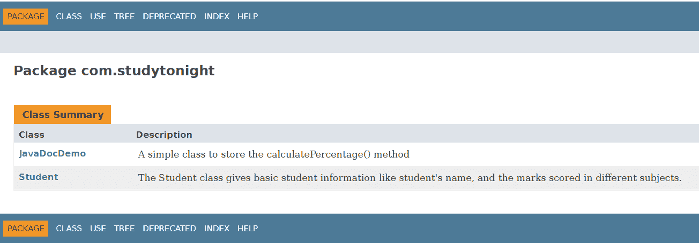
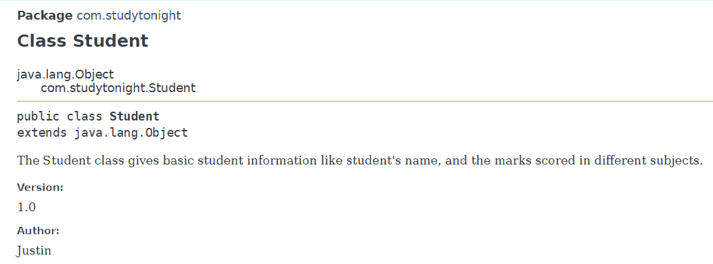
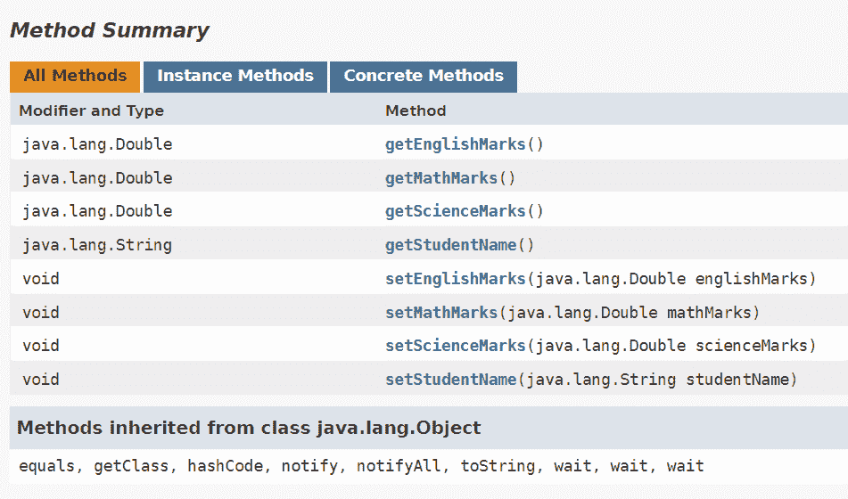
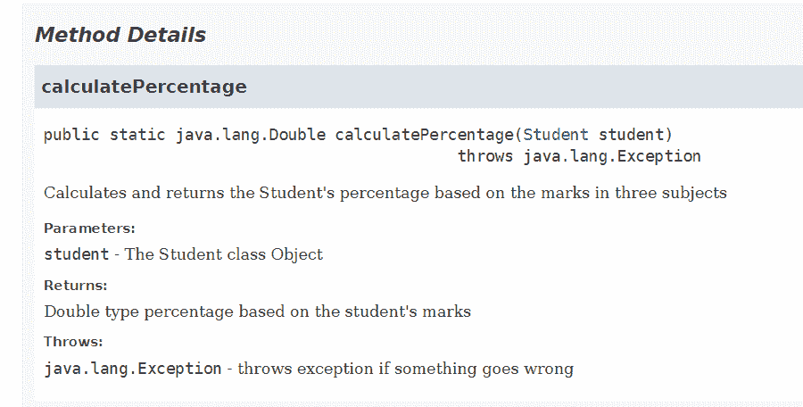

# Javadoc 简介

> 原文：<https://www.studytonight.com/java-examples/introduction-to-javadoc>

文档提供了关于如何使用软件及其功能的见解。好的文档会使软件更容易适应。Java 提供了一个名为 Javadoc 的工具，可以生成 HTML 页面格式的文档。

在本教程中，我们将学习如何创建和使用 Javadoc。

## Java 注释

注释是解释代码功能的一种方式。他们添加到源代码本身。在 Java 中，我们有三种类型的注释。

*   单行注释(以//开头，跨越整行)
*   多行注释(以/*开头，以*/结尾)
*   Javadoc 注释(以/**开头，以*/结尾)

这些注释被编译器完全忽略，不会影响我们代码的性能。Javadoc 注释被 Javadoc 工具用来为我们的代码生成文档。编写好的 Javadoc 注释以创建易于阅读的文档非常重要。

## Javadoc 评论

如上所述，Javadoc 注释有助于 Javadoc 工具生成更好的文档。Javadoc 注释包含两部分。它包含特定元数据的代码描述和 Javadoc 标签。这些注释放在我们要向其添加信息的类、字段或方法之前。

### Javadoc 标签

Javadoc 标签用于指定关于一段代码的一些元数据。它们以@符号开始。有很多标签是为了不同的目的而定义的。下面解释一些最常用的标签。

*   @author 用来描述作者的名字。
*   @param 提供了有关传递给方法的参数的信息。
*   @see 用于添加对代码中其他元素的引用。
*   @version 用于设置代码的版本。
*   @return 用于描述方法的返回值。
*   @exception 用于指定异常的类型(如果方法使用了 throws 关键字)。也可以使用@throws。
*   @已弃用用于说明代码部分被弃用的原因。

我们也可以根据自己的需要创建自定义标签。使用以下 Javadoc 命令创建自定义标签。

```java
javadoc -tag <tag-name>:<location:allowed>:<text-name-in-output> <class-location>
```

由于 Javadoc 工具为文档生成了一个 HTML 页面，我们可以在 Javadoc 注释中添加 HTML 标签，以更好地格式化描述。

```java
/**
*    <h1>Method to Print Hello World<h1>
*    <p> This method uses the <b>System.out.print()</b> method to print Hello World 
*    to the console.</p>
*/
public static void printHelloWorld()
{
    System.out.print("\n\nHello World\n\n");
}
```

### 类级别的 Javadoc 注释

让我们创建一个学生类，并向其中添加 Javadoc 注释。我们将包括对课程的简要描述。我们还将添加@author 标签来设置类的作者名，并添加@version 标签来指定类的版本。

```java
/**
 * The Student class gives basic student information like student's name, and 
 * the marks scored in different subjects.
 * 
 * @author 	Justin
 * @version 1.0
 *
 */
public class Student
{
    ...
}
```

### 字段级别的 Javadoc 注释

接下来，我们将向 Student 类添加一些属性，并为它们编写 Javadoc 注释。我们将为每个字段添加简单的描述。

```java
public class Student
{
	/**
	 * Student name field of String type
	 */
	String studentName;

	/**
	 * Marks scored in Mathematics
	 */
	Double mathMarks;

	/**
	 * Marks scored in Science
	 */	
	Double scienceMarks;

	/**
	 * Marks scored in English
	 */
	Double englishMarks;
}
```

### 方法级的 Javadoc 注释

我们将创建一个新类，并向该类添加一个方法。这种方法计算学生的百分比。让我们查看这个方法的 Javadoc 注释。

```java
/**
	 * Calculates and returns the Student's percentage based on the marks in three subjects
	 * 
	 * @param student The Student class Object
	 * @return Double type percentage based on the student's marks
	 * @throws Exception throws exception if something goes wrong
	 *
*/
public static Double calculatePercentage(Student student) throws Exception
{
	Double math = student.getMathMarks();
	Double sci = student.getScienceMarks();
	Double eng = student.getEnglishMarks();
	return (math + sci + eng) / 300;
}
```

## 正在生成 Javadoc

我们可以通过命令行使用下面的 Javadoc 命令轻松生成 Javadoc 文档页面。

我们需要指定我们想要文档的类或包。使用`-d`标志指定您想要创建文档文件的位置。

```java
javadoc -d doc <class or package name>
```

IDEs 还可以生成 Javadoc 文档。

我们可以通过打开**index.html**文件来查看生成的文档。以下图像显示了生成的文档。

### 包中存在的类的摘要



### 学生班





### JavaDocDemo 类中的计算百分比()方法



## 摘要

Javadoc 是一个文档生成器工具。我们需要在源代码中使用 Javadoc 注释来创建描述性且易于理解的文档。Javadoc 为我们提供了内置标签，我们可以用它来指定代码的某些属性。我们还可以创建定制的 Javadoc 标签来满足我们的需求。

* * *

* * *