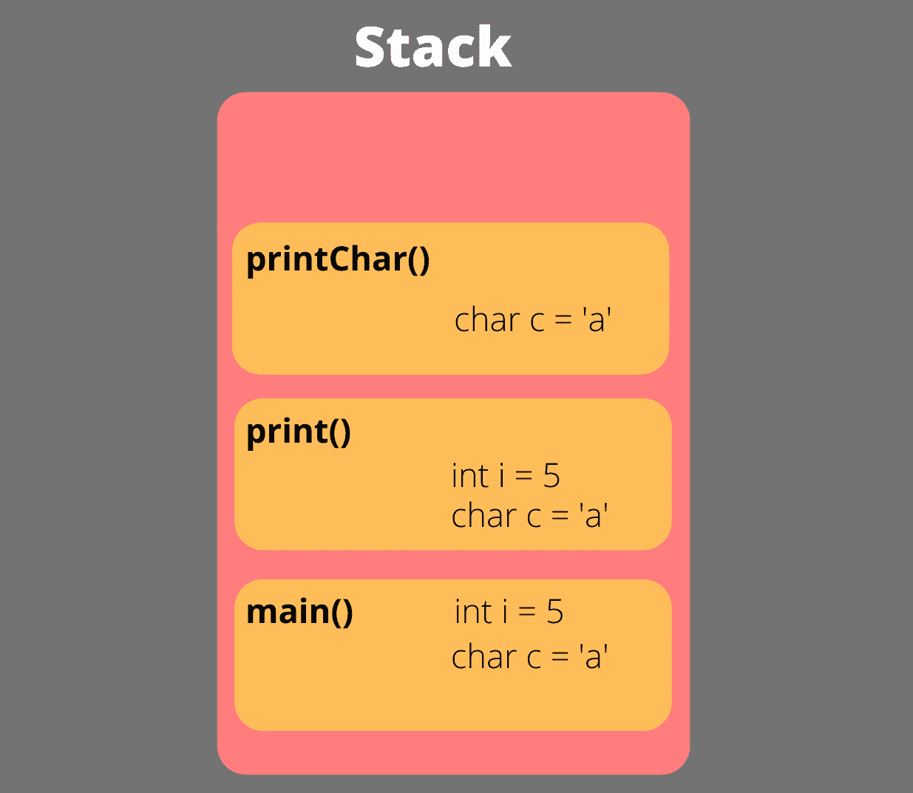
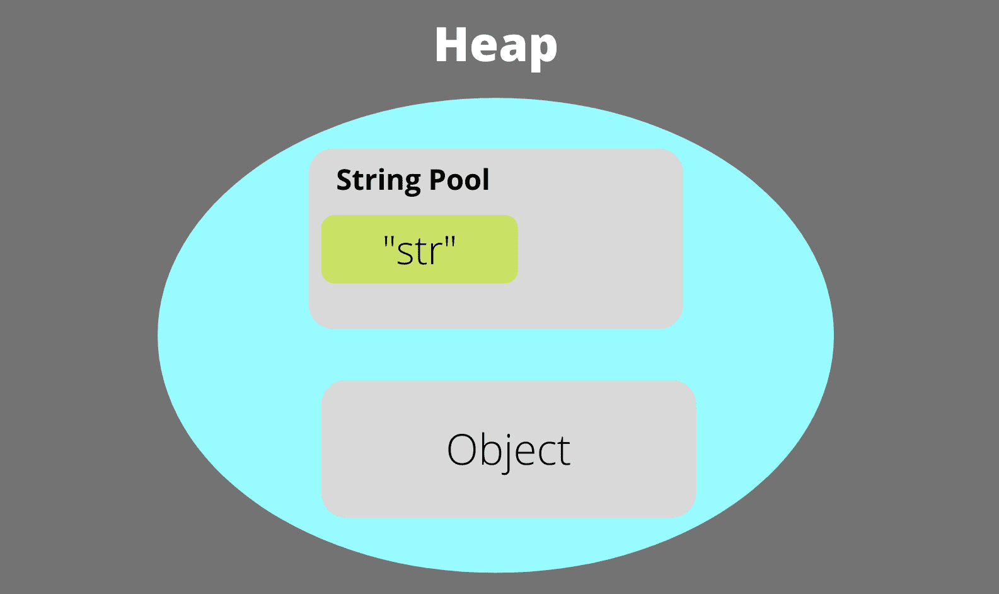
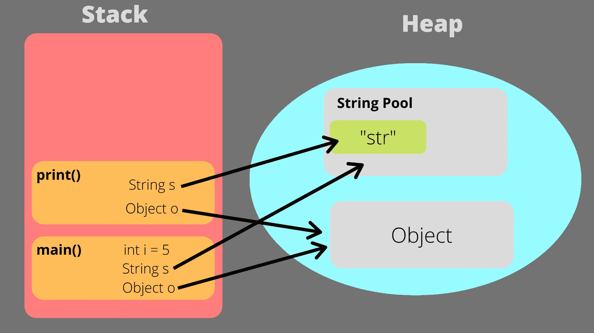

# Java 堆栈和堆内存

> 原文：<https://www.studytonight.com/java-examples/java-stack-and-heap-memory>

Java 中的内存分为两部分-`Stack`和`Heap`。这样做是为了确保我们的应用有效地利用内存。

在本教程中，我们将更多地了解这两种类型的记忆以及它们之间的主要区别。

## 栈存储器

*   堆栈内存用于**线程执行**和**静态内存分配**。**所有原始数据驻留在堆栈内存中，对其他对象的引用也存储在其中**。它只包含当前线程可用的本地数据。
*   每当从 Java 应用调用一个方法时，该方法的一个新块就会被添加到堆栈中。该块将包含方法所需的所有原始数据和引用。
*   堆栈内存，顾名思义，使用堆栈数据结构的**后进先出(LIFO)** 方法来添加和移除方法调用。
*   堆栈内存比堆内存快得多。它也比堆内存更安全，因为数据只能由正在运行的线程访问。它是**线程安全的**，不需要同步，因为每个线程都有自己的堆栈。
*   内存的分配和解除分配是自动完成的。每当调用一个方法时，都会在堆栈的顶部为该方法添加一个新的块。当方法完成执行或**返回时，**则块和所有相应的数据被移除，空间变得可用于新的方法调用。
*   如果耗尽堆栈内存，我们可能会遇到**堆栈溢出错误或**。我们可以编写一个简单的程序来模拟这个错误。如果我们重复调用一个方法，那么这些方法调用将在堆栈中累积，最终，我们会得到这个错误。在下面的代码中，我们递归调用其定义中的`overflowError()`方法，这导致了`StackOverflowError`。

```java
public class JavaMemoryManagement
{
	public static void overflowError()
	{
		overflowError();
	}	
	public static void main(String[] args)
	{
		overflowError();
	}
}
```

让我们看一个例子来理解内存是如何在堆栈中分配的。

在下面的代码中，我们在`main()`方法中创建了原始整数数据和 char 数据。这个`main()`方法会被推到栈顶。然后我们调用`print()`方法，该方法将再次添加到堆栈顶部。在 print()方法内部，我们正在调用`printChar()`方法，并且在堆栈上为该方法分配了一个块。堆栈中的所有这些方法块都有所需的可用数据。

```java
public class JavaMemoryManagement
{
	public static void print(int i, char c)
	{
		System.out.println(i);
        printChar(c);
	}	
	public static void printChar(char c)
	{
		System.out.println(c);
	}	
	public static void main(String[] args)
	{
		int i = 5;
		char c = 'a';
		print(i, c);
	}
}
```

最终的堆栈内存如下图所示。

## 

## 堆内存

*   堆内存是所有类实例或对象被分配内存的地方。如上所述，对这些对象的引用存储在堆栈存储器中。所有**动态内存分配都发生在堆**中。堆内存也是**全局可访问的**，任何线程都可以访问内存。
*   与使用堆栈数据结构的堆栈内存不同，堆数据结构与堆内存没有任何联系。
*   堆内存不如堆栈内存安全，因为所有线程都可以访问对象，我们必须同步它们。
*   它也比堆栈内存慢很多。
*   内存分配和释放不是很简单，堆内存使用复杂的内存管理技术。内存释放不是自动完成的，Java 使用垃圾收集机制来释放空间。
*   堆内存进一步分为三个部分:
    *   **Young Generation:** 这部分堆内存是所有新分配对象驻留的地方。当这部分内存变满时，就会发生垃圾收集。
    *   **老一代:**当年轻一代对象跨越一个阈值时间限制时，则转移到老一代空间。这通常包含不经常使用的对象。
    *   **永久生成:**这是 JVM 存储运行时类和应用方法的元数据的地方。
*   如果我们用完了堆内存，那么 JVM 抛出`**OutOfMemoryError**`。如果我们继续分配空间而不删除旧的对象，就会发生这种情况。我们可以通过创建一个无限循环来模拟这个错误，该循环不断为新的字符串类对象分配内存。下面的代码将运行几秒钟，然后我们将得到 OutOfMemory 错误

```java
public class JavaMemoryManagement
{
	public static void outOfMemoryError()
	{
		List<String> list = new ArrayList<String>();
		while(true)
		{
			String s = "str";
			list.add(s);
		}
	}	
	public static void main(String[] args)
	{
		outOfMemoryError();
	}
}
```

考虑下面的例子来更好地理解堆内存。

在下面的代码中，我们正在创建一个字符串对象，它将在堆内存的**字符串池**中被分配空间。我们还创建了一个对象类的实例，并将为这个对象分配空间。对这些对象的引用将存储在堆栈内存中。

```java
public class JavaMemoryManagement
{
	public static void main(String[] args)
	{
		String s = "str";
		Object o = new Object();
	}
}
```

最终的堆内存如下图所示。



## 堆栈和堆内存的主要区别

下表解释了这两种内存之间的一些主要区别。

| **参数** | **堆栈内存** | **堆内存** |
| 使用 | 堆栈内存用于线程执行和存储方法调用以及与方法相关联的原始数据和引用。 | 堆内存用于存储动态分配的对象。 |
| 大小 | 堆栈的大小要小得多。 | 堆内存比堆栈大得多。 |
| 一生 | 堆栈内存仅在线程执行期间或当前方法运行时使用。堆栈内存是短暂的。 | 堆内存在应用的整个运行期间使用。 |
| 效率 | 堆栈内存非常高效，内存访问也更快。 | 堆的效率较低，比堆栈慢得多。 |
| 内存分配和释放 | 调用新方法时会自动分配内存，方法返回时也会自动取消分配。 | 当创建新对象时，内存由程序员手动分配。垃圾收集器通过移除不再被引用的对象来释放内存。 |
| 安全 | 堆栈内存是线程安全的，每个线程都有自己的堆栈，只能由所有者线程访问。 | 堆内存不是线程安全的，程序员必须使用同步技术，因为对象可以被任何线程访问。 |
| 内存管理 | 堆栈内存使用后进先出法进行内存管理。 | 内存管理在堆内存中相当复杂。 |
| 错误 | 当堆栈内存满了，我们得到一个堆栈溢出错误。 | 当堆内存满了，我们会得到一个 OutOfMemoryError。 |
| 改变尺寸 | 可以使用-Xss 命令改变堆栈的大小。 | 我们可以通过使用-Xms 命令来更改堆的初始大小。我们可以通过使用-Xmx 命令来声明最大堆大小。 |

## 堆栈和堆内存示例

让我们试着理解当我们创建新对象和调用方法时，引擎盖下会发生什么。考虑下面的代码，它创建了一个新的 int 变量、一个 String 对象和 object 类的另一个对象。然后调用 print()方法打印字符串和对象。

```java
public class JavaMemoryManagement
{
	public static void print(String s, Object o)
	{
		System.out.println(s);
        System.out.println(o);
	}	
	public static void main(String[] args)
	{
		int i = 5;
		String s = "str";
		Object o = new Object();
		print(s, o);
	}
}
```

下面的步骤解释了当我们运行上面的代码时会发生什么。

*   执行从`main()`方法开始。此方法将被添加到堆栈的顶部。
*   在`main()`方法中，创建 int 类型的原始数据。这将出现在堆栈本身中。
*   接下来，创建`String`类的对象。将在堆内存中为该对象分配空间，对该对象的引用将存储在堆栈中。创建`Object`类的实例时也会发生同样的事情。
*   接下来`print()`方法将被添加到堆栈的顶部。对字符串类实例和`Object`类实例的引用将可用于该方法。记忆将如下所示。



## 摘要

JVM 使用两种类型的内存来高效执行我们的应用。所有原语和方法调用都存储在堆栈内存中，所有动态分配的对象都存储在堆内存中。堆栈是一种简单的内存类型，它使用后进先出的顺序(就像堆栈数据结构一样)，而内存管理在堆中相当复杂。堆内存进一步分为年轻一代、老一代和永久一代。

* * *

* * *