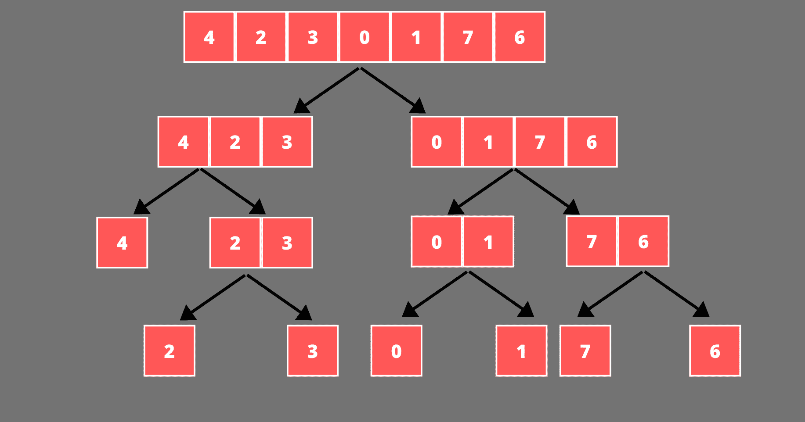
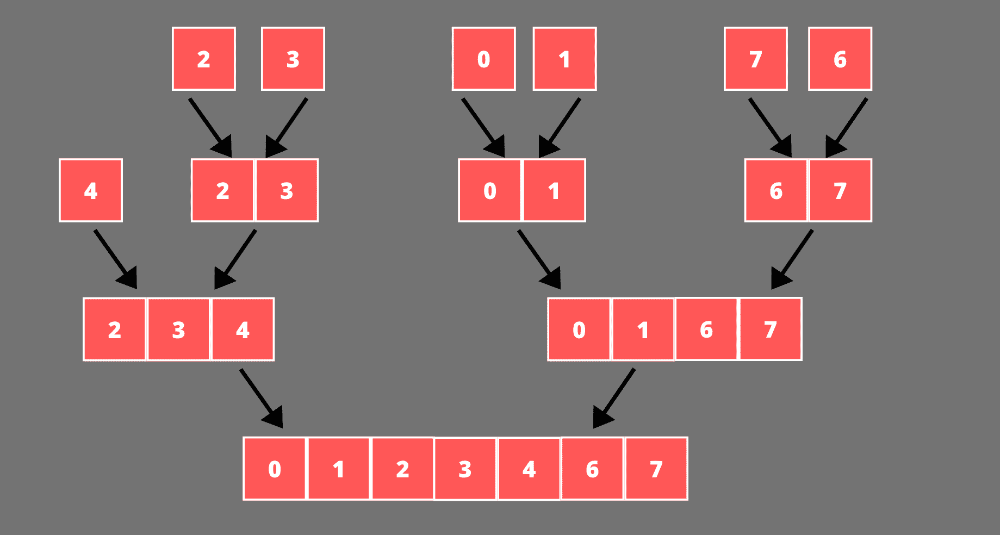
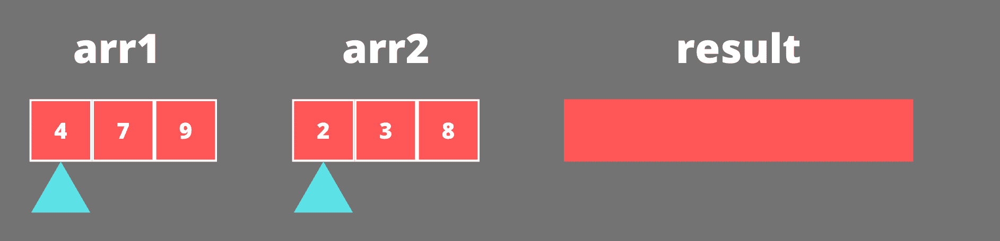
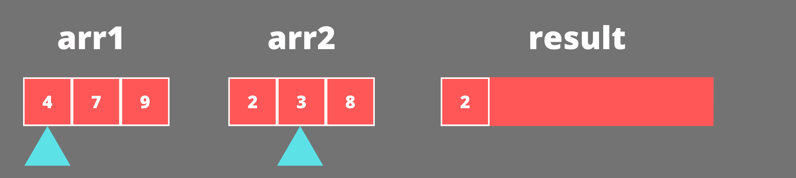
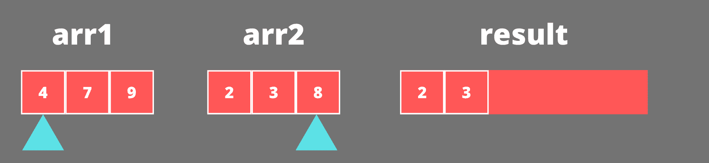
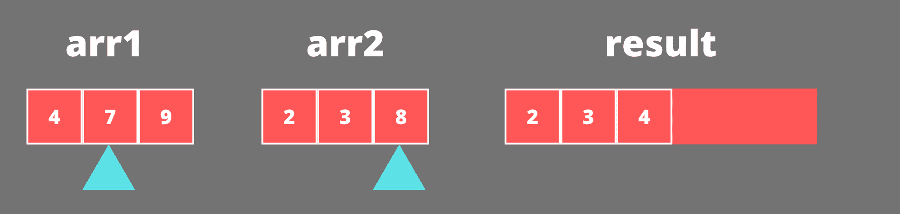
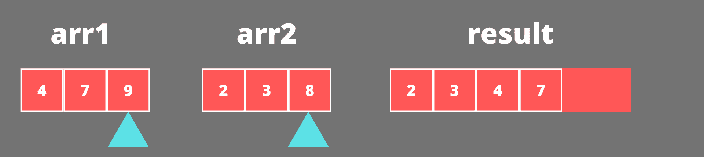
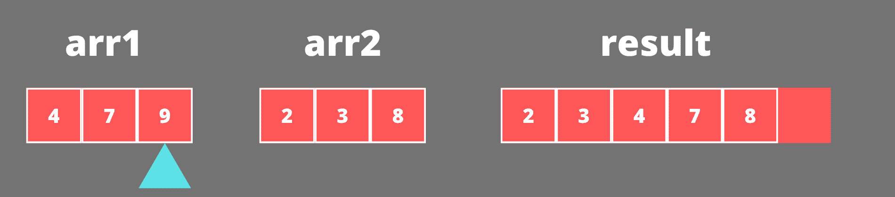

# Java 中的归并排序

> 原文：<https://www.studytonight.com/java-examples/merge-sort-in-java>

归并排序是一种高效稳定的排序算法。它基于分治算法方法。在本教程中，我们将了解更多关于归并排序及其在 Java 中的实现。

## 归并排序算法

归并排序使用**分治**技术进行排序。算法的除法部分包括将输入数组分成两个较小的数组。较小的数组再次分成两半。

只要数组包含不止一个元素，这个过程就递归地继续。记住**一个只有一个元素的数组已经被排序了**。归并排序利用了这个属性，并将其用于算法的征服部分。

这部分的算法总结如下。

*   如果输入数组长度小于 2，则返回。
*   否则，计算数组的中间索引并递归拆分前半部分。
*   然后递归拆分数组的右半部分。
*   将数组的左半部分和右半部分合并成一个排序数组。



分割输入数组后，算法将这些较小尺寸的数组合并成一个排序数组。**合并总是在两个排序的数组**上进行。发生这种情况是因为合并过程将在将输入数组划分为单元素数组后开始。



让我们考虑一个例子来更好地理解数组的合并。假设我们有两个排序数组，[4，7，9]和[2，3，8]。以下步骤解释了如何将这两个数组合并成一个排序数组。

最初，我们在两个数组的开头都有一个指针。我们将重复以下步骤，直到任何一个数组中的元素用完。



比较两个数组指针引用的元素。第二数组的第一元素小于第一数组的第一元素(2<4)。因此，我们将较小的元素添加到最终排序的数组中，并将第二个数组的指针向左移动一个位置。



同样，第二个数组的引用元素更小(3<4)。所以 3 被加到最后一个数组中，第二个数组的指针向前移动。



现在，第一个数组的引用元素变小了(4<8)。所以 4 被添加到结果数组中，第一个数组的指针向前移动到 7。



7 小于 8，所以它被添加到结果数组中，第一个数组的指针移到 9。



第二个数组的被引用元素小于第一个数组的被引用元素(8<9)。所以 8 被添加到最终的排序数组中。第二个数组指针不能向前移动，因为我们用完了第二个数组中的元素。所以循环结束。



另一个数组的所有元素都被添加到最终的数组中。我们的最终数组看起来像[2，3，4，7，8，9]。

## Java 中归并排序的实现

让我们在 Java 中实现归并排序。我们将使用两种方法来实现归并排序算法。一个 **mergeSort()** 方法将递归地划分输入数组，并对它们调用 merge()方法。 **merge()** 方法将包含合并逻辑。

**mergeSort()** 方法代码如下。

```java
public static void mergeSort(int[] arrToSort, int startIdx, int endIdx)
{
	if (startIdx >= endIdx) //array contains just a single element
		return; 

	int midIdx = startIdx + (endIdx - startIdx) / 2; //middle index
	mergeSort(arrToSort, startIdx, midIdx); //Divide the left half recursively
	mergeSort(arrToSort, midIdx + 1, endIdx); //Divide the right half recursively

	merge(arrToSort, startIdx, midIdx, endIdx); //merge the left and right half
} 
```

**合并()**方法代码如下。

```java
public static void merge(int[] arrToSort, int startIdx, int midIdx, int endIdx)
{
	int[] leftArr = new int[midIdx - startIdx + 1]; 
	int[] rightArr = new int[endIdx - midIdx];

	//Initializing the left and right arrays
	for(int i=0; i<leftArr.length; i++)
		leftArr[i] = arrToSort[startIdx + i];

	for(int i=0; i<rightArr.length; i++)
		rightArr[i] = arrToSort[midIdx + i + 1];

	//merging the left and right arrays into a single sorted array
	int leftArrIdx = 0, rightArrIdx = 0, sortedArrIdx = startIdx;
	while((leftArrIdx < leftArr.length) && (rightArrIdx < rightArr.length))
	{
		if(leftArr[leftArrIdx] < rightArr[rightArrIdx])
		{
			arrToSort[sortedArrIdx] = leftArr[leftArrIdx];
			leftArrIdx += 1;
		}
		else
		{
			arrToSort[sortedArrIdx] = rightArr[rightArrIdx];
			rightArrIdx += 1;
		}
		sortedArrIdx += 1;
	}

	//Adding the rest of the elements of left array if present
	while(leftArrIdx < leftArr.length)
	{
		arrToSort[sortedArrIdx] = leftArr[leftArrIdx];
		leftArrIdx += 1;
		sortedArrIdx += 1;
	}

	//Adding the rest of the elements of right array if present
	while(rightArrIdx < rightArr.length)
	{
		arrToSort[sortedArrIdx] = rightArr[rightArrIdx];
		rightArrIdx += 1;
		sortedArrIdx += 1;
	}
}
```

让我们运行几个例子来检查我们的方法是否工作正常。

```java
public static void main(String[] args)
{
	int[] arr1 = { 4, 2, 3, 0, 1, 7, 6 };
	mergeSort(arr1, 0, arr1.length - 1);
	System.out.println(Arrays.toString(arr1));

	int[] arr2 = {};
	mergeSort(arr2, 0, arr2.length - 1);
	System.out.println(Arrays.toString(arr2));

	int[] arr3 = {7};
	mergeSort(arr3, 0, arr3.length - 1);
	System.out.println(Arrays.toString(arr3));

	int[] arr4 = {-1, -7, 0, 11, 102, -11};
	mergeSort(arr4, 0, arr4.length - 1);
	System.out.println(Arrays.toString(arr4));
}
```

【0，1，2，3，4，6，7】
[]
【7】
[-11，-7，-1，0，11，102]

## 时间和空间复杂性

归并排序算法的递归关系将是 **T(n) = 2T(n/2) + O(n)** 。这就导致了 O(nLogn) 的**时间复杂度。记住归并排序是一个**稳定的算法，它的时间复杂度不会改变**。它的最佳情况、最坏情况和平均情况的时间复杂度将总是等于 **O(nLogn)** 。**

我们需要额外的空间，它等于输入数组的大小。这使得**空间复杂度等于 O(n)，**，其中 n 是输入数组的长度。

## 摘要

归并排序是最有效的算法之一，它可以很容易地用递归实现。它使用分治模式对数组进行排序。这是一个非常稳定的算法，其时间复杂度在所有三种情况下(最佳、最差和平均)都保持不变。

* * *

* * *