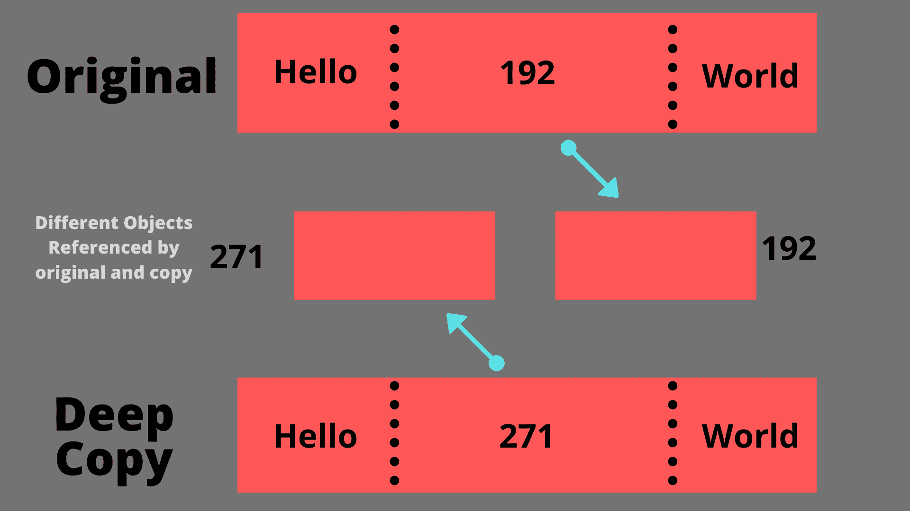

# 如何在 Java 中制作对象的深度副本？

> 原文：<https://www.studytonight.com/java-examples/how-to-make-a-deep-copy-of-an-object-in-java>

在 Java 中复制对象时，我们可能会得到一个浅拷贝，对克隆对象的任何修改也会改变原始对象。为了避免这种情况，我们使用深度复制的概念。当使用这种技术时，复制的对象不依赖于原始对象，我们可以独立处理这两个对象。

## 什么是浅拷贝？

一个**浅拷贝将简单地把原始对象**的字段值拷贝到新对象中。在浅拷贝中，如果原始对象有任何对其他类对象的引用(一个类成员本身就是某个其他类的对象)，那么**只克隆该对象的引用**。因此，此引用对象中的任何更改都将反映在原始对象和克隆对象上。


例如，假设我们有一个学生类，它有一个 GPA 类型的成员变量(用户定义的类)。现在，让我们创建一个名为 **s** 的学生类对象。接下来，我们将创建这个对象的克隆，并将其称为**副本**。现在，如果我们对**副本**对象的 GPA 进行任何更改，那么这个更改也会反映在原始 **s** 对象的 GPA 字段中。这是浅层克隆的一个例子。

请记住，我们需要**实现可克隆接口**和**覆盖克隆()**方法以允许克隆。我们将简单地使用标准的 clone()方法来执行浅层克隆。标准克隆()方法如下所示。

```java
//Standard clone() method to perform Shallow Cloning

@Override
protected Object clone() throws CloneNotSupportedException {
    return super.clone();
}
```

### 示例:Java 中的吞咽复制

下面的代码演示了浅层克隆的完整示例。

```java
class GPA
{
	int firstYear;
	int secondYear;

	GPA(int fy, int sy)
	{
		this.firstYear = fy;
		this.secondYear = sy;
	}

	public int getFirstYear() {
		return firstYear;
	}

	public void setFirstYear(int firstYear) {
		this.firstYear = firstYear;
	}

	public int getSecondYear() {
		return secondYear;
	}

	public void setSecondYear(int secondYear) {
		this.secondYear = secondYear;
	}
}

class Student implements Cloneable
{
	private String name;
	private GPA gpa;

	Student(String name, GPA gpa)
	{
		this.name = name;
		this.gpa = gpa;
	}

    //Standard clone() method to perform Shallow Cloning
	@Override
	protected Object clone() throws CloneNotSupportedException {
        return super.clone();
    }

	public String getName()
	{
		return this.name;
	}

	public GPA getGPA()
	{
		return this.gpa;
	}
	public void setName(String name)
	{
		this.name = name;
	}	
	public void setGPA(GPA g)
	{
		this.gpa = g;
	}
}

public class CopyDemo
{
	public static void main(String[] args) throws CloneNotSupportedException
	{
		GPA g = new GPA(7, 8);
		Student s = new Student("Justin", g);//original object

		Student copy = (Student)s.clone();//shallow copy

		System.out.println("Original Object's GPA: " + s.getGPA().getFirstYear() + " " + s.getGPA().getSecondYear());
		System.out.println("Cloned Object's GPA: " + copy.getGPA().getFirstYear() + " " + copy.getGPA().getSecondYear());

		copy.getGPA().setFirstYear(10);//Changing the GPA field of the shallow copy

		System.out.println("\nAfter changing the shallow copy");
		System.out.println("Original Object's GPA: " + s.getGPA().getFirstYear() + " " + s.getGPA().getSecondYear());
		System.out.println("Cloned Object's GPA: " + copy.getGPA().getFirstYear() + " " + copy.getGPA().getSecondYear());

	}
} 
```

原始对象的 GPA: 7 8
克隆对象的 GPA:7 8
T3】在更改了浅拷贝
原始对象的 GPA: 10 8
克隆对象的 GPA: 10 8 之后

## 什么是深度复制？

一个**深度副本将为原始类引用的对象**创建一个新对象。这确保了原始对象和克隆对象是独立的。**对于原始数据类型，浅克隆和深克隆的工作方式相同**，因为不涉及引用。



### 通过覆盖克隆()方法制作深度拷贝

在浅层克隆示例中，我们使用了标准的 clone()方法，但是如果我们希望创建深层拷贝，则必须对此方法进行一些更改。

我们将基本上克隆被引用的类，由于被引用的类只包含基本类型，因此创建了一个深度副本。然后，我们将这个深度副本分配给我们在 clone()方法中创建的新对象，并简单地返回它。修改后的克隆()方法如下所示。

```java
@Override
protected Object clone() throws CloneNotSupportedException
{
    Student s = (Student)super.clone();
    s.setGPA((GPA)s.getGPA().clone());
    return s;
}
```

我们还需要覆盖引用类(本例中为 GPA)中的 clone()方法，以确保我们可以在其上使用 clone()方法。

```java
class GPA implements Cloneable
{
	int firstYear;
	int secondYear;

	GPA(int fy, int sy)
	{
		this.firstYear = fy;
		this.secondYear = sy;
	}

	@Override
	protected Object clone() throws CloneNotSupportedException {
        return super.clone();
    }

    //getters and setters
}
```

### 示例:Java 中的深度复制

完整的代码如下所示。正如我们在输出中看到的，改变复制对象中的某些东西不会修改原始对象。

```java
class GPA implements Cloneable
{
	int firstYear;
	int secondYear;

	GPA(int fy, int sy)
	{
		this.firstYear = fy;
		this.secondYear = sy;
	}

	@Override
	protected Object clone() throws CloneNotSupportedException {
        return super.clone();
    }

	public int getFirstYear() {
		return firstYear;
	}

	public void setFirstYear(int firstYear) {
		this.firstYear = firstYear;
	}

	public int getSecondYear() {
		return secondYear;
	}

	public void setSecondYear(int secondYear) {
		this.secondYear = secondYear;
	}
}

class Student implements Cloneable
{
	private String name;
	private GPA gpa;

	Student(String name, GPA gpa)
	{
		this.name = name;
		this.gpa = gpa;
	}

	@Override
	protected Object clone() throws CloneNotSupportedException {
        Student s = (Student)super.clone();
        s.setGPA((GPA)s.getGPA().clone());
        return s;
    }

	public String getName()
	{
		return this.name;
	}

	public GPA getGPA()
	{
		return this.gpa;
	}
	public void setName(String name)
	{
		this.name = name;
	}	
	public void setGPA(GPA g)
	{
		this.gpa = g;
	}
}

public class CopyDemo
{
	public static void main(String[] args) throws CloneNotSupportedException
	{
		GPA g = new GPA(7, 8);
		Student s = new Student("Justin", g);//original object

		Student copy = (Student)s.clone();//deep copy

		System.out.println("Original Object's GPA: " + s.getGPA().getFirstYear() + " " + s.getGPA().getSecondYear());
		System.out.println("Cloned Object's GPA: " + copy.getGPA().getFirstYear() + " " + copy.getGPA().getSecondYear());

		copy.getGPA().setFirstYear(10);//Changing the GPA field of the deep copy

		System.out.println("\nAfter changing the Deep copy");
		System.out.println("Original Object's GPA: " + s.getGPA().getFirstYear() + " " + s.getGPA().getSecondYear());
		System.out.println("Cloned Object's GPA: " + copy.getGPA().getFirstYear() + " " + copy.getGPA().getSecondYear());

	}
} 
```

原始对象的 GPA: 7 8
克隆对象的 GPA: 7 8

更改深度副本
后原始对象的 GPA: 7 8
克隆对象的 GPA: 10 8

### 在 Java 中使用复制构造器

复制构造器是进行深度复制的最简单方法。我们只需创建一个构造器，该构造器将同一个类的对象作为输入，并返回一个具有相同值但有新引用的新对象(如果涉及被引用的类)。

GPA 类的复制构造器如下所示。

```java
GPA(GPA g)
{
	this.firstYear = g.firstYear;
	this.secondYear = g.secondYear;
}
```

学生类的复制构造器如下所示。

```java
Student(Student s)
{
	this.name = new String(s.name);
	this.gpa = new GPA(s.gpa);
} 
```

### 示例:Java 中的复制构造器

完整的代码如下所示。正如我们所看到的，修改复制的对象不会改变原始对象。

```java
class GPA
{
	int firstYear;
	int secondYear;

	GPA(int fy, int sy)
	{
		this.firstYear = fy;
		this.secondYear = sy;
	}

	GPA(GPA g)
	{
		this.firstYear = g.firstYear;
		this.secondYear = g.secondYear;
	}

	public int getFirstYear() {
		return firstYear;
	}

	public void setFirstYear(int firstYear) {
		this.firstYear = firstYear;
	}

	public int getSecondYear() {
		return secondYear;
	}

	public void setSecondYear(int secondYear) {
		this.secondYear = secondYear;
	}
}

class Student
{
	private String name;
	private GPA gpa;

	Student(String name, GPA gpa)
	{
		this.name = name;
		this.gpa = gpa;
	}

	Student(Student s)
	{
		this.name = new String(s.name);
		this.gpa = new GPA(s.gpa);
	}

	public String getName()
	{
		return this.name;
	}

	public GPA getGPA()
	{
		return this.gpa;
	}
	public void setName(String name)
	{
		this.name = name;
	}	
	public void setGPA(GPA g)
	{
		this.gpa = g;
	}
}

public class CopyDemo
{
	public static void main(String[] args) throws CloneNotSupportedException
	{

		GPA g = new GPA(7, 8);
		Student s = new Student("Justin", g);//Original Object

		Student copy = new Student(s);//Deep copy

		System.out.println("Original Object's GPA: " + s.getGPA().getFirstYear() + " " + s.getGPA().getSecondYear());
		System.out.println("Cloned Object's GPA: " + copy.getGPA().getFirstYear() + " " + copy.getGPA().getSecondYear());

		copy.getGPA().setFirstYear(10);//Changing the GPA field of the deep copy

		System.out.println("\nAfter changing the Deep copy");
		System.out.println("Original Object's GPA: " + s.getGPA().getFirstYear() + " " + s.getGPA().getSecondYear());
		System.out.println("Cloned Object's GPA: " + copy.getGPA().getFirstYear() + " " + copy.getGPA().getSecondYear());
	}
} 
```

原始对象的 GPA: 7 8
克隆对象的 GPA: 7 8

更改深度副本
后原始对象的 GPA: 7 8
克隆对象的 GPA: 10 8

## 使用序列化的深度复制

序列化是执行深度复制的另一种简单方式。S **对一个对象进行序列化，然后反序列化它，本质上产生了一个具有新引用但值相同的新对象**。这将返回一个新对象，它是原始对象的深度副本。需要克隆的对象类必须实现 Serializable 接口。我们将按照以下步骤使用序列化创建深度拷贝。

*   首先，创建输入和输出流，然后，使用它们创建对象输入和对象输出流。
*   要克隆的对象被传递给对象输出流。
*   使用对象`InputStream`读取新对象。这将是原始对象的深层副本。

序列化并不总是进行深度复制的首选方式，因为它比 clone()方法昂贵得多，并且不是所有的类都是可序列化的。完整的代码如下所示。

学生类中使用序列化的深度复制方法如下所示。

```java
public Student deepCopyUsingSerialization()
{
	try
	{
		ByteArrayOutputStream bo = new ByteArrayOutputStream();
		ObjectOutputStream o = new ObjectOutputStream(bo);
		o.writeObject(this);

		ByteArrayInputStream bi = new ByteArrayInputStream(bo.toByteArray());
		ObjectInputStream i = new ObjectInputStream(bi);

		return (Student)i.readObject();
	}
	catch(Exception e)
	{
	    return null;
	}	
}
```

### 示例:使用序列化的深度复制

完整的代码如下所示。

```java
import java.io.ByteArrayInputStream;
import java.io.ByteArrayOutputStream;
import java.io.ObjectInputStream;
import java.io.ObjectOutputStream;
import java.io.Serializable;

@SuppressWarnings("serial")
class GPA implements Serializable 
{
	int firstYear;
	int secondYear;

	GPA(int fy, int sy)
	{
		this.firstYear = fy;
		this.secondYear = sy;
	}

	public int getFirstYear() {
		return firstYear;
	}

	public void setFirstYear(int firstYear) {
		this.firstYear = firstYear;
	}

	public int getSecondYear() {
		return secondYear;
	}

	public void setSecondYear(int secondYear) {
		this.secondYear = secondYear;
	}
}

@SuppressWarnings("serial")
class Student implements Serializable
{
	private String name;
	private GPA gpa;

	Student(String name, GPA gpa)
	{
		this.name = name;
		this.gpa = gpa;
	}

	public Student deepCopyUsingSerialization()
	{
		try
		{
			ByteArrayOutputStream bo = new ByteArrayOutputStream();
			ObjectOutputStream o = new ObjectOutputStream(bo);
			o.writeObject(this);

			ByteArrayInputStream bi = new ByteArrayInputStream(bo.toByteArray());
			ObjectInputStream i = new ObjectInputStream(bi);

			return (Student)i.readObject();
		}
		catch(Exception e)
		{
			return null;
		}	
	}

	public String getName()
	{
		return this.name;
	}

	public GPA getGPA()
	{
		return this.gpa;
	}
	public void setName(String name)
	{
		this.name = name;
	}	
	public void setGPA(GPA g)
	{
		this.gpa = g;
	}
}

public class CopyDemo
{
	public static void main(String[] args) throws CloneNotSupportedException
	{
		//deep cloning
		GPA g = new GPA(7, 8);
		Student s = new Student("Justin", g);

		Student copy = s.deepCopyUsingSerialization();

		System.out.println("Original Object's GPA: " + s.getGPA().getFirstYear() + " " + s.getGPA().getSecondYear());
		System.out.println("Cloned Object's GPA: " + copy.getGPA().getFirstYear() + " " + copy.getGPA().getSecondYear());

		copy.getGPA().setFirstYear(10);//Changing the GPA field of the deep copy

		System.out.println("\nAfter changing the Deep copy");
		System.out.println("Original Object's GPA: " + s.getGPA().getFirstYear() + " " + s.getGPA().getSecondYear());
		System.out.println("Cloned Object's GPA: " + copy.getGPA().getFirstYear() + " " + copy.getGPA().getSecondYear());
	}
} 
```

原始对象的 GPA: 7 8
克隆对象的 GPA: 7 8

更改深度副本
后原始对象的 GPA: 7 8
克隆对象的 GPA: 10 8

## 摘要

浅拷贝只是将字段值从原始对象拷贝到新对象中，但是如果原始对象包含对其他对象的引用，我们可能会得到未接受的结果。为了解决这个问题，我们使用深度复制。如果对象仅使用基元字段，浅拷贝和深拷贝将给出相同的结果。我们可以通过使用 Cloneable()接口并覆盖 clone()方法来制作对象的深度副本。复制构造器是执行深度复制的一种更简单、更灵活的方式。我们也可以使用序列化，但是我们需要记住，它的计算比其他方法更昂贵。

* * *

* * *