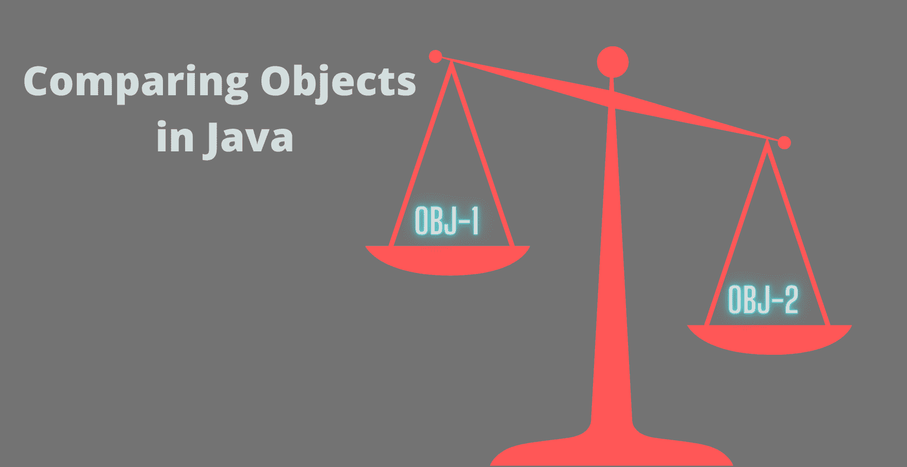

# Java 中的比较器和可比

> 原文：<https://www.studytonight.com/java-examples/comparator-and-comparable-in-java>

相互比较项目是非常常见的，它有各种各样的应用。排序的整个思想是基于将一个对象与另一个对象进行比较，并决定哪个对象在排序的集合中最先出现。**比较器和可比较器是两个接口，可以通过类实现来比较它们的对象**。在本教程中，我们将了解更多关于这些接口的信息，并了解两者之间的一些关键区别。



## 可比接口

可比界面用于**根据一些参数或标准**比较一个类的不同对象。这些标准形成了该类的自然排序。

**例如**，考虑一个有三个字段的学生班级——姓名、GPA 和注册号。现在，假设我们想根据两个学生的平均成绩来比较他们。基于 GPA 的对象的这种自然排序可以通过使用可比接口来定义。

要相互比较一个类的对象，**类必须实现可比较接口**。然后我们需要**通过覆盖 compareTo()方法**来定义比较策略。**比较()方法返回一个整数值**。根据以下条件，该值可以是正值、负值或零。

*   如果调用对象更大，则为正。
*   如果调用对象较小，则为负。
*   如果两者相等，则为 0。

让我们继续学生类的例子，并尝试根据他们的平均成绩来比较两个学生对象。我们可以简单地返回调用学生对象和作为参数的学生对象的 GPA 的差异。这将根据上述条件返回一个整数。下面显示了此场景的 compareTo()方法。

```java
@Override
public int compareTo(Student other)
{
	return (int)(this.getGpa() - other.getGpa());
}
```

### 示例:Java 中的可比接口

现在，让我们用这个方法来比较两个学生。完整的类实现和主要方法如下所示。

```java
class Student implements Comparable<Student>
{
	private String name;
	private int gpa;
	private int regNo;

	//Constructor
	public Student(String name, int gpa, int regNo) {
		this.name = name;
		this.gpa = gpa;
		this.regNo = regNo;
	}

    //Override the comapareTo() method
	@Override
	public int compareTo(Student other)
	{
		return (int)(this.getGpa() - other.getGpa());//compare using GPA
	}

	//getters and setters
	public String getName() {
		return name;
	}
	public void setName(String name) {
		this.name = name;
	}

	public int getGpa() {
		return gpa;
	}
	public void setGpa(int gpa) {
		this.gpa = gpa;
	}

	public int getRegNo() {
		return regNo;
	}
	public void setRegNo(int regNo) {
		this.regNo = regNo;
	}
}

public class ComparatorComparable
{
	public static void main(String[] args)
	{
		Student s1 = new Student("Justin", 9, 101);
		Student s2 = new Student("Victor", 8, 102);

		int comparisonResult = s1.compareTo(s2);

		if(comparisonResult > 0)
			System.out.println(s1.getName() + " has higher GPA");

		else if(comparisonResult < 0)
			System.out.println(s2.getName() + " has higher GPA");

		else
			System.out.println(s1.getName() + " and "+ s2.getName() + " have same GPA");
	}
} 
```

贾斯汀的 GPA 更高

我们经常需要将对象的集合(如数组列表或列表)按升序和降序排序。**Collections 类有一个 sort()方法，该方法在内部使用类**的这个被覆盖的 compareTo()方法来比较对象，然后对它们进行排序。让我们根据学生的平均成绩对学生名单进行排序。GPA 最低的学生在排序列表中排名第一。

```java
import java.util.ArrayList;
import java.util.Collections;

public class ComparatorComparable
{
	public static void main(String[] args)
	{
		Student s1 = new Student("Justin", 9, 101);
		Student s2 = new Student("Victor", 7, 102);
		Student s3 = new Student("Jessica", 8, 103);
		Student s4 = new Student("Paul", 5, 104);
		Student s5 = new Student("Rachel",8, 105);

		ArrayList<Student> listOfStudents = new ArrayList<Student>();
		listOfStudents.add(s1);
		listOfStudents.add(s2);
		listOfStudents.add(s3);
		listOfStudents.add(s4);
		listOfStudents.add(s5);

		Collections.sort(listOfStudents);

		for(Student s : listOfStudents)
			System.out.println(s.getName() + " " + s.getGpa());
	}
} 
```

保罗 5
维克多 7
杰西卡 8
瑞秋 8
贾斯汀 9

## 比较器接口

比较器接口也用于根据一些参数比较一个类的对象。但是与 Comparable 接口不同，Comparator 接口可以用来创建多个类，以便根据不同成员变量的值来比较对象。

**例如**，如果我们希望根据学生的注册号码、他们的 GPA 以及他们的名字对一组学生进行排序，那么我们可以创建三个不同的类来实现比较器接口。

*   **可比较接口，另一方面，只能创建一个 compareTo()方法**，该方法将根据任意一个成员对数组进行排序。
*   有时我们可能无法访问原始类，因此我们无法根据需要创建 compareTo()方法。在这些情况下，比较器接口证明非常有用。
*   **要使用 Comparator 接口，我们需要创建一个单独的类来实现这个接口**。然后，**我们必须在我们的类**中覆盖这个接口的 compare()方法。
*   **compare()方法类似于**可比界面的 compareTo()方法。它还返回一个遵循与 compareTo()方法相同条件的整数值。

### 示例:Java 中的比较器接口

让我们创建三个不同的类来实现比较器接口，并覆盖 compare()方法。

学生平均成绩等级:

```java
class CompareUsingGPA implements Comparator<Student>
{
	@Override
	public int compare(Student s1, Student s2)
	{
		return s1.getGpa() - s2.getGpa();
	}
}
```

学生姓名的类别:

```java
class CompareUsingName implements Comparator<Student>
{
	@Override
	public int compare(Student s1, Student s2)
	{
		return s1.getName().compareTo(s2.getName());//the compareTo() method is already defined
													//for strings so we can directly use it				
	}
}
```

学生注册班级:

```java
class CompareUsingRegNo implements Comparator<Student>
{
	@Override
	public int compare(Student s1, Student s2)
	{
		return s1.getRegNo() - s2.getRegNo();
	}
}
```

现在让我们使用这些比较器对学生列表进行排序。**collections . sort()可以获取一个额外的类对象，该类对象具有一个被覆盖的 compare()方法**。sort()方法将在内部使用这个 compare()方法对对象进行排序。

```java
public class ComparatorComparable
{
	public static void main(String[] args)
	{
		Student s1 = new Student("Justin", 9, 101);
		Student s2 = new Student("Victor", 7, 102);
		Student s3 = new Student("Jessica", 8, 103);
		Student s4 = new Student("Paul", 5, 104);
		Student s5 = new Student("Rachel",8, 105);

		ArrayList<Student> listOfStudents = new ArrayList<Student>();
		listOfStudents.add(s1);
		listOfStudents.add(s2);
		listOfStudents.add(s3);
		listOfStudents.add(s4);
		listOfStudents.add(s5);

		System.out.println("Intial unsorted list:");
		for(Student s:listOfStudents)
			System.out.println(s.getName() + " " + s.getRegNo() + " " + s.getGpa());

		//Sorting Using GPA
		CompareUsingGPA c1 = new CompareUsingGPA();
		Collections.sort(listOfStudents, c1);
		System.out.println("\nSorting using GPA");

		for(Student s:listOfStudents)
			System.out.println(s.getName() + " " + s.getRegNo() + " " + s.getGpa());

		//Sorting Using Names
		CompareUsingName c2 = new CompareUsingName();
		Collections.sort(listOfStudents, c2);
		System.out.println("\nSorting using Name");

		for(Student s:listOfStudents)
			System.out.println(s.getName() + " " + s.getRegNo() + " " + s.getGpa());

		//Sorting Using Registration Number
		CompareUsingRegNo c3 = new CompareUsingRegNo();
		Collections.sort(listOfStudents, c3);
		System.out.println("\nSorting using Registration Numbers");

		for(Student s:listOfStudents)
			System.out.println(s.getName() + " " + s.getRegNo() + " " + s.getGpa());		
	}
}
```

初始未排序列表:
Justin 101 9
Victor 102 7
Jessica 103 8
Paul 104 5
Rachel 105 8
T7】使用 GPA 排序
Paul 104 5
Victor 102 7
Jessica 103 8
Rachel 105 8
Justin 101 9
T14】使用名称排序
Jessica 103 8 【T16

## 摘要

可比和比较器接口用于比较一个类的对象。可比接口用于为类设置自然的排序模式。当我们需要多种比较对象的方式时，可以使用比较器接口。当我们无法访问原始类时，比较器也很有用。

* * *

* * *