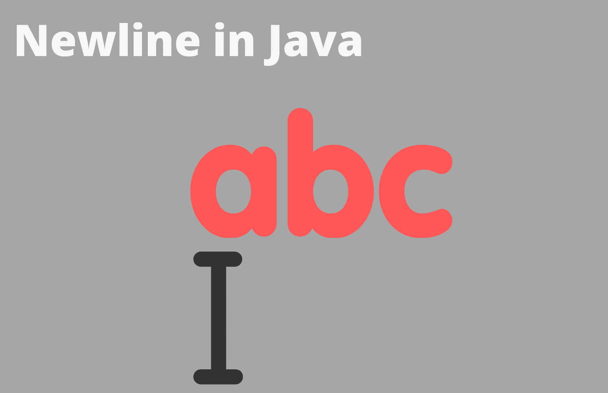

# 在 Java 中为字符串添加换行符

> 原文：<https://www.studytonight.com/java-examples/adding-a-newline-character-to-a-string-in-java>

字符串在 Java 中是一种重要的数据类型，我们必须知道如何格式化字符串以返回多行输出。向字符串中添加新行可以通过许多不同的方式来完成。换行符依赖于平台，但是 Java 也提供了一些独立于平台的行分隔符，我们可以在 Java 代码中使用。让我们学习如何使用它们。



## 平台相关换行符

**\n** 或 **\r** 或两者的组合可用于为字符串添加新行。我们只需要将它添加到新行的输出位置。例如，如果我们想将“Java 很棒”分成三行，字符串看起来像“Java **\n** 是 **\n** 棒极了”。

\n 称为**换行(LF)** ，用于将光标移动到新行。\r 称为**回车符(CR)** ，用于将光标移动到当前行的开头。

然而，这些换行符依赖于平台。不同的操作系统以不同的方式定义了一个新的系列。

*   对于 Windows，使用 **\r\n** (CRLF)

*   对于基于 Unix 的操作系统(包括现代 Macs)，使用 **\n(** LF)

*   对于旧的苹果操作系统(在操作系统-X 之前)，使用 **\r** (CR)

考虑下面演示 CRLF 用法的例子。

```java
public static void main(String[] args) 
{  
    String str1 = "Java is awesome";
    System.out.println(str1);
    String str2 = "Java\r\nis\r\nawesome";
    System.out.print(str2);	       
} 
```

爪哇很牛逼
爪哇
很牛逼

## 独立于平台的行分隔符

换行符 CR 和 LF 可用于添加新行，但它们依赖于平台。Java 为我们提供了一些根据操作系统返回行分隔符的方法。

这使得我们的代码与平台无关。

我们可以使用`System.lineSeparator()`在字符串之间添加新行。

```java
public static void main(String args[])
{
 	String str1 = "Java is awesome";
 	System.out.println(str1);
 	String newline = System.lineSeparator();
 	String str2 = "Java" + newline + "is" + newline + "awesome";
 	System.out.print(str2);
}
```

爪哇很牛逼
爪哇
很牛逼

或者我们可以用`line.separator`作为参数的`getProperty()`方法。

```java
public static void main(String args[])
{
    String str1 = "Java is awesome";
    System.out.println(str1);
    String newline = System.getProperty("line.separator");
    String str2 = "Java" + newline + "is" + newline + "awesome";
    System.out.print(str2);
}
```

爪哇很牛逼
爪哇
很牛逼

## 与平台无关的换行符

**%n** 是一个独立于平台的换行符，与我们已经讨论过的其他方法相比，它更容易使用。只要你想移动到新的一行，只需添加`**%n**`。

确保使用`printf()`方法将字符串打印到控制台。

```java
public static void main(String args[])
{
 	String str1 = "Java is awesome";
 	System.out.println(str1);
 	String str2 = "Java%nis%nawesome";
 	System.out.printf(str2);
}
```

爪哇很牛逼
爪哇
很牛逼

## 使用`System.out.println()`方法

打印字符串时，还有另一种方法可以将字符串添加到新行中。我们可以使用`println()`方法来做到这一点。它首先将字符串打印到控制台，然后将光标移到新的一行。然而，这不是格式化字符串的好方法，因为如果我们有几个字符串，我们的代码会变得很长。

**例如**，如果我们希望在十条不同的线上打印十个字符串，那么我们将不得不写`System.out.println()`十个不同的时间。

```java
public static void main(String args[])
{
    String str1 = "Java";
	String str2 = "is ";
 	String str3 = "awesome";
	System.out.println(str1);
 	System.out.println(str2);
 	System.out.print(str3);//Not using println() as we do not need a new line after this	 	
}
```

爪哇
是
牛逼

## 摘要

我们将非常频繁地处理字符串，如果我们希望返回多行输出，了解如何正确格式化字符串是很重要的。如果我们确定我们的代码不会在其他操作系统上使用，我们可以使用平台相关的换行符，比如回车符和换行符。像`lineSeparator()`和`getProperty()`这样的方法会根据操作系统返回适当的行分隔符。

`%n`是另一个换行符，但它与平台无关。

* * *

* * *