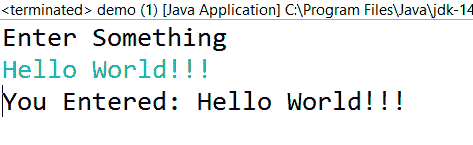

# java `BufferedReader`

> 原文：<https://www.studytonight.com/java-examples/java-bufferedreader>

`BufferedReader`类是`java.io`包的一部分，扩展了`Reader`类。BufferedReader 用于从字符输入流中读取文本，并缓冲字符以获得更好的性能。

在本教程中，我们将了解更多关于此类的信息。

## 什么是 BufferedReader？

*   如上所述，`BufferedReader`是一个用于从某个源(如文件或套接字)读取文本的类。
*   BufferedReader 包装另一个阅读器或输入流，以提高我们程序的整体效率和性能。
*   缓冲区缓存器使用缓冲区来存储从源中读取的数据。它减少了所需的输入/输出操作数量。
*   像**文件阅读器**和**输入流阅读器**这样的几个阅读器读取操作成本很高，最好用 BufferedReader 打包。

## 缓冲恐惧者构造器

BufferedReader 类提供了**两个构造器**。它们中的每一个都以 Reader 为参数。我们还可以在构造器中指定底层缓冲区的大小。默认缓冲区大小为 **8KB** 。

```java
BufferedReader?(Reader in)
```

```java
BufferedReader?(Reader in, int bufferSize)
```

## 另一个阅读器的缓冲恐惧器

让我们用缓冲恐惧器包装一个文件阅读器。我们可以用它来读取文件中的数据。

```java
String path = "C:\\Users\\Lenovo\\Desktop\\Demo.txt";
FileReader fileReader = new FileReader(path);
BufferedReader bufferedReader = new BufferedReader(fileReader);//Creating a BufferedReader by wrapping the FileReader
```

在后面的部分中，我们将使用它以不同的方式从文件中读取数据。

## 带流的缓存器

我们可以使用一个输入流作为源来创建一个缓存器。

让我们包装**输入流阅读器**并从**系统读取数据。它会读取我们用键盘输入的数据。下面的代码演示了这一点。**

```java
import java.io.BufferedReader;
import java.io.IOException;
import java.io.InputStreamReader;

public class Demo
{	
	public static void main(String[] args) throws IOException
	{
		InputStreamReader isr = new InputStreamReader(System.in);
		BufferedReader bufferedReader = new BufferedReader(isr);//Creating a BufferedReader		
		System.out.println("Enter Something");
		String line = bufferedReader.readLine();
		System.out.print("You Entered: " + line);		
		bufferedReader.close();//Closing the stream
	}
}
```

下图显示了输出。



## 关闭流

我们应该始终使用 BufferedReader 的 **close()** 方法来释放与读取器相关联的所有系统资源。如果我们使用的是**资源试用**块，我们不需要显式调用这个方法。

## bufferedreader vs 扫描仪

扫描仪和缓存器都可以从外部源读取数据。然而，这两者之间有一些区别。

*   BufferedReader 类是**同步的**和**线程安全的**，而 Scanner 类是不同步的。
*   扫描仪类有一个较小的固定大小的缓冲区(1KB)。缓存器缓存器可以改变缓存器的大小。另外，BufferedReader 使用的默认缓冲区大小比 Scanner 类大得多。
*   BufferedReader 比 Scanner 更快，因为它无需解析数据即可读取数据。
*   扫描仪将隐藏 IOException。有了缓冲恐惧器，我们需要处理这个异常。

## 逐行读取文件

`BufferedReader`类提供了几种读取数据的方法。 **readLine()** 方法一次读取一行。如果我们到达流的末尾，这个方法返回 null。让我们用这个方法读一个文件。**演示文件包含以下几行。**

```java
This is a Demo File.
We will read this file using BufferedReader.
This is the end of file.
```

读取文件的代码如下所示。

```java
import java.io.BufferedReader;
import java.io.FileReader;
import java.io.IOException;

public class Demo
{	
	public static void main(String[] args) throws IOException
	{
		String path = "C:\\Users\\Lenovo\\Desktop\\Demo.txt";
		FileReader fileReader = new FileReader(path);
		BufferedReader bufferedReader = new BufferedReader(fileReader);//Creating a BufferedReader

        String line;
		int lineCount = 0;
		//Reading the file line by line
		while( (line = bufferedReader.readLine()) != null ) 
		{
			lineCount += 1;
			System.out.println("Line: " + lineCount);
			System.out.println(line + "\n");
		}		
        bufferedReader.close();//Closing the stream
	}
}
```

行:1
这是一个演示文件。

行:2
我们将使用 BufferedReader 读取此文件。

行:3
这是文件结束。

## 从文件中读取单个字符

我们也可以使用 BufferedReader 类的 **read()** 方法一次读取一个字符。此方法返回整数形式的字符读数。如果我们到达流的末端，那么它返回-1。下面的代码演示了这个方法的工作原理。我们的文件包含文本“你好世界！”。

```java
import java.io.BufferedReader;
import java.io.FileReader;
import java.io.IOException;

public class Demo
{	
	public static void main(String[] args) throws IOException
	{
		String path = "C:\\Users\\Lenovo\\Desktop\\Demo.txt";
		FileReader fileReader = new FileReader(path);
		BufferedReader bufferedReader = new BufferedReader(fileReader);//Creating a BufferedReader

		int charRead;
		//Reading the file one char at a time
		while( (charRead = bufferedReader.read()) != -1 ) 
		{
			System.out.println((char)charRead);
		}		
		bufferedReader.close();//Closing the stream
	}
}
```

H
e
l
l
o
T6】W
o
r
l
d
！

## 从文件中读取多个字符

read()方法也可以一次读取多个字符。我们需要传递一个 char 数组来存储数据。我们还需要使用一个偏移量来指示字符数组的起始索引。存储的数据从这个索引开始。我们还需要提到要阅读的最大字符长度。

我们的文件包含文本“HelloWorld”。我们想从文件中读出“你好”。下面的代码演示了如何做到这一点。

```java
import java.io.BufferedReader;
import java.io.FileReader;
import java.io.IOException;

public class Demo
{	
	public static void main(String[] args) throws IOException
	{
		String path = "C:\\Users\\Lenovo\\Desktop\\Demo.txt";
		FileReader fileReader = new FileReader(path);
		BufferedReader bufferedReader = new BufferedReader(fileReader);//Creating a BufferedReader

		char[] charArr = new char[5];
		bufferedReader.read(charArr, 0, 5);//reading 5 characters into the charArr
		System.out.print(charArr);		
		bufferedReader.close();//Closing the stream
	}
}
```

你好

## 跳过字符

BufferedReader 类提供了一个 **skip()** 方法，我们可以用它来跳过字符。它需要一个`Long`类型参数。假设我们的文件包含文本“H*e*l*l*o”。读完每个字符后，我们需要跳过一个字符，因为我们不想读星号。

```java
import java.io.BufferedReader;
import java.io.FileReader;
import java.io.IOException;

public class Demo
{	
	public static void main(String[] args) throws IOException
	{
		String path = "C:\\Users\\Lenovo\\Desktop\\Demo.txt";
		FileReader fileReader = new FileReader(path);
		BufferedReader bufferedReader = new BufferedReader(fileReader);//Creating a BufferedReader

		int charRead;
		StringBuilder sb = new StringBuilder();
		//Reading the file one char at a time
		while( (charRead = bufferedReader.read()) != -1 ) 
		{
			sb.append((char)charRead);
			bufferedReader.skip(1L);//Skipping one character
		}		
		System.out.print(sb);
		bufferedReader.close();//Closing the stream
	}
}
```

你好

## 标记并重置

BufferedReader 类为我们提供了**标记()**方法来标记特定的字符。使用**重置()**方法，我们可以在将来的任何时候回到这个标记的字符。mak()方法接受一个整数作为输入，该整数表示在标记无效之前可以读取的最大字节数。

假设我们的文件包含文本“He*llo”。我们将阅读所有的字符，但标出星号。然后我们将使用 reset()回到这个标记。

```java
import java.io.BufferedReader;
import java.io.FileReader;
import java.io.IOException;

public class Demo
{	
	public static void main(String[] args) throws IOException
	{
		String path = "C:\\Users\\Lenovo\\Desktop\\Demo.txt";
		FileReader fileReader = new FileReader(path);
		BufferedReader bufferedReader = new BufferedReader(fileReader);//Creating a BufferedReader

		char[] charArr = new char[5];

		charArr[0] = (char)bufferedReader.read();//H
		charArr[1] = (char)bufferedReader.read();//e

		bufferedReader.mark(10);//Marked the asterisk
		bufferedReader.skip(1);//Skipped the asterisk

		charArr[2] = (char)bufferedReader.read();//l
		charArr[3] = (char)bufferedReader.read();//l
		charArr[4] = (char)bufferedReader.read();//o
		System.out.println(charArr);

		bufferedReader.reset();//Going back to the mark
		char asterisk = (char) bufferedReader.read();//Reading the asterisk
		System.out.print(asterisk);

		bufferedReader.close();//Closing the stream
	}
}
```

你好
*

## 摘要

BufferedReader 类从文件或流等源中读取数据。它通过使用减少输入/输出操作数量的缓冲区来提高其他读取器的性能。BufferedReader 类提供了几种方便的方法来读取数据。我们可以使用 readLine()方法来读取单独的行。read()方法可以读取单个或多个字符。

* * *

* * *