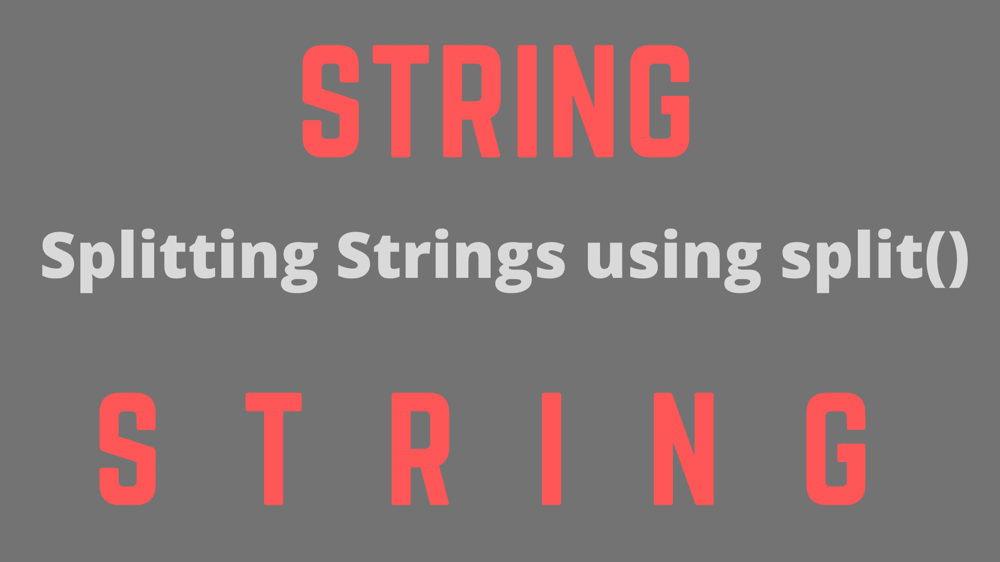

# Java 字符串`split()`方法

> 原文：<https://www.studytonight.com/java-examples/java-string-split-method>

split()方法用于根据某个字符(**分隔符**)或**正则表达式**将字符串拆分为字符串数组。对于简单的日常任务，如从句子中提取单词或从段落中提取句子，这是一种非常有用的方法。这个 Java 方法也用于**令牌化**。让我们学习如何在 Java 中使用 split()方法。



### 方法签名

string split()方法有两个签名。我们可以简单地传递正则表达式或用于拆分字符串的分隔符。

```java
public String[] split(String regularExpression)
```

我们还可以传递一个额外的整数参数 **limit** 来表示主字符串应该拆分成的最大字符串数。

```java
public String[] split(String regularExpression, int limit)
```

*   split()方法**返回字符串数组**。数组长度应小于或等于限制。
*   如果未将限制传递给方法，或者将限制设置为 0 或任何小于 0 的值，则返回的数组大小不受限制。
*   对于大于 0 的任何其他限制，该模式将最多应用 **(limit - 1)** 次，并且返回数组的最后一个字符串将具有最后一个匹配模式之后的所有字符。

## 字符串拆分()示例

让我们看一些例子来更好地理解 split()方法的工作原理。

### 例 1

让我们试着把一个简单的句子分成几个单词。为了简单起见，句子中只有用空格隔开的单词，不会使用其他标点符号。我们将使用 **\\s** 作为代表空白的分隔符。我们不会传递极限参数。

```java
public static void main(String args[])
{
	String sentence = "this is a simple sentence";
	String[] words = sentence.split("\\s");
	System.out.println("The words are: ");
	for(int i = 0; i <= words.length - 1; i++)
		System.out.println(words[i]);
} 
```

单词是:
这个
是
一个
简单的
句子

如果我们将**极限参数作为 0** 传递，上述代码的输出不会改变。下面的代码演示了这一点。

```java
public static void main(String args[])
{
	String sentence = "this is a simple sentence";
    int limit = 0;
	String[] words = sentence.split("\\s", limit);
	System.out.println("The words are: ");
	for(int i = 0; i <= words.length - 1; i++)
		System.out.println(words[i]);
} 
```

单词是:
这个
是
一个
简单的
句子

但是，如果我们传递一些其他的极限值，那么数组的最大长度将等于这个极限值。例如，如果我们将限制传递为 2，那么模式将只匹配 1 次(限制- 1)，并且第一次匹配之后的所有字符都将包含在下一个字符串中。返回的数组只有两个字符串。

```java
public static void main(String args[])
{
	String sentence = "this is a simple sentence";
    int limit = 2;
	String[] words = sentence.split("\\s", limit);
	System.out.println("The words are: ");
	for(int i = 0; i <= words.length - 1; i++)
		System.out.println(words[i]);
} 
```

单词是:
这个
是一个简单的句子

现在，让我们通过一个大于句子字数的**限制。这不会影响输出。**

```java
public static void main(String args[])
{
	String sentence = "this is a simple sentence";
    int limit = 7;
	String[] words = sentence.split("\\s", limit);
	System.out.println("The words are: ");
	for(int i = 0; i <= words.length - 1; i++)
		System.out.println(words[i]);
} 
```

单词是:
这个
是
一个
简单的
句子

我们也可以通过一个**负极限值**，但是输出将保持不变。

```java
public static void main(String args[])
{
	String sentence = "this is a simple sentence";
    int limit = -3;
	String[] words = sentence.split("\\s", limit);
	System.out.println("The words are: ");
	for(int i = 0; i <= words.length - 1; i++)
		System.out.println(words[i]);
} 
```

单词是:
这个
是
一个
简单的
句子

### 示例:使用 Delimeter 拆分

现在，让我们试着拆分一个有标点符号如逗号和句号的句子。我们用来拆分的正则表达式将是“**[\ \ p { Pick } \ \ s]+**”。我们想把整个句子分开，所以我们不会设置限制。

```java
public static void main(String args[])
{
	String sentence = "this is: a simple. sentence, with! some? punctuation: marks.";
	String regex = "[\\p{Punct}\\s]+";
	String[] words = sentence.split(regex);
	System.out.println("The words are: ");
	for(int i = 0; i <= words.length - 1; i++)
		System.out.println(words[i]);
} 
```

单词是:
这个
是
一个
简单的
句子
加上
一些
标点
符号

### 示例:使用正则表达式拆分字符串

我们还可以将上述例子中获得的单个单词拆分成字符。让我们使用 split()方法两次，一次是将句子拆分成单词，然后将单词拆分成字符。

```java
public static void main(String args[])
{
	String sentence = "this is: a simple. sentence, with! some? punctuation: marks.";
	String regex = "[\\p{Punct}\\s]+";
	String[] words = sentence.split(regex);//splitting the sentence
	String[] characters;
	System.out.println("The words are: ");
	for(int i = 0; i <= words.length - 1; i++)
	{
		characters = words[i].split("");//splitting the words
		for(String character : characters)
			System.out.print(character + " ");
		System.out.println();
	}	
} 
```

单词是:
t h I s
I s
a
s I m p l e
s e n t e n c e
w I t h
s o m e
p u n c t u a t I o n
m a r k s

## 摘要

在本教程中，我们学习了如何使用 split()方法拆分字符串。此方法采用正则表达式或分隔符作为输入，还采用可选的限制参数。如果正则表达式无效，那么它会抛出一个**模式同步异常**。它是处理字符串的一个很好的工具，可以在很多不同的情况下使用。

* * *

* * *