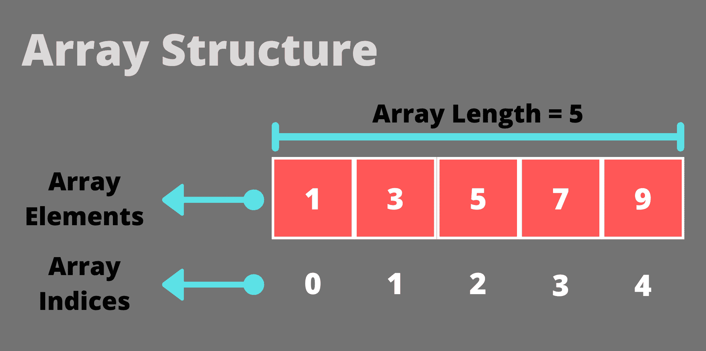

# 在 Java 中初始化数组

> 原文：<https://www.studytonight.com/java-examples/initializing-arrays-in-java>

数组是一种**线性数据结构**，用于**以有序的方式**存储相似的元素。数组是一种非常简单但功能强大的数据结构，可用于各种任务。存储在数组中的每个元素都可以通过使用其索引值来访问。**数组遵循从零开始的索引**，这意味着第一个索引将为零。在本教程中，我们将学习用 Java 初始化数组的不同方法。



## 在 Java 中声明数组

在初始化之前，我们必须知道如何声明数组。声明意味着定义变量名称和将存储在数组中的元素的数据类型。下面的代码显示了声明数组的一般语法。

```java
datatype[] variableName;
```

## 在 Java 中初始化数组

让我们学习一下给数组赋值的不同方法。

### 将所有数组元素初始化为零

我们可以简单地声明一个数组，并在一行代码中将数组的每个元素初始化为零。零是 Java 在我们声明数组大小时分配的默认值。下面的代码演示了这个场景。

```java
public class InitializeDemo
{
	public static void main(String[] args)
	{
		//Declaring array
		int[] intArray;
		//Initializing to Zero
		intArray = new int[5];
		//Printing the values
		for(int i = 0; i < intArray.length; i++)
			System.out.println(intArray[i]);
	}
} 
```

0
0
0
0
0

对于字符串数组，默认值为 null。

```java
public class InitializeDemo
{
	public static void main(String[] args)
	{
		//Declaring array
		String[] strArray;
		//Initializing to Zero
		strArray = new String[5];
		//Printing the values
		for(int i = 0; i < strArray.length; i++)
			System.out.println(strArray[i]);
	}
} 
```

零
零
零
零
零

### 一次初始化一个数组元素

我们并不总是想在数组中存储零。我们可以在单个 for 循环的帮助下逐个初始化每个元素。我们将使用元素的索引来初始化数组。

例如，让我们**初始化一个数组来存储前 5 个自然数**的平方。

```java
public class InitializeDemo
{
	public static void main(String[] args)
	{
		//Declaring array
		int[] intArray;
		//Defining the array length
		intArray = new int[5];
		//Initializing
		for(int i = 0; i < intArray.length; i++)
			intArray[i] = (i+1) * (i+1);
		//Printing the values
		for(int i = 0; i < intArray.length; i++)
			System.out.println(intArray[i]);
	}
} 
```

1
4
9
16
25

如果我们使用多维数组，那么我们需要使用嵌套循环。下面的代码显示了如何初始化 2D 数组。

```java
public class InitializeDemo
{
	public static void main(String[] args)
	{
		//Declaring array
		int[][] intArray;
		//Defining the array length
		intArray = new int[3][4];

		//Initializing
		for(int i = 0; i < intArray.length; i++)
			for(int j = 0; j < intArray[0].length; j++)
				intArray[i][j] = (i+1) * (j+1);

		//Printing the values
		for(int i = 0; i < intArray.length; i++)
		{
			for(int j = 0; j < intArray[0].length; j++)
				System.out.print(intArray[i][j] + " ");
			System.out.println();
		}

	}
} 
```

1 2 3 4
2 4 6 8
3 6 9 12

我们也可以通过扫描仪类获取用户输入来初始化数组。

```java
import java.util.Scanner;

public class InitializeDemo
{
	public static void main(String[] args)
	{
		//Declaring array
		int[] intArray;
		//Defining the array length
		intArray = new int[5];

		Scanner s = new Scanner(System.in);
		System.out.println("Enter the values: ");
		//Initializing
		for(int i = 0; i < intArray.length; i++)
			intArray[i] = s.nextInt();
		s.close();

		System.out.println("The array contains: ");
		//Printing the values
		for(int i = 0; i < intArray.length; i++)
			System.out.println(intArray[i]);
	}
} 
```

输入数值:
5
10
15
20
25
数组包含:
5
10
15
20
25

### 在声明时初始化数组

我们可以声明一个数组，同时用一行代码初始化它。当使用这种技术初始化时，我们不需要指定数组的大小。

```java
public class InitializeDemo
{
	public static void main(String[] args)
	{
		//Declaring array
		int[] intArray = {3,6,9,12,15};

		//Printing the values
		for(int i = 0; i < intArray.length; i++)
			System.out.println(intArray[i]);
	}
} 
```

3
6
9
12
15

### 使用数组.填充()方法

Arrays 类为我们提供了 fill()方法，该方法可以用一些元素填充整个数组或数组的一部分。此方法无法初始化数组，它用于修改已经初始化的数组。

如果我们使用下面的签名，那么数组的所有元素都将被设置为 value 参数。

```java
public static void fill(int[] intArray, int value)
```

相反，如果我们使用以下语法，那么 fromIndex 和 toIndex 之间的所有元素(不包括)都将被设置为 value 参数。

```java
public static void fill(int[] intArray, int fromIndex, int toIndex, int value)
```

下面的代码演示了 fill()方法的工作原理。我们也可以使用其他数据类型的数组。

```java
import java.util.Arrays;

public class InitializeDemo
{
	public static void main(String[] args)
	{
		int[] intArray = new int[10]; //Array initialized with zeroes.
		System.out.println("Initial Array: " + Arrays.toString(intArray));
		Arrays.fill(intArray, -5);//Changing all the elements to -5
		System.out.println("Changing all elements of the array: " + Arrays.toString(intArray));

		int fromIdx = 1, toIdx = 5;
		Arrays.fill(intArray, fromIdx, toIdx, 0);//Changing some elements back to 0
		System.out.println("Changing a few elements of the array: " + Arrays.toString(intArray));
	}
} 
```

初始数组:【0，0，0，0，0，0，0，0，0，0，0】
更改数组的所有元素:[-5，-5，-5，-5，-5，-5，-5，-5，-5，-5]
更改数组的一些元素:[-5，0，0，0，0，-5，-5，-5，-5]

### 使用 Arrays.setAll()方法

`Arrays`类的 setAll()方法可以在**生成器函数**的帮助下初始化数组。这个生成器函数通过使用索引来计算数组值。

例如，让我们尝试**用前 10 个自然数**的平方初始化一个数组。

```java
import java.util.Arrays;

public class InitializeDemo
{
	public static void main(String[] args)
	{
		//Declaring array
		int[] intArray;

		intArray = new int[10];
		//Initializing using setAll()
		Arrays.setAll(intArray, (index) -> (index+1) * (index+1) );

		//Printing the values
		for(int i = 0; i < intArray.length; i++)
			System.out.println(intArray[i]);
	}
} 
```

1
4
9
16
25
36
49
64
81
100

现在，让我们尝试初始化一个字符串数组。如果一个元素的指数小于 5，那么它应该有值 **< 5** ，否则它应该有值 **> =5** 。

```java
import java.util.Arrays;

public class InitializeDemo
{
	public static void main(String[] args)
	{
		//Declaring array
		String[] strArray;

		strArray = new String[10];
		//Initializing using setAll()
		Arrays.setAll(strArray, (index) -> ((index < 5) ? "<5" : ">=5" ));

		//Printing the values
		for(int i = 0; i < strArray.length; i++)
			System.out.println("Index: " + i + " Value: " + strArray[i]);
	}
} 
```

指数:0 值:< 5
指数:1 值:< 5
指数:2 值:< 5
指数:3 值:< 5
指数:4 值:< 5
指数:5 值:> =5
指数:6 值:> =5
指数:7 值:> =5
指数:8 值:> =5

### 使用 ArrayUtils.clone()方法

我们可以使用 clone()方法通过复制或克隆另一个数组来初始化一个数组。这仅用于创建现有阵列的副本。它是 Apache Commons Lang 3 包的一部分。

```java
import org.apache.commons.lang3.ArrayUtils;

public class InitializeDemo
{
	public static void main(String[] args)
	{
		int[] intArray = {1, 3, 5, 7, 9};
		int[] copy = ArrayUtils.clone(intArray);

		for(int i = 0; i < copy.length; i++)
			System.out.println(copy[i]);
	}
}
```

1
3
5
7
9

### 使用 Arrays.copyOf()方法

我们还可以使用 Arrays 类的 copyOf()方法来创建另一个数组的副本。

此方法采用一个额外的整数参数来表示要复制的元素数量。

*   如果此参数小于原始数组的长度，则只复制前几个元素。
*   如果它大于原始数组的长度，那么额外的元素将被初始化为零。
*   如果它完全等于原始数组的长度，则创建一个精确的副本。

```java
import java.util.Arrays;

public class InitializeDemo
{
	public static void main(String[] args)
	{
		int[] intArray = {1, 3, 5, 7, 9};
		int[] copy1 = Arrays.copyOf(intArray, 3);
		int[] copy2 = Arrays.copyOf(intArray, 7);
		int[] copy3 = Arrays.copyOf(intArray, 5);

		System.out.println("Original Array: " + Arrays.toString(intArray));
		System.out.println("Copied array with smaller length: " + Arrays.toString(copy1));
		System.out.println("Copied array with greater length: " + Arrays.toString(copy2));
		System.out.println("Copied array with same length: " + Arrays.toString(copy3));
	}
} 
```

原始数组:[1，3，5，7，9]
长度较小的复制数组:[1，3，5]
长度较大的复制数组:[1，3，5，7，9，0，0]
长度相同的复制数组:[1，3，5，7，9]

## 常见问题

### 问:初始化和声明数组有什么区别？

声明意味着设置将存储在数组中的元素的名称和数据类型。初始化意味着给数组元素设置一个初始值。

### 问:什么是动态数组？

动态数组是可以动态调整大小的数组。普通数组的大小是固定的，如果它们已经满了，我们就不能在其中插入额外的元素，但是动态数组没有这个问题。

### 问:如何将整数数组的所有元素初始化为 0？

如上所述，如果我们将空间分配给一个数组，那么默认情况下，所有数组元素都设置为 0。我们还可以使用其他方法，如 fill()和 setAll()来实现这一点。

## 摘要

数组是最常用的线性数据结构之一。Java 中有很多初始化数组的方法。大多数情况下，我们将使用 for 循环来初始化数组的元素，但是必须知道也可以用于初始化的不同方法。我们还学习了如何使用 clone()和 copyOf()方法将现有数组的内容复制到新数组中。

* * *

* * *