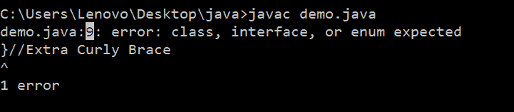
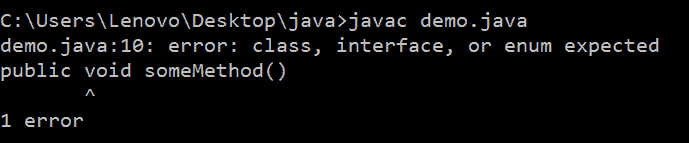
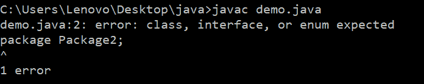

# Java 中的【预期类接口或枚举】错误

> 原文：<https://www.studytonight.com/java-examples/class-interface-or-enum-expected-error-in-java>

`class, interface, or enum expected`错误是一个编译时错误，由于缺少大括号而发生。这个错误很容易解决。让我们看看发生这种错误的一些情况。

## 缺少大括号

如上所述，`the class, interface, or enum expected`错误可能由于缺少大括号而发生。编译器会告诉我们不需要的大括号的确切位置。例如，在下面的代码中，第 9 行有一个额外的右大括号。

```java
public class Demo
{
	public static void main(String args[])
	{
		int a = 10, b = 15;
		System.out.print("The Sum is: " + (a + b));
	}
}
}
```

下图显示了我们试图编译上述代码时得到的错误消息。9(突出显示)显示发生错误的行号。我们可以通过移除额外的支架来纠正它。



## 类外方法

此错误的另一个原因可能是类外部存在的方法。例如，在下面的代码中，someMethod()方法在 Demo 类之外。这个函数不是任何类的一部分，所以我们会在编译过程中得到这个错误。我们可以通过在类内移动方法来解决这个错误。

```java
public class Demo
{
	public static void main(String args[])
	{
		int a = 10, b = 15;
		System.out.print("The Sum is: " + (a + b));
	}
}
public void someMethod()
{
	//do something
} 
```

### 输出:



## 多个包

我们只能在一个 Java 文件中声明一个包。如果我们有多个包，那么我们会得到`class, interface, or enum expected`编译错误。

```java
package Package1;
package Package2;
public class Demo
{
	public static void main(String args[])
	{
		int a = 10, b = 15;
		System.out.print("The Sum is: " + (a + b));
	}
}
```



## 摘要

由于一些不同的原因，类、接口或枚举出现了预期的错误。解决这个错误非常简单。如果我们使用的是 IDE，这个错误并不是什么大问题。

* * *

* * *