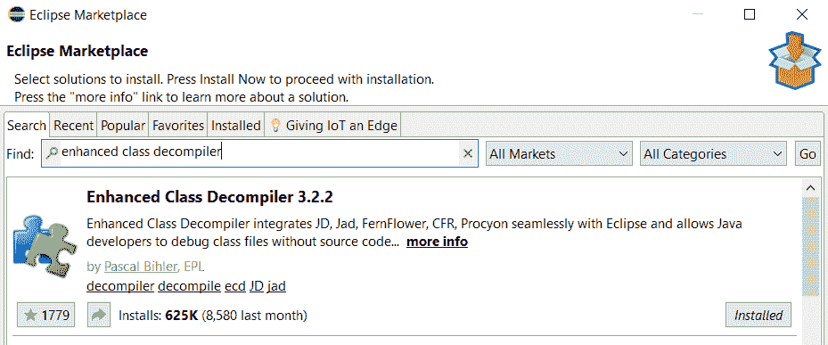
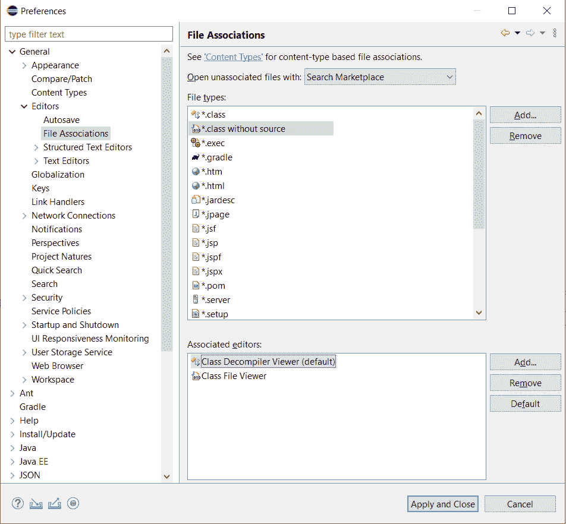
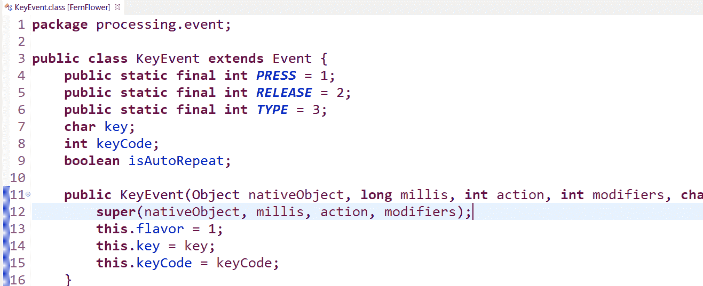
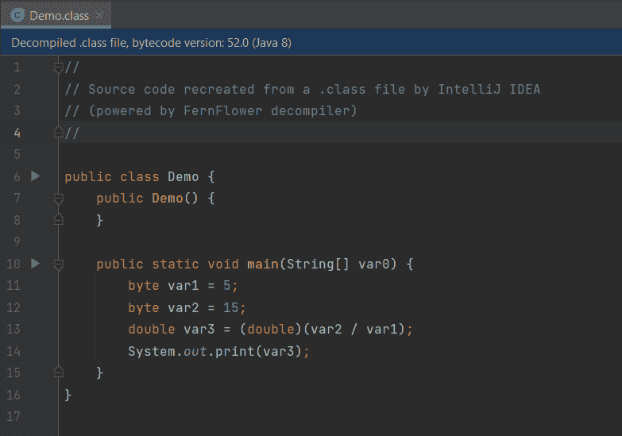
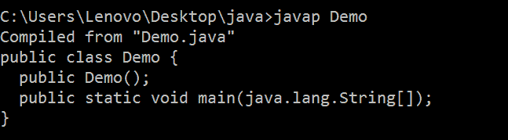
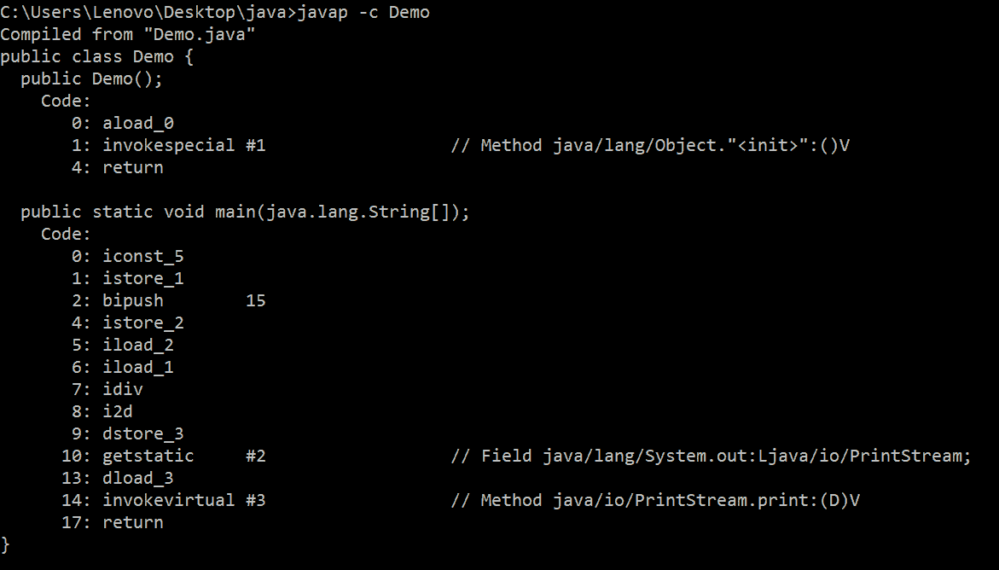

# 如何反编译 Java 类

> 原文：<https://www.studytonight.com/java-examples/how-to-decompile-java-classes>

顾名思义，反编译程序用于撤销编译器的效果。反编译程序用于从. class 文件中获取. java 文件。反编译帮助我们理解库的源代码。像 IntelliJ IDEA 这样的一些 ide 自带内置反编译程序，而像 Eclipse 这样的其他 ide 可以安装和使用其他反编译程序。

在本教程中，我们将学习如何反编译一个类来获取它的源代码。

## 使用 Eclipse 集成开发环境进行反编译

我们可以使用**增强类反编译程序(ECD)** 插件在 Eclipse 中反编译类文件。ECD 可以从 Eclipse 市场安装。**前往帮助> Eclipse 市场**，搜索增强类反编译程序。



我们还需要设置 ECD 才能正常工作。转到窗口>首选项>常规>编辑器>文件关联，并选择“*”。没有源的类”选项。选择“类反编译程序查看器”作为它的默认值，并应用更改。



接下来，我们可以通过点击一个类文件来反编译它。下图显示了反编译的 KeyEvent 类。 **FernFlower** 反编译程序用于此目的。



## 使用智能思想进行反编译

IntelliJ IDEA 自带一个内置的反编译程序，使用 **FernFlower** 反编译程序。我们可以用 IntelliJ 打开一个. class 文件，它会自动反编译成它的源代码。让我们尝试反编译由以下源代码生成的类文件。

```java
public class Demo
{
	public static void main(String[] args)
	{
		int num1 = 5;
		int num2 = 15;
		double result = num2 / num1;
		System.out.print(result);
	}
} 
```

反编译的代码如下图所示。



## 使用命令行进行反编译

我们也可以从命令行反编译 JAR 或类文件。我们可以使用一些不同的工具。

### JD-CLI

我们可以使用 JD-CLI 使用简单的 java 命令反编译我们的文件。前往 JD-CLI 的 GitHub 页面([https://github.com/intoolswetrust/jd-cli](https://github.com/intoolswetrust/jd-cli))下载并设置反编译程序。

```java
java -jar jd-cli.jar [class-file]
```

### 蕨类植物

我们还可以使用 FernFlower 反编译程序，使用命令行反编译 JARs 或类文件。克隆蕨类植物资源库([https://github.com/fesh0r/fernflower](https://github.com/fesh0r/fernflower))并使用 Gradle 工具为其构建源代码。

```java
git clone https://github.com/fesh0r/fernflower
```

```java
cd fernflower
```

```java
gradle build
```

接下来，我们可以运行以下命令来反编译一个 JAR 文件，并将内容存储在上述目录中。

```java
java -jar fernflower.jar [path to JAR or .class file] [directory to store the decompiled files]
```

### javap！javap

我们还可以使用 javap 命令来查看类文件中的反汇编代码。它不会显示任何方法实现，但是我们可以查看每个方法的反汇编代码。

让我们考虑一下，我们将下面的代码编译成了一个 Demo.class 文件。

```java
public class Demo
{
	public static void main(String[] args)
	{
		int num1 = 5;
		int num2 = 15;
		double result = num2 / num1;
		System.out.print(result);
	}
} 
```

下图显示了一个简单的 javap 命令的输出。



主要方法查看**拆解代码**。



## 摘要

要理解应用背后的逻辑，需要查看编译文件的源代码。我们可以反编译 JARs 或。通过使用像 Eclipse 或 IntelliJ IDEA 这样的 ide 来创建类文件。Eclipse 需要安装额外的插件，而 IntelliJ IDEA 附带了一个使用 FernFlower 的内置反编译程序。我们还可以使用流行的命令行工具，如 JD-CLI 或 FernFlower，使用 IDEs 反编译文件。

* * *

* * *