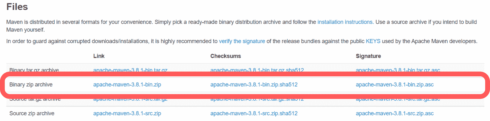
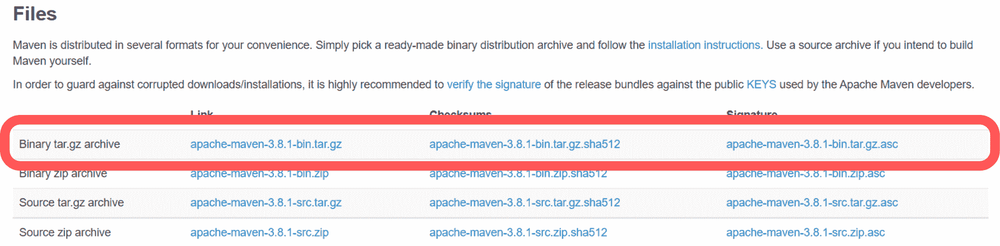

# 如何在 Windows、Linux 和 Mac 上安装 Maven

> 原文：<https://www.studytonight.com/java-examples/how-to-install-maven-on-windows-linux-and-mac>

Maven 是一个命令行工具，用于构建和管理基于 Java 的应用程序。我们可以获得一个包含设置 Maven 所需的所有文件的档案。不需要安装程序。我们需要设置先决条件并配置我们的环境来运行 Maven。

Maven 是使用 Java 编写的，所以请确保您的系统中安装了 Java。

运行以下命令，确保您的系统上安装了 Java。如果没有安装 JAVA，安装最新的 JDK 并添加 JAVA_HOME 环境变量。

```java
java -version
```

## 在 Windows 上安装 Maven

*   我们首先需要从官方的 Apache Maven 项目网站-[https://maven.apache.org/download.cgi](https://maven.apache.org/download.cgi)下载最新版本的 Maven。下载可用的最新 ZIP 文件。



*   将内容解压缩到您想要存储 Maven 文件的位置。
*   接下来，使用系统属性将 **M2_HOME** 和 **MAVEN_HOME** 变量添加到 Windows 环境变量中。将它们指向您存储 Maven 文件的位置。
*   最后一步包括更新 PATH 变量，以便从任何地方运行 Maven 命令。我们需要将 Maven bin 文件夹- **%M2_HOME%\bin** -追加到路径变量中。
*   我们可以通过运行以下命令来检查 Maven 的版本，从而确认 Maven 是否设置成功。

```java
mvn -version
```

## 在 Linux 上安装 Maven

*   要在 Linux 上安装 Maven，前往官方的 Apache Maven 项目网站([https://maven.apache.org/download.cgi](https://maven.apache.org/download.cgi))并下载二进制的 tar.gz 文件。将归档文件提取到您想要使用 Maven 的文件夹中。



*   接下来，打开终端，使用以下命令设置环境变量。请注意，M2_Home 路径必须与提取的 Maven 文件的位置相对应。

```java
export M2_HOME=/usr/local/apache-maven/apache-maven-3.8.1
```

```java
export M2=$M2_HOME/bin
```

```java
export MAVEN_OPTS=-Xms256m -Xmx512m
```

*   接下来，我们需要将 M2 变量附加到路径中。

```java
export PATH=$M2:$PATH
```

*   要确认是否成功添加了 Maven，请使用以下命令。

```java
mvn -version
```

## 在 Ubuntu 上安装 Maven

我们可以通过使用 **apt** 命令很容易地在 Ubuntu 上安装 Maven。

*   首先，通过运行以下命令更新包索引。

```java
sudo apt update
```

*   接下来，使用以下 apt 命令安装 Maven。

```java
sudo apt install maven
```

*   上面的命令可能需要几分钟来下载和安装 Maven。完成后，我们可以使用以下命令验证安装。

```java
mvn -version 
```

## 在 Mac OS X 上安装 Maven

*   前往 Apache Maven 项目官方网站([https://maven.apache.org/download.cgi](https://maven.apache.org/download.cgi))下载最新的 Maven 二进制 tar.gz 文件。将其提取到您希望 Maven 居住的位置。


*   接下来，我们需要设置环境变量。我们需要将 Maven bin 目录添加到路径变量中。打开。并向其中添加以下命令。

```java
export M2_HOME="/Users/User-1/Downloads/apache-maven-3.8.1"
export PATH=${PATH}:${M2_HOME}/bin
```

*   使用来源。bash_profile 命令来应用更改。要验证安装，请运行以下 mvn 命令。

```java
mvn -version 
```

### 使用自制程序

如果您已经安装了自制程序，那么您可以简单地运行以下命令来安装 Maven。

```java
brew install maven
```

要确认安装，请运行 mvn 版本命令。

## 摘要

Maven 是一个流行的 Java 应用程序构建和依赖管理工具。安装和设置 Maven 并不复杂。我们可以从 Apache Maven 项目网站下载必要的文件。在本教程中，我们学习了如何在不同的操作系统上安装 Maven。

* * *

* * *