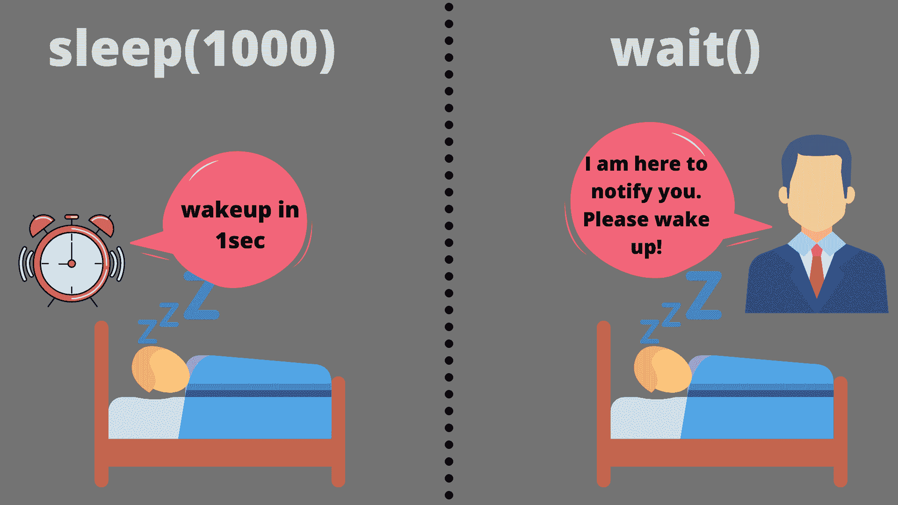

# Java 中等待和睡眠的区别

> 原文：<https://www.studytonight.com/java-examples/difference-between-wait-and-sleep-in-java>

使用线程时，等待和睡眠会频繁出现。这些术语不可互换，含义不同。两者都用于**暂停线程**的执行，但是它们之间有一些主要的区别。让我们了解更多关于等待和睡眠的区别。



## Java 中的等待与睡眠

*   等待和睡眠都用于暂停线程的执行，并使其进入**不可运行状态**。但是在睡眠的情况下，**线程会在固定的时间段**后醒来。当使用 wait()方法时，只有当对线程正在等待的同步块调用 **notify()** 或 **notifyAll()** 方法时，才能唤醒线程。
*   当我们只处理一个线程，并希望在一段时间内停止它的执行时，我们将使用 sleep。而**多线程**和**同步**总是采用等待的方式。**等待方法应该总是在同步块**中调用。
*   两者的另一个主要区别是**等待会释放锁定，但睡眠不会**。由于这个原因，睡眠不用于同步目的，因为线程可以长时间睡眠，没有其他线程可以访问关键部分。

以上几点总结了 Java 中等待和睡眠方法的主要区别。下表讨论了几个不同之处。

| **等待** | **睡眠** |
| 在对象上调用 wait()方法。 | 在当前执行的线程上调用 sleep()。 |
| 用于线程同步。 | 用于时间同步。 |
| Wait()不是静态方法。 | sleep()是一个静态方法。 |
| 只能从同步块中调用 Wait()。如果我们从同步块外部调用它，那么我们将得到一个**illegalmonitorstatexception**。 | sleep()也可以在同步块之外调用。 |
| wait()可以在下列重载方法的帮助下使用:

*   等待()
*   等待(长时间超时)
*   等待(长超时，整数纳秒)

 | sleep()可以在以下三种重载方法的帮助下使用:

*   睡眠(长毫秒)
*   睡眠(长毫秒，整数纳秒)

 |

### 睡眠的方法签名()

```java
public static void sleep(long milliseconds) throws Interrupted_Execption
```

### 等待的方法签名()

```java
public final void wait(long timeout)
```

### 示例:Java 中的 sleep()和 wait()

让我们借助下面的例子来理解 sleep()和 wait()方法的工作原理。

在下面的例子中，主线程将休眠 1 秒钟，然后继续执行。但是当调用 wait()时，线程会无限等待，因为没有其他线程在对象上调用 notify()。该程序将无限期运行。

```java
public class SleepvsWait
{
	private static Object o = new Object();	
	public static void main(String[] args) throws InterruptedException
	{
		System.out.println("Thread Going to sleep...");
		Thread.sleep(1000);
		System.out.println("Thread woke up after 1 second.");

		synchronized(o)
		{
			System.out.println("Thread will wait for notify...");
			o.wait();
		}

		System.out.println("Thread woken up after notify() or notifyAll() or timeout.");
	}
}
```

线程要睡觉了...
线程 1 秒后唤醒。
线程将等待通知...

现在，让我们为 wait()方法指定一个超时持续时间。超时后，线程将继续执行。

```java
public class SleepvsWait
{
	private static Object o = new Object();
	public static void main(String[] args) throws InterruptedException
	{
		System.out.println("Thread Going to sleep...");
		Thread.sleep(1000);
		System.out.println("Thread woke up after 1 second.");

		synchronized(o)
		{
			System.out.println("Thread will wait for notify...");
			o.wait(1000);
		}
		System.out.println("Thread woken up after notify() or notifyAll() or timeout.");
	}
} 
```

线程要睡觉了...
线程 1 秒后唤醒。
线程将等待通知...
线程在 notify()或 notifyAll()或超时后被唤醒。

## 常见问题

### 问:notify()和 notifyAll()有什么区别？

notify()只会唤醒一个等待锁定的线程，而 notifyAll()会唤醒所有等待锁定对象的线程。

### 问:收益率()是用来做什么的？

yield()是一种暂停线程执行的方式，以便其他线程可以执行关键部分。它用于给其他具有相同或更高优先级的线程一个执行的机会。如果所有其他线程都具有较低的优先级，那么当前线程将继续执行。

### 问:什么是 Java 中的同步块？

同步块是一次只能由单个线程访问的块。同步块使用监视器或锁来实现特定对象的同步。

## 结论

在这个简短的教程中，我们了解了 Java 中线程使用的 wait()和 sleep()方法之间的区别。我们只需要记住 **wait()用于线程同步**并通过记住其他线程的存在来完成一切。另一方面，S **leep 主要用于单线程和时间同步**。

* * *

* * *