# 在 Java 中找不到或加载主类错误

> 原文：<https://www.studytonight.com/java-examples/could-not-find-or-load-main-class-error-in-java>

使用 [Java](https://www.studytonight.com/java/overview-of-java.php) 或任何其他编程语言时，错误和[异常](https://www.studytonight.com/java/exception-handling.php)非常常见。**找不到或加载主类**错误非常常见，并且可能频繁发生。这个错误仅仅意味着 JVM 找不到主类。让我们看看发生此错误的原因，并尝试解决此错误。

这里，我们在一个名为**ErrorDemo.java**的 java 文件中有以下代码。

```java
public class ErrorDemo
{
	public static void main(String[] args)
	{
		System.out.println("Error Fixed");
	}
}
```

我们可以使用 **javac** 命令编译这段代码，并提供 java 文件名。

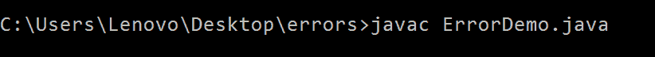

上述命令生成一个**。与主方法的类同名的类文件**。

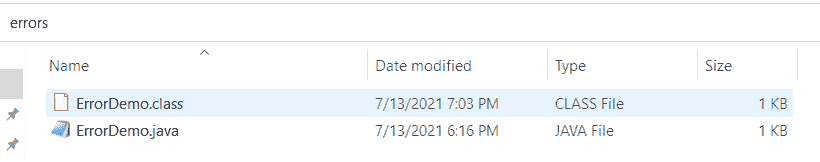

我们可以使用 java 命令运行代码并查看输出。我们可以看到一切都很好，我们得到了预期的输出。

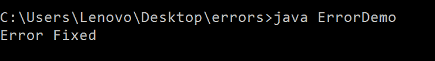

### 类别文件名不正确时出错

让我们故意把事情搞砸来查看**找不到或者加载主类**的错误。如果我们试图运行一个 java 程序，但是没有通过正确的**，就会出现这个错误。类文件**名称。

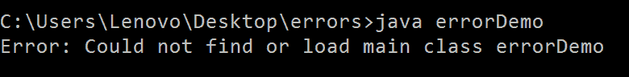

另一件需要记住的事情是，我们使用 javac 命令来编译一个 java 文件，并且我们需要添加。使用文件名时的 java 扩展名。但是当运行。类文件，不要传递。具有类名的类扩展。这也将返回相同的错误。


### 目录不正确时出错

注意，我们必须为。正确文件夹中的类文件。例如，如果我们导航到桌面(使用 cd..命令)，那么同样，我们也会得到同样的错误。

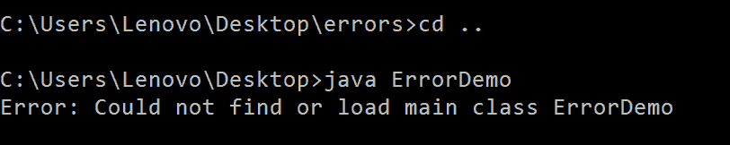

### 错误不正确的包名

[Java 中的包](https://www.studytonight.com/java/package-in-java.php)是一组相似的类或[接口](https://www.studytonight.com/java/java-interface.php)，它们被组合在一起以便于访问。当试图运行包中存在的. class 文件时，我们需要使用包名和类名。

让我们修改我们的程序，以便将类包含在一个包中。

```java
package p;

public class ErrorDemo
{
	public static void main(String[] args)
	{
		System.out.println("Error Fixed");
	}
}
```

现在，当我们用 **-d** 和一个**点(。)**然后是。类文件将在包 p 中创建。

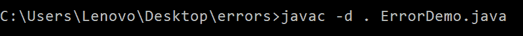

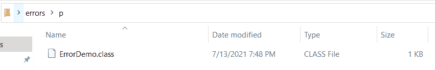

让我们尝试运行这个类文件，就像我们在上面的例子中所做的那样。但是我们现在得到一个错误。

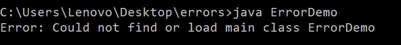

为了纠正它，我们还需要在运行文件时传递包名。

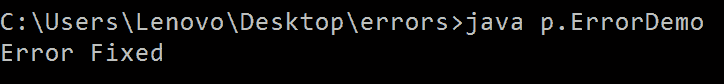

请记住，我们是从父目录而不是从包目录 **p** 运行上述命令。

### 类路径

如上所述，如果我们运行。不包含此文件的目录中的类文件。这是因为，默认情况下，JVM 将在我们当前的目录中搜索类文件。类路径通知 JVM 在特定的文件夹中查找文件。定义类路径有助于我们从其他目录中运行 java 类文件。运行**时，使用 java 命令的**-类路径**或 **-cp** 选项来传递类路径。类文件**。

**比如**，如果我们的**。类**文件存在于一个名为**错误**的文件夹中，我们试图从桌面运行代码，然后我们会得到以下错误。

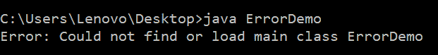

我们可以使用类路径来纠正这个错误。

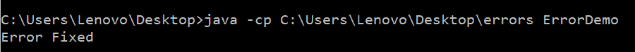

## 常见问题

### 我们如何在 Java 中运行一个文件？

如本文开头所示，首先使用 javac 命令编译一个 Java 文件，这会生成一个. class 文件。接下来，我们可以运行这个。类文件。[阅读更多](https://www.studytonight.com/java/first-java-program.php)。

### 路径与类路径有何不同？

路径是我们可以找到扩展名为。exe 或。jar，而类路径就是我们可以找到**的位置。类**文件。默认情况下，类路径被设置为我们正在工作的当前目录。

### 什么是 classnotfoundexception？

当 JVM 在提到的类路径中找不到我们试图运行的类时，就会出现 ClassNotFoundException。

### 当我们在运行 javac 命令后得到以下错误时怎么办:javac 不被识别为内部和外部命令？

出现此错误是因为我们没有设置 PATH 环境变量。我们可以使用以下命令临时设置它。传递 JDK 的文件夹路径。

```java
C:\Users\user1>set path=C:\Program Files\Java\jdk1.8.0_144\bin
```

阅读更多关于 [Java 环境设置](https://www.studytonight.com/java/setting-classpath-for-java.php)的内容。

### 摘要

**找不到或加载主类**错误在 Java 中很常见。大多数情况下，这是因为我们写的类名不正确，或者我们添加了不必要的。运行时的类扩展。如果类是包的一部分，那么我们必须在运行代码时提供**完全限定类名**以避免错误。

* * *

* * *