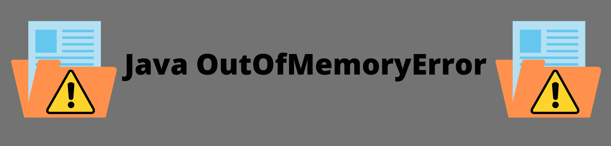
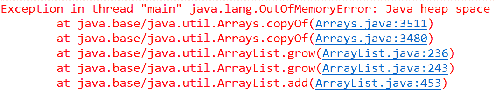
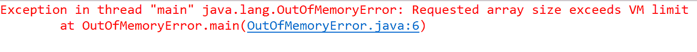
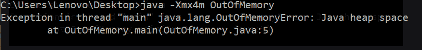
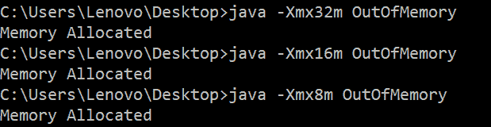

# Java 堆内存错误

> 原文：<https://www.studytonight.com/java-examples/java-heap-memory-error>

使用任何编程语言时，错误和异常都很常见。在 Java 中，所有对象都存储在堆内存中， **JVM 在无法为对象**分配空间时抛出 OutOfMemoryError。有时这个错误也被称为 Java 堆空间错误。让我们进一步了解这个错误。



## Java.lang.OutOfMemoryError 背后的原因

Java 有一个预定义的应用应该占用的最大内存量，如果应用超过这个限制，就会抛出 OutOfMemory 错误。让我们看看这个错误背后的原因。

1.  出现这种错误可能是由于**糟糕的编程实践，如使用低效的算法、错误的数据结构选择、无限循环、没有清除不需要的资源、将对象保存太长时间**等。如果这是错误背后的原因，那么人们应该重新考虑在编写程序时所做的选择。
2.  可能还有一些用户无法控制的其他原因。例如，**缓存字符串的第三方库，或者部署**后不清理的服务器。有时，即使堆和对象一切正常，也会出现这种错误。
3.  **内存泄漏也会导致内存不足错误**。内存泄漏是指堆中存在未使用的对象，并且垃圾收集器无法移除该对象，因为它仍然有有效的引用。开放资源也可能导致内存泄漏，必须使用**最终阻止**来关闭它们。垃圾收集器将自动移除所有未引用的对象，这种情况可以通过让垃圾收集器可以使用未使用的对象来轻松避免。还提供了其他工具来检测和避免内存泄漏。
4.  **终结器的过度使用也会导致内存不足错误**。具有 finalize 方法的类在垃圾收集时不会回收其对象空间。在垃圾收集过程之后，这些对象被排队等待稍后的终结，如果终结器线程跟不上队列，则会引发此错误。

我们总是可以增加 JVM 所需的内存，但是如果问题更严重，那么我们最终会耗尽内存。应该尝试优化代码，并查找可能导致此错误的内存泄漏。

### 示例:由于无限循环导致内存不足错误

让我们创建一个对象类型的`ArrayList`，并向其中无限地添加元素，直到内存耗尽。

```java
import java.util.ArrayList;
public class OutOfMemory
{
	public static void main(String args[])
	{
		ArrayList<Object> list = new ArrayList<Object>();

		while(true)
		{
			Object o = new Object();
			list.add(o);
		}
	}
}
```

在这个例子中，即使我们增加分配给应用的内存，我们最终也会用完空间。下图显示了上述程序返回的错误消息。



### 示例:由于内存有限，内存不足

如果分配给应用的内存少于所需内存，则返回内存不足错误。我们还可以尝试优化我们的代码，以便降低其空间复杂度。如果我们确信如果我们有更多的内存，这个错误可以被修复，那么我们可以通过使用 **-Xmx** 命令来增加它。让我们运行一个没有所需内存的程序。

```java
public class OutOfMemoryError
{
	public static void main(String[] args)
	{
		Integer[] outOfMemoryArray = new Integer[Integer.MAX_VALUE];
	}
} 
```

错误信息如下图所示。



## 通过增加堆空间解决内存不足问题

**增加堆空间有时可以解决内存不足错误**。如果我们确定没有内存泄漏，并且我们的代码不能进一步优化，那么增加堆空间可以解决我们的问题。我们将在运行 java 应用时使用 **-Xmx** 命令来增加堆空间。

例如，如果对内存设置 4MB 限制，以下代码将不起作用。

```java
public class OutOfMemory
{
	public static void main(String[] args)
	{
		String[] str = new String[1000000];
		System.out.print("Memory Allocated");
	}
}
```



然而，如果我们将限制增加到 8MB 或更大，那么它就可以完美地工作。



## 常见问题

### 问:Java 中的默认堆大小是多少？

Java 中的默认堆大小是 1GB，对于大多数任务来说已经足够了。

### 问:-Xmx 和-Xms 有什么区别？

Xms 定义初始或最小堆大小，xmx 用于设置最大堆大小。JVM 将启动由-xms 定义的内存，并且不会超过由-xmx 设置的限制。

### 问:什么是栈内存？

栈内存是后进先出内存，用于静态内存分配和线程执行。每当创建一个新对象时，它都存储在堆内存中，对它的引用存储在栈内存中。

## 摘要

**OutOfMemoryError 是 VirtualMachineError 的一个子类，当 JVM 没有足够的空间来分配新对象时抛出**。这个错误可能是由于**糟糕的编程实践**造成的，比如使用无限循环或者不清除不想要的对象。这也可能是由于某些第三方库**的存在。**内存泄漏也会导致这个错误**我们可以使用 Eclipse Memory Analyzer 之类的工具来修复。有时候，仅仅增加分配给应用的堆空间就能解决问题。我们还应该尝试寻找优化的算法，以便我们程序的整体空间复杂度小于最大可用空间。**

* * *

* * *