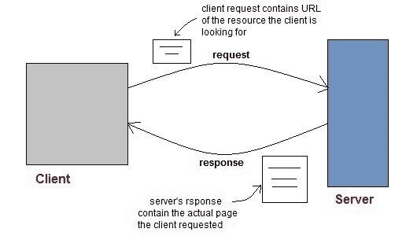
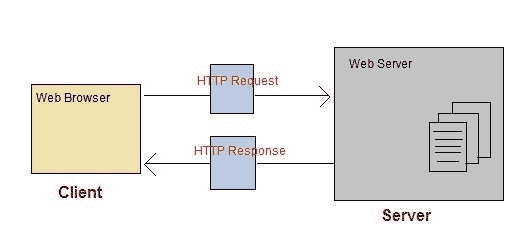
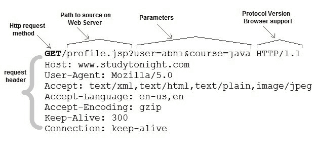
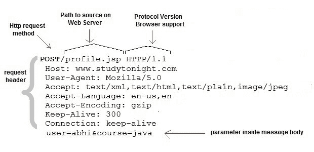

# Servlet:网络简介

> 原文：<https://www.studytonight.com/servlet/introduction-to-web.php>

Web 由通过有线和无线网络连接的数十亿个客户端和服务器组成。网络客户端向网络服务器发出请求。web 服务器接收请求，找到资源，并将响应返回给客户端。当服务器响应请求时，它通常会向客户端发送某种类型的内容。客户端使用网络浏览器向服务器发送请求。服务器通常用一组用超文本标记语言编写的指令向浏览器发送响应。所有浏览器都知道如何向客户端显示 HTML 页面。

* * *

## 网络应用

网站是静态文件(网页)的集合，如 HTML 页面、图像、图形等。一个 **Web 应用**是一个在服务器上有动态功能的网站。**谷歌**、**脸书**、**推特**都是网络应用的例子。

* * *

### 超文本传输协议

*   HTTP 是客户端和服务器在网络上用来通信的协议。
*   它类似于其他互联网协议，如 SMTP(简单邮件传输协议)和 FTP(文件传输协议)，但有一个根本区别。
*   HTTP 是一个**无状态协议**，也就是说 HTTP 每个连接只支持一个请求。这意味着使用 HTTP，客户端连接到服务器发送一个请求，然后断开连接。这种机制允许更多的用户在一段时间内连接到给定的服务器。
*   客户端发送一个 HTTP 请求，服务器使用 HTTP 用一个 HTML 页面回答客户端。

* * *

### HTTP 方法

HTTP 请求可以使用多种方法，但是你最常用的是**获取**和**发布**。方法名告诉服务器正在发出的请求的类型，以及消息的其余部分将如何格式化。

**HTTP 方法和说明:**

| 

方法名称

 | 

描述

 |
| --- | --- |
| 选择 | 请求/响应链上可用的通信选项请求。 |
| 得到 | 请求使用给定的 URI 从服务器检索信息。 |
| 头 | 与 GET 相同，只是它不返回消息体，只返回标题和状态行。 |
| 邮政 | 请求服务器接受包含在 HTTP 方法主体中的实体。 |
| 删除 | 请求服务器删除资源。 |
| 连接 | 保留用于可以切换为隧道的代理。 |
| 放 | 这和 POST 是一样的，但是 POST 是用来创建的，PUT 可以用来创建也可以用来更新。它用上传的内容替换目标资源的所有当前表示。 |

* * *

## 获取和发布请求之间的区别

| 

获取请求

 | 

开机自检请求

 |
| --- | --- |
| 数据以报头形式发送到服务器 | 数据在请求正文中发送 |
| 获取请求只能发送有限数量的数据 | 可以发送大量数据。 |
| 获取请求不安全，因为数据暴露在 URL 中 | 发布请求是安全的，因为数据没有在网址中公开。 |
| Get 请求可以加入书签，效率更高。 | 发布请求不能被书签标记。 |

* * *

## PUT 和 POST 方法的一般区别

以下是 PUT 和 POST 方法之间的一些基本区别:

*   **将**发布到网址会在服务器定义的网址上创建子资源，而**将**发布到网址会在客户端定义的网址上创建/替换整个资源。
*   POST 创建一个子资源，因此 POST 到`/books`将创建一个资源，该资源将位于`/books`资源下。`/books/1`。两次发送相同的帖子请求将创建两个资源。
*   PUT 用于在客户端已知的 URL 创建或替换资源。
*   当客户端在创建资源之前已经知道 url 时，PUT 必须用于 CREATE。
*   PUT 会替换已知 url 处的资源(如果它已经存在)，因此两次发送相同的请求没有效果。换句话说，对 PUT 的调用是**幂等的。**

* * *

### 解析一个 HTTP GET 请求

Get 请求包含服务器的路径和添加到其中的参数。

* * *

#### 解析一个 HTTP POST 请求

Post 请求用于在服务器上发出更复杂的请求。例如，如果用户用多个字段填写了一个表单，而应用程序希望将所有表单数据保存到数据库中。然后表单数据将在 POST 请求正文中发送到服务器，也称为消息正文。

* * *

* * *