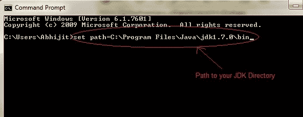
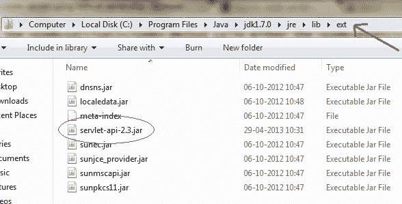
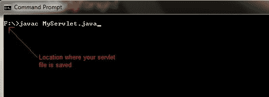
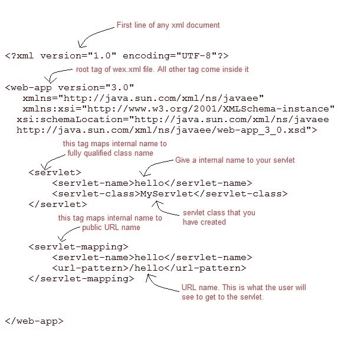
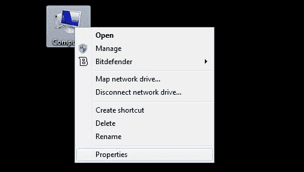
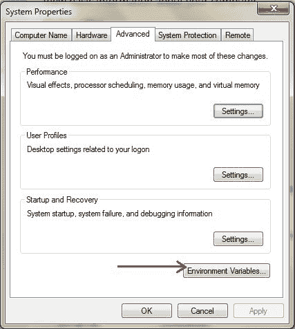
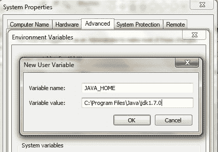
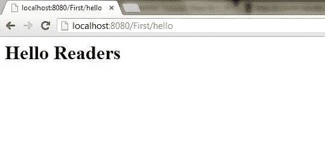

# 使用 tomcat 服务器创建 Servlet 应用的步骤

> 原文：<https://www.studytonight.com/servlet/steps-to-create-servlet-using-tomcat-server.php>

要创建一个 Servlet 应用，您需要遵循下面提到的步骤。这些步骤对于所有的网络服务器都是通用的。在我们的例子中，我们使用的是 Apache Tomcat 服务器。Apache Tomcat 是一个用于测试 servlets 和 JSP 技术的开源 web 服务器。下载最新版本的 [Tomcat 服务器](http://tomcat.apache.org/)并安装在你的机器上。

在您的机器上安装 Tomcat 服务器后，请遵循以下步骤:

1.  为您的应用创建目录结构。
2.  创建一个 Servlet
3.  编译 Servlet
4.  为应用创建部署描述符
5.  启动服务器并部署应用

下面详细解释了这 5 个步骤，让我们创建第一个 Servlet 应用。

* * *

## 1.创建目录结构

Sun 微系统定义了创建 servlet 应用必须遵循的唯一目录结构。


在 **Apache-Tomcat\webapps** 目录中创建上述目录结构。所有 HTML、静态文件(图片、css 等)直接保存在**网络应用**文件夹下。而所有的 Servlet 类都保存在`classes`文件夹中。

`web.xml`(部署描述符)文件保存在`WEB-INF`文件夹下。

* * *

## 2.创建一个 Servlet

创建 servlet 有三种不同的方法。

*   通过实现 **Servlet** 接口
*   通过扩展**泛型 Servlet** 类
*   通过扩展 **HttpServlet** 类

但是通常一个 servlet 是通过扩展 **HttpServlet** 抽象类创建的。如前所述 **HttpServlet** 给出了 **Servlet** 接口的`service()`方法的定义。我们将要创建的 servlet 类不应该覆盖`service()`方法。我们的 servlet 类将只覆盖`doGet()`或`doPost()`方法。

当对 servlet 的请求到来时，网络容器调用 servlet 的`service()`方法，根据请求的类型，`service()`方法调用`doGet()`或`doPost()`方法。

**注意:**默认情况下，请求是**获取**请求。

```java
import javax.servlet.*;
import javax.servlet.http.*;
import java.io.*;

public MyServlet extends HttpServlet
{
	public void doGet(HttpServletRequest request,HttpServletResposne response) 
	                     throws ServletException {
		response.setContentType("text/html");
		PrintWriter out = response.getWriter();
		out.println("<html><body>");
		out.println("<h1>Hello Readers</h1>");
		out.println("</body></html>");
	}
} 
```

将上述代码写在记事本文件中，并将其保存为您电脑上的任何地方的**MyServlet.java**。从那里编译它(在下一步中解释)，并将类文件粘贴到您必须在 **Tomcat/webapps** 目录中创建的`WEB-INF/classes/`目录中。

* * *

## 3.编译一个 Servlet

要编译一个 Servlet，需要一个 JAR 文件。不同的服务器需要不同的 JAR 文件。在 Apache Tomcat 服务器中`servlet-api.jar`文件是编译一个 servlet 类所必需的。

编译 Servlet 的步骤:

*   设置类路径。



*   下载 **servlet-api.jar** 文件。
*   将 servlet-api.jar 文件粘贴到`Java\jdk\jre\lib\ext`目录中。



*   编译 Servlet 类。



**注意:**编译完你的 Servlet 类后，你必须将类文件粘贴到`WEB-INF/classes/`目录中。

* * *

## 4.创建部署描述符

**部署描述符(DD)** 是 Web 容器用来运行 Servlets 和 JSP 页面的 XML 文档。DD 用于几个重要目的，例如:

*   将 URL 映射到 Servlet 类。
*   初始化参数。
*   定义错误页面。
*   安全角色。
*   声明标记库。

我们将在后面详细讨论所有这些。现在我们将看到如何为我们的 web 应用创建一个简单的 **web.xml** 文件。



* * *

## 5.启动服务器

双击 **startup.bat** 文件启动你的 Apache Tomcat 服务器。

或者，使用 RUN 提示符在您的 windows 计算机上执行以下命令。

```java
C:\apache-tomcat-7.0.14\bin\startup.bat

```

* * *

## 6.第一次启动 Tomcat 服务器

如果你是第一次启动 Tomcat 服务器，你需要在环境变量中设置 JAVA_HOME。以下步骤将向您展示如何设置它。

*   右键点击**我的电脑**，进入**物业**。



*   进入**高级**选项卡，点击**环境变量...**按钮。



*   点击**新建**按钮，在变量名文本字段中输入 **JAVA_HOME** ，在变量值文本字段中输入 JDK 的路径。单击确定保存。



* * *

## 7.运行 Servlet 应用

打开浏览器，输入**http:localhost:8080/First/hello**



万岁！我们的第一个 Servlet 应用成功运行。

* * *

* * *