# 使用 Netbeans IDE 创建第一个 Servlet 应用

> 原文：<https://www.studytonight.com/servlet/creating-servlet-in-netbeans.php>

在[最后一课](steps-to-create-servlet-using-tomcat-server.php)中，我们创建了第一个 Servlet 应用，但是没有使用任何 IDE。集成开发环境是集成开发环境，它使创建应用变得容易得多。我们将学习如何在 NetBeans IDE 和 [Eclipse IDE](creating-servlet-in-eclipse.php) 上创建 Servlet 应用。然后你可以决定你想用哪一个。

使用集成开发环境是创建 Servlet 应用最简单的方法。集成开发环境是一种软件应用，为计算机程序员提供软件开发工具。 **Eclipse** 、**mycplise**、 **Netbeans** 都是一些流行 Java IDE 的例子。

* * *

## 在 Netbeans IDE 中创建 Servlet 应用的步骤

要在 Netbeans IDE 中创建 servlet 应用，您需要遵循以下(简单的)步骤:

1.  Open Netbeans IDE, Select **File** -> **New Project**

    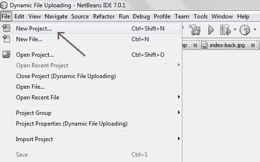

* * *

3.  Select **Java Web** -> **Web Application**, then click on Next,

    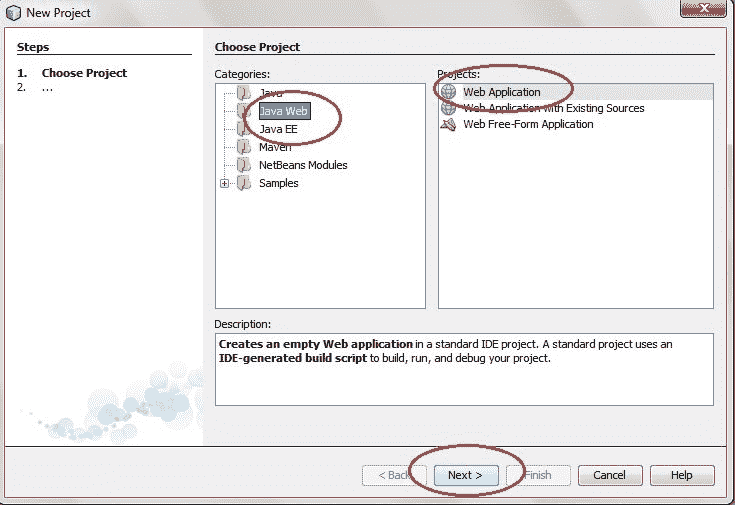

* * *

5.  Give a name to your project and click on Next,

    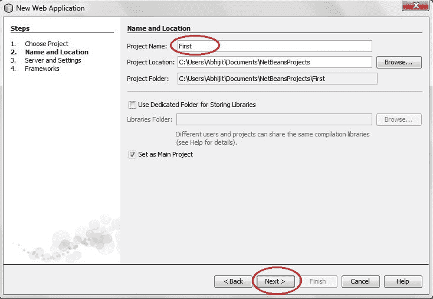

* * *

7.  and then, Click **Finish**

    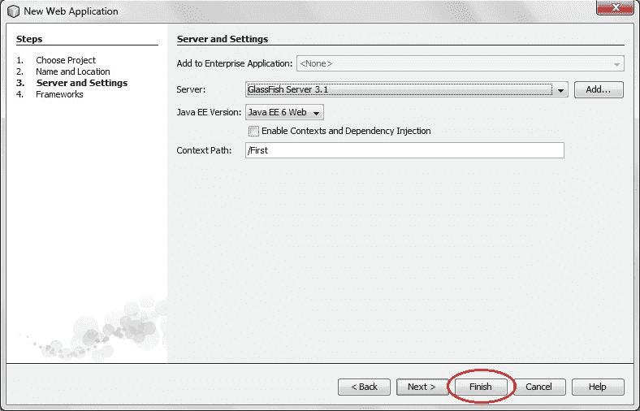

* * *

9.  The complete directory structure required for the Servlet Application will be created automatically by the IDE.

    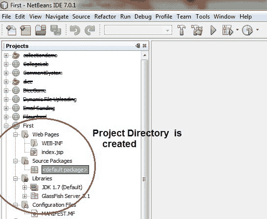

* * *

11.  To create a Servlet, open **Source Package**, right click on **default packages** -> **New** -> **Servlet**.

    

* * *

13.  Give a Name to your Servlet class file,

    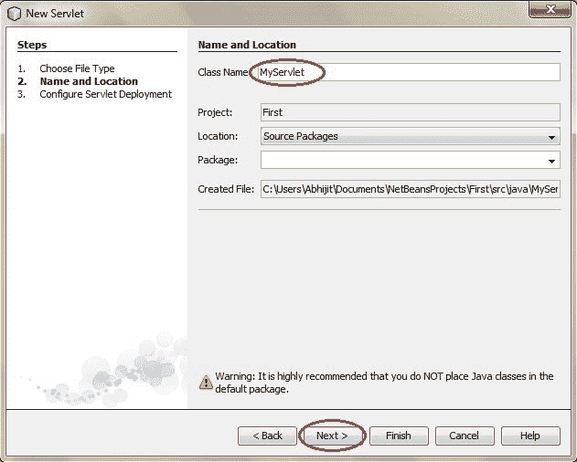

    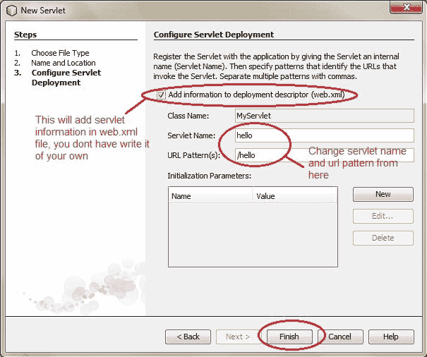

* * *

15.  Now, your Servlet class is ready, and you just need to change the method definitions and you will good to go.

    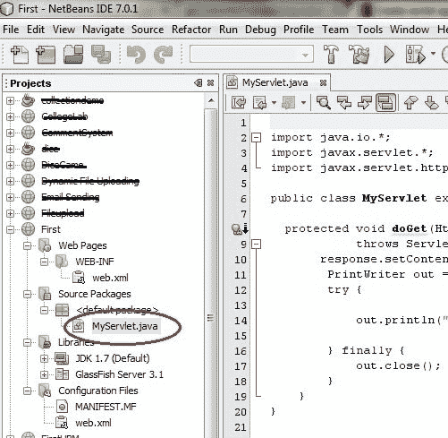

* * *

17.  Write some code inside your Servlet class.

    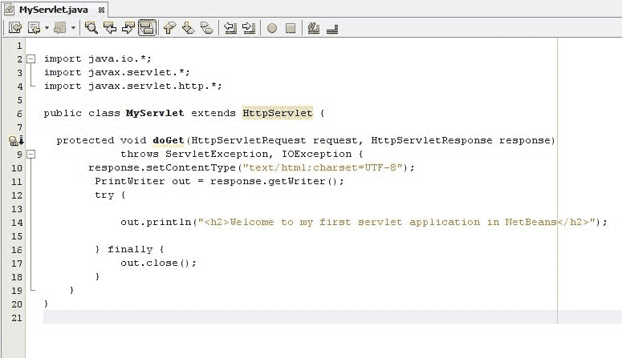

* * *

19.  Create an HTML file, right click on **Web Pages** -> **New** -> **HTML**

    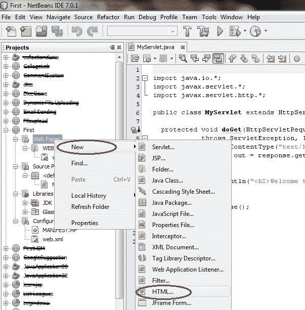

* * *

21.  Give it a name. We recommend you to name it `index`, because browser will always pick up the `index.html` file automatically from a directory. Index file is read as the first page of the web application.

    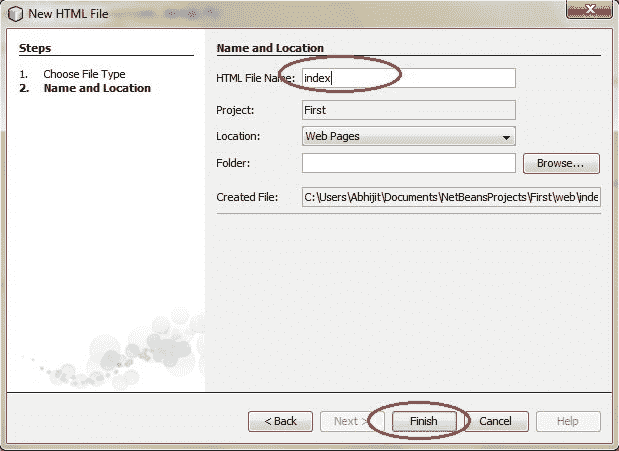

* * *

23.  Write some code inside your HTML file. We have created a hyperlink to our Servlet in our HTML file.

    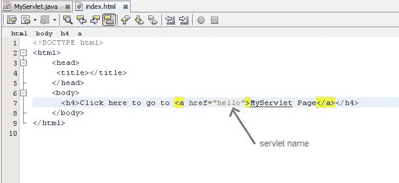

* * *

25.  Edit **web.xml** file. In the web.xml file you can see, we have specified the **url-pattern** and the **servlet-name**, this means when `hello` url is accessed our Servlet file will be executed.

    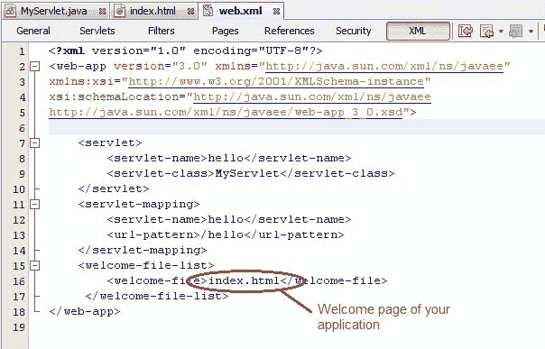

* * *

27.  Run your application, right click on your Project and select **Run**

    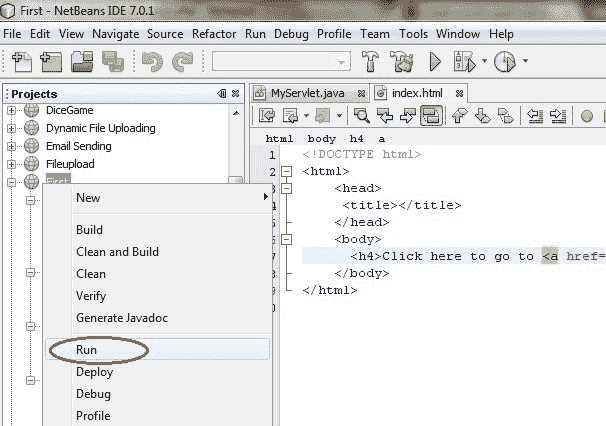

* * *

29.  Click on the link created, to open your Servlet.

    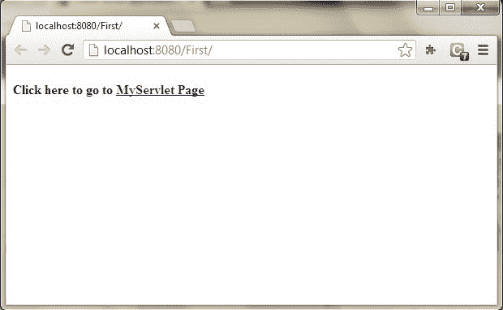

* * *

31.  Hurray! Our First Servlet class is running.

    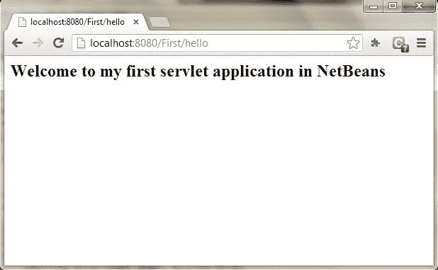

* * *

* * *