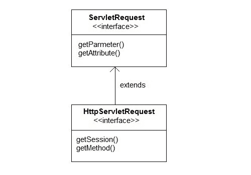
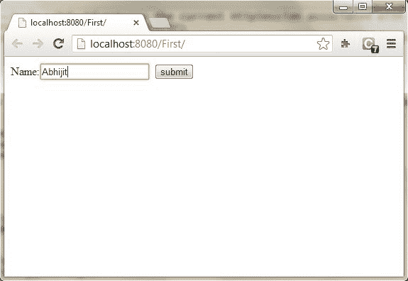

# `ServletRequest`类简介

> 原文：<https://www.studytonight.com/servlet/servlet-request.php>

Servlet 的真正工作是处理客户端请求。Servlet API 提供了两个重要的接口**javax . servlet . servlet request**和**javax . servlet . http . httpservletrequest**封装客户端请求。这些接口的实现向 servlet 提供了关于客户端请求的重要信息。

* * *

## 服务请求的一些重要方法

| 方法 | 描述 |
| 对象`getAttribute(String name)` | 按名称返回请求对象的属性集 |
| 枚举`getAttributeName()` | 返回包含该请求中可用属性名称的枚举 |
| int `getContentLength()` | 请求正文的返回大小 |
| int `getContentType()` | 返回请求内容的媒体类型 |
| servletinputstream〔t0〕 | 返回用于读取二进制数据的输入流 |
| 弦`getParameter(String name)` | 按名称返回参数值 |
| 弦`getLocalAddr()` | 返回接收请求的接口的互联网协议地址 |
| 枚举`getParameterNames()` | 返回所有参数名称的枚举 |
| 字符串[] `getParameterValues(String name)` | 返回一个 String 对象数组，其中包含给定请求参数的所有值，如果参数不存在，则返回 null |
| servletcontext〔t0〕 | 返回当前请求的 servlet 上下文。 |
| 弦`getServerName()` | 返回向其发送请求的服务器的主机名 |
| int `getServerPort()` | 返回请求发送到的端口号 |
| 布尔值 `isSecure()` | 返回一个布尔值，指示此请求是否是使用安全通道(如 HTTPS)发出的。 |
| 作废`removeAttribute(String name)` | 从此请求中移除属性 |
| 作废`setAttribute(String name, Object o)` | 在此请求中存储一个属性。 |

* * *

### HttpServletRequest 接口

**httpersvletrequest**接口增加了与 **HTTP** 协议相关的方法。



* * *

### HttpServletRequest 的一些重要方法

| 方法 | 描述 |
| 弦`getContextPath()` | 返回 URI 请求中指示请求上下文的部分 |
| 饼干`getCookies()` | 返回一个数组，其中包含客户端随此请求发送的所有 Cookie 对象 |
| 弦`getQueryString()` | 返回路径后请求 URL 中包含的查询字符串 |
| http session〔t0〕 | 返回与此请求关联的当前 HttpSession，或者，如果没有当前会话并且 create 为 true，则返回新会话 |
| 弦`getMethod()` | 返回发出此请求的 HTTP 方法的名称，例如 GET、POST 或 PUT。 |
| 部分`getPart(String name)` | 获取具有给定名称的部件 |
| 弦`getPathInfo()` | 返回与客户端发出请求时发送的 URL 相关联的任何额外路径信息。 |
| 弦`getServletPath()` | 返回这个请求的 URL 中调用 servlet 的部分 |

* * *

### 演示 Servlet 请求的示例

在这个例子中，我们将展示一个参数是如何从 HTML 页面传递到请求对象中的 Servlet 的。

**index.html**

```java
<form method="post" action="check">
    Name <input type="text" name="user" >
    <input type="submit" value="submit">
</form> 
```

**web.xml**

```java
<servlet>
    <servlet-name>check</servlet-name>
    <servlet-class>MyServlet</servlet-class>
</servlet>
<servlet-mapping>
    <servlet-name>check</servlet-name>
    <url-pattern>/check</url-pattern>
</servlet-mapping> 
```

**MyServlet.java**

```java
import java.io.*;
import javax.servlet.*;
import javax.servlet.http.*;

public class MyServlet extends HttpServlet {

  protected void doPost(HttpServletRequest request, HttpServletResponse response)
            throws ServletException, IOException {
       response.setContentType("text/html;charset=UTF-8");
        PrintWriter out = response.getWriter();
        try {

            String user = request.getParameter("user");
            out.println("<h2> Welcome "+user+"</h2>");
        } finally {            
            out.close();
        }
    }
} 
```

**输出:**



* * *


* * *

* * *