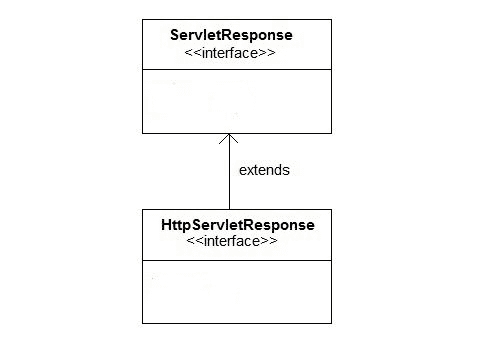

# `ServletResponse`简介

> 原文：<https://www.studytonight.com/servlet/servlet-response.php>

Servlet API 提供了两个重要的接口 **ServletResponse** 和**httpersvletresponse**来协助向客户端发送响应。

* * *

## 服务响应的一些重要方法

| 方法 | 描述 |
| PrintWriter `getWriter()` | 返回一个 PrintWriter 对象，该对象可以向客户端发送字符文本。 |
| 作废`setBufferSize(int size)` | 设置响应正文的首选缓冲区大小 |
| 作废`setContentLength(int len)` | 设置响应中内容主体的长度在 HTTP servlets 中，此方法设置 HTTP 内容长度头 |
| 作废`setContentType(String type)` | 在发送响应之前，设置发送给客户端的响应的内容类型。 |
| 作废`setBufferSize(int size)` | 设置响应正文的首选缓冲区大小。 |
| 布尔值 `isCommitted()` | 返回一个布尔值，指示响应是否已提交 |
| 作废`setLocale(Locale loc)` | 如果尚未提交响应，则设置响应的区域设置。 |

* * *

## HttpServletResponse 接口

**HttpServletResponse** 接口添加了与 **HTTP** 响应相关的方法。它扩展了 ServletResponse 接口。HttpServletResponse 的对象是在 servlet 容器中创建的。



* * *

### HttpServletResponse 的一些重要方法

| 方法 | 描述 |
| 作废`addCookie(Cookie cookie)` | 将指定的 cookie 添加到响应中。 |
| 作废`sendRedirect(String location)` | 使用指定的重定向位置 URL 向客户端发送临时重定向响应，并清除缓冲区 |
| int `getStatus()` | 获取此响应的当前状态代码 |
| 弦`getHeader(String name)` | 获取具有给定名称的响应头的值。 |
| 作废`setHeader(String name, String value)` | 使用给定的名称和值设置响应头 |
| 作废`setStatus(int sc)` | 设置此响应的状态代码 |
| 作废`sendError(int sc, String msg)` | 使用指定的状态向客户端发送错误响应，并清除缓冲区 |

* * *

### Eclipse 上的 HttpServletResponse 接口示例

#### 为了创建一个 HttpServletResponse 接口，下面是程序的目录结构:


### 以下是创建程序的步骤。

第一步:通过点击**文件= >新建= >动态网页项目**在 eclipse 上创建一个动态项目


**第二步:现在创建一个 HTML 文件。**

右键单击项目，然后单击 HTML 文件。给出文件名，然后点击完成按钮。


#### 并写出下面的代码。

```java
	 <!DOCTYPE html>
<html>
<head>
<meta charset="ISO-8859-1">
<title>studytonight.com</title>
</head>
<body>
<form align="center" action="display" method="get">
<h3>studytonight.com</h3>
<hr>
Enter User name: <input type="text" name="val1"><br><br>
Enter Password: &nbsp;&nbsp;<input type="password" name="val2" ><br><br>
<input type="submit" value="login">
</body>
</html> 

```

**第三步:现在在 web.xml 文件中添加下面的代码。**

web.xml 文件是一个部署描述符。这里有所有的配置。

```java
	 <?xml version="1.0" encoding="UTF-8"?>
<web-app xmlns:xsi="http://www.w3.org/2001/XMLSchema-instance"  xsi:schemaLocation="http://xmlns.jcp.org/xml/ns/javaee http://xmlns.jcp.org/xml/ns/javaee/web-app_4_0.xsd" id="WebApp_ID" version="4.0">
  <display-name>ServletResponse</display-name>
   <servlet>
  	<servlet-name>abc3</servlet-name>
  	<servlet-class>demo4</servlet-class>
  </servlet>
  <servlet-mapping>
  <servlet-name>abc3</servlet-name>
  <url-pattern>/display</url-pattern>
  </servlet-mapping>
</web-app> 

```

**步骤 4:现在接下来创建一个 servlet。为此创建一个类。给出包名和类名。**


在类文件中添加下面的代码。

#### **演示 4.java**

```java
	 import javax.servlet.http.*;
import javax.servlet.*;
import java.io.*;
public class demo4 extends HttpServlet{
   public void doGet(HttpServletRequest req,HttpServletResponse res)
   throws ServletException,IOException
   {
     res.setContentType("text/html");
     PrintWriter pwriter=res.getWriter();
     String uname=req.getParameter("val1");
     String pw=req.getParameter("val2");
     pwriter.println("User Details Page:");
     pwriter.println("Hello "+uname);
     pwriter.println("Your Password is **"+pw+"**");
     pwriter.close();
  }
} 

```

#### **现在，运行代码**

要运行代码，右键单击项目并选择运行方式= >在服务器上运行。


下面是 demo4.html 页面。填写所有字段，然后单击登录按钮登录 servlet 页面。


这是 servlet 页面。


* * *

* * *