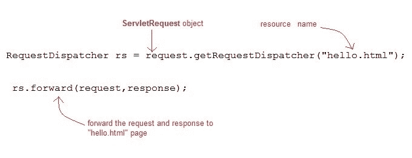
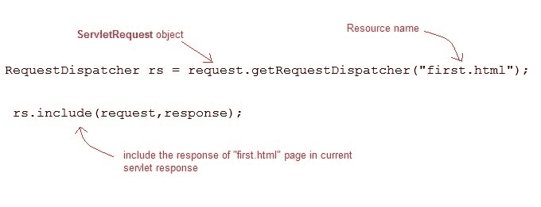
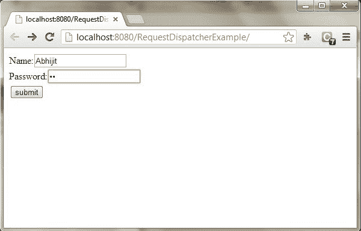
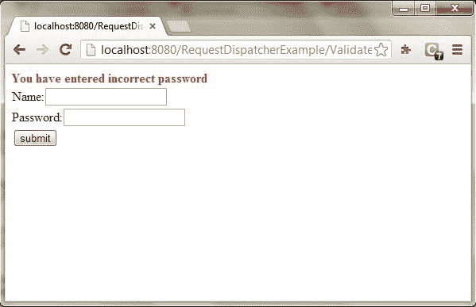
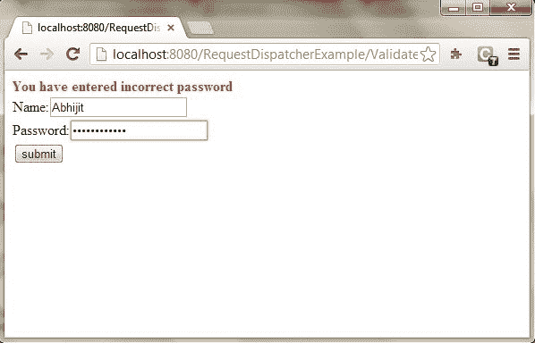
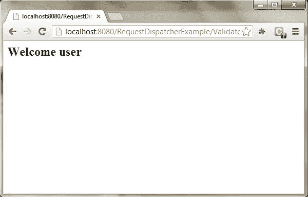

# Servlet 中的请求调度程序

> 原文：<https://www.studytonight.com/servlet/request-dispatcher.php>

在 Java 中，RequestDispatcher 接口用于将请求分派给资源，即 Html、servlet 或 JSP。另一个资源的内容可以包含在这个界面中。RequestDispatcher 有两种方法。它们如下:

* * *

## Servlet:请求调度器的方法

**RequestDispatcher** 接口提供了两个重要的方法

| 方法 | 描述 |
| 公共 void forward(ServletRequest 请求，ServletResponse 响应)引发 ServletException，java.io.IOException | 它用于将请求从服务器上的一个 servlet 转发到另一个 servlet。 |
| public void include(servlet request 请求，ServletResponse 响应)抛出 ServletException，java.io.IOException | 它用于在响应中包含资源的内容。 |

* * *

### forward()方法:


* * *

### include()方法:


* * *

### Eclipse 上 forward()和 include()方法的示例

使用 forward()和 include()方法创建程序时，下面是程序的目录结构:


* * *

### 以下是创建程序的步骤。

第一步:通过点击**文件= >新建= >动态网页项目**在 eclipse 上创建一个动态项目


第二步:现在创建一个 HTML 文件。

右键单击项目，然后单击 HTML 文件。给出文件名，然后点击完成按钮。


并写出下面的代码。

**Index.html**

```java
    <!DOCTYPE html>
<html>
<head>
<meta charset="ISO-8859-1">
<title>studytonight</title>
</head>
<body>
<form align="center" action="display" method="post"> 
<h3>studytonight.com</h3>
<hr>
Name: <input type="text" name="val1"><br> <br>
User Id: <input type="text" name="val2"><br> <br>
Password: <input type="password" name="val3"><br> <br> 
<input type="submit" value="login">  
</form>  
</body>
</html> 

```

步骤 3:现在在 web.xml 文件中添加下面的代码。

web.xml 文件是一个部署描述符。这里有所有的配置。

```java
    <?xml version="1.0" encoding="UTF-8"?>
<web-app xmlns:xsi="http://www.w3.org/2001/XMLSchema-instance"  xsi:schemaLocation="http://xmlns.jcp.org/xml/ns/javaee http://xmlns.jcp.org/xml/ns/javaee/web-app_4_0.xsd" id="WebApp_ID" version="4.0">
  <display-name>forward</display-name>
  <servlet>  
    <servlet-name>demo5</servlet-name>  
    <servlet-class>forward.demo5</servlet-class>  
  </servlet>  
  <servlet>  
    <servlet-name>demo5i</servlet-name>  
    <servlet-class>forward.demo5i</servlet-class>  
  </servlet>  

  <servlet-mapping>  
    <servlet-name>demo5</servlet-name>  
    <url-pattern>/display</url-pattern>  
  </servlet-mapping>  
  <servlet-mapping>  
    <servlet-name>demo5i</servlet-name>  
    <url-pattern>/display1</url-pattern>  
  </servlet-mapping>  

  <welcome-file-list>  
   <welcome-file>index.html</welcome-file>  
  </welcome-file-list>  
</web-app> 

```

步骤 4:现在接下来创建一个 servlet。为此创建一个类。给出包名和类名。

对于这个例子，我们需要两个 servlet 类。


现在在类文件中添加下面的代码。

**演示 5.java**

```java
    package forward;

import java.io.*;  
import javax.servlet.*;  
import javax.servlet.http.*;  

public class demo5 extends HttpServlet {  

public void doPost(HttpServletRequest request, HttpServletResponse response)  
        throws ServletException, IOException {  

    response.setContentType("text/html");  
    PrintWriter out = response.getWriter();  

    String n=request.getParameter("val1");  
    String u=request.getParameter("val2"); 
    String p=request.getParameter("val3");  

    if(p.equals("studytonight"))
            {  
        RequestDispatcher rd=request.getRequestDispatcher("display1");  
        rd.forward(request, response);  
    }  
    else{  
        out.print("Incorrect UserId or Password");  
        RequestDispatcher rd=request.getRequestDispatcher("/index.html");  
        rd.include(request, response);  

        }  
    }  

} 

```

**演示。java**

```java
    package forward;

import java.io.*;  
import javax.servlet.*;  
import javax.servlet.http.*;  

public class demo5i extends HttpServlet {  

    public void doPost(HttpServletRequest request, HttpServletResponse response)  
        throws ServletException, IOException {  

    response.setContentType("text/html");  
    PrintWriter out = response.getWriter();  

    String n=request.getParameter("val2");  
    out.print("Welcome "+n);  
    }  

} 

```

现在，运行代码。

要运行代码，右键单击项目并选择运行方式= >在服务器上运行。


下面是 index.html 页面。填写所有字段，点击登录按钮登陆
servlet 页面。


如果你的密码是正确的，那么它将登陆 demo5.java 的 servlet 页面


如果你的密码不正确，它将登陆 demo5i.java 页面。


* * *

### 如何获取请求调度程序的对象

**ServletRequest** 的`getRequestDispatcher()`方法返回 **RequestDispatcher** 的对象。

```java
RequestDispatcher rs = request.getRequestDispatcher("hello.html");
rs.forward(request,response); 
```



**或**

```java
RequestDispatcher rs = request.getRequestDispatcher("hello.html");
rs.include(request,response); 
```



* * *

### 演示 RequestDispatcher 用法的示例

在本例中，我们将向您展示如何使用 RequestDispatcher 来**转发**或**在 Servlet 中包含资源的**响应。这里我们使用**index.html**从用户那里获取用户名和密码，**验证** Servlet 将验证用户输入的密码，如果用户已经输入“今晚学习”作为密码，那么他将被转发到**欢迎使用** Servlet，否则用户将停留在 index.html 页面并显示一条错误消息。

**要创建的文件:**

*   **index.html**会有表单字段来获取用户信息。
*   **Validate.java**将验证用户输入的数据。
*   **Welcome.java**将成为欢迎页面。
*   **web.xml** ，部署描述符。

**index.html**

```java
<form method="post" action="Validate">
Name:<input type="text" name="user" /><br/>
Password:<input type="password" name="pass" ><br/>
<input type="submit" value="submit">
</form> 
```

**Validate.java**

```java
import java.io.*;
import javax.servlet.*;
import javax.servlet.http.*;

public class Validate extends HttpServlet {

    protected void doPost(HttpServletRequest request, HttpServletResponse response)
            throws ServletException, IOException {

        response.setContentType("text/html;charset=UTF-8");
        PrintWriter out = response.getWriter();
        try {
            String name = request.getParameter("user");
            String password = request.getParameter("pass");

            if(password.equals("studytonight"))
            {
                RequestDispatcher rd = request.getRequestDispatcher("Welcome");
                rd.forward(request, response);
            }
            else
            {
                out.println("<font color='red'><b>You have entered incorrect password</b></font>");
                RequestDispatcher rd = request.getRequestDispatcher("index.html");
                rd.include(request, response);
            }
        }
        finally {            
            out.close();
        }

    }
}
```

**Welcome.java**

```java
import java.io.*;
import javax.servlet.*;
import javax.servlet.http.*;

public class Welcome extends HttpServlet {

    protected void doPost(HttpServletRequest request, HttpServletResponse response)
            throws ServletException, IOException {

        response.setContentType("text/html;charset=UTF-8");
        PrintWriter out = response.getWriter();
        try {
            out.println("<h2>Welcome user</h2>");
        } 
        finally {            
            out.close();
        }
    }
} 
```

**web.xml**

```java
<web-app>
    <servlet>
        <servlet-name>Validate</servlet-name>
        <servlet-class>Validate</servlet-class>
    </servlet>
    <servlet>
        <servlet-name>Welcome</servlet-name>
        <servlet-class>Welcome</servlet-class>
    </servlet>
    <servlet-mapping>
        <servlet-name>Validate</servlet-name>
        <url-pattern>/Validate</url-pattern>
    </servlet-mapping>
    <servlet-mapping>
        <servlet-name>Welcome</servlet-name>
        <url-pattern>/Welcome</url-pattern>
    </servlet-mapping>
    <welcome-file-list>
        <welcome-file>index.html</welcome-file>
        </welcome-file-list>
</web-app> 
```

* * *

这将是第一个屏幕。您可以在此输入您的用户名和密码。



* * *

当您单击“提交”时，将验证密码，如果不是“今晚学习”，将显示错误消息。



* * *

输入任何用户名，但输入“今晚学习”作为密码。



* * *

密码将被成功验证，您将被引导到欢迎服务程序。



* * *

* * *