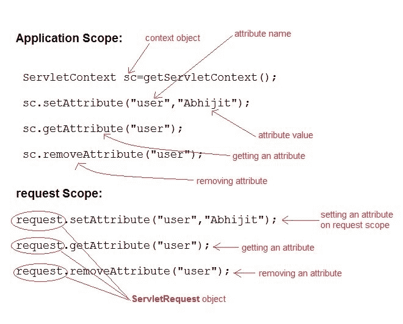

# Servlet:属性介绍

> 原文：<https://www.studytonight.com/servlet/attribute.php>

**属性**是用于在网络应用程序中共享信息的对象。属性允许 Servlets 之间共享信息。可以从以下范围之一设置和获取属性:

1.  请求
2.  会议
3.  应用



* * *

## Servlet:如何设置属性

`public void setAttribute(String name, Object obj)`方法用于设置属性。

**设置属性演示示例**

```java
import java.io.*;
import javax.servlet.*;
import javax.servlet.http.*;

public class First extends HttpServlet {

  protected void doPost(HttpServletRequest request, HttpServletResponse response)
            throws ServletException, IOException {
        response.setContentType("text/html;charset=UTF-8");
        PrintWriter out = response.getWriter();
        ServletContext sc = getServletContext();
        sc.setAttribute("user","Abhijit");	//setting attribute on context scope
    }
}
```

* * *

## Servlet:如何获取属性

`Object getAttribute(String name)`方法用于获取属性。

**演示获取集合属性**值的示例

```java
import java.io.*;
import javax.servlet.*;
import javax.servlet.http.*;

public class Second extends  HttpServlet {

  protected void  doPost(HttpServletRequest request, HttpServletResponse response)
            throws ServletException, IOException {
        response.setContentType("text/html;charset=UTF-8");
        PrintWriter out = response.getWriter();
        ServletContext sc = getServletContext();

        String str = sc.getAttribute("user");  //getting attribute from context scope

        out.println("Welcome"+str);  // Prints : Welcome Abhijit   
    }
}
```

* * *

* * *