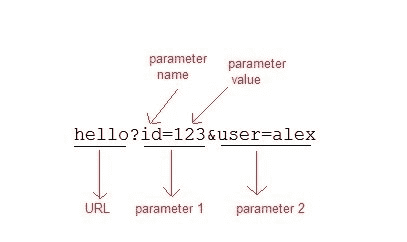

# 在 Servlet 中使用 URL 重写进行会话管理

> 原文：<https://www.studytonight.com/servlet/url-rewriting-for-session-management.php>

如果客户端在浏览器中禁用了 cookie，那么使用 cookie 的会话管理将不起作用。在这种情况下 **URL 重写**可以作为备份。**网址改写**将永远有效。

在 URL 重写中，会在 URL 的末尾添加一个标记(参数)。令牌由用`equal(=)`符号分隔名称/值对组成。

**例如:**



当用户点击有参数的网址时，请求会进入**网页容器**，在网址的末尾有额外的信息。**网络容器**将获取请求的网址的额外部分，并将其用于会话管理。

`getParameter()`方法用于获取服务器端的参数值。

* * *

#### 演示网址重写用法的示例

以下提到的文件是示例所必需的:

**index.html**

```java
<form method="post" action="validate">
    Name:<input type="text" name="user" /><br/>
    Password:<input type="text" name="pass" ><br/>
    <input type="submit" value="submit">
</form> 
```

**web.xml**

```java
 <web-app...>

    <servlet>
        <servlet-name>validate</servlet-name>
        <servlet-class>MyServlet</servlet-class>
    </servlet> 
    <servlet-mapping>
        <servlet-name>validate</servlet-name>
        <url-pattern>/validate</url-pattern>
    </servlet-mapping>

    <servlet>
        <servlet-name>First</servlet-name>
        <servlet-class>First</servlet-class>
    </servlet>
    <servlet-mapping>
        <servlet-name>First</servlet-name>
        <url-pattern>/First</url-pattern>
    </servlet-mapping>

    <welcome-file-list>
        <welcome-file>index.html</welcome-file>
    </welcome-file-list>

</web-app> 
```

**MyServlet.java**

```java
import java.io.*;
import javax.servlet.*;
import javax.servlet.http.*;

public class MyServlet extends HttpServlet {

  protected void doPost(HttpServletRequest request, HttpServletResponse response)
            throws ServletException, IOException {
        response.setContentType("text/html;charset=UTF-8");
        String name = request.getParameter("user");
        String pass = request.getParameter("pass");

        if(pass.equals("1234"))
        {
            response.sendRedirect("First?user_name="+ name);
        }
    }   
} 
```

**First.java**

```java
import java.io.*;
import javax.servlet.*;
import javax.servlet.http.*;

public class First extends HttpServlet {

  protected void doGet(HttpServletRequest request, HttpServletResponse response)
            throws ServletException, IOException {
        response.setContentType("text/html;charset=UTF-8");
        PrintWriter out = response.getWriter();
        String user = request.getParameter("user_name");
        out.println("Welcome "+user);
    }
} 
```

* * *

* * *